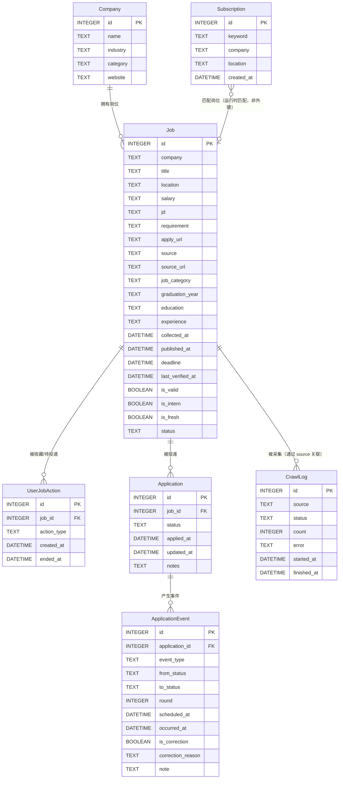

# 数据库表设计

> TASK-007 产出。基于 PRD v3 §六数据模型 + TASK-006 架构决策，落地为完整的数据库物理设计。
>
> ---
> **版本**：v3（M1 公司招聘雷达数据底座）
> **v3 修订说明**：保留 M0 的 7 表投递管理基线，新增公司层级、招聘活动、活动届别、轻量岗位引用、来源快照和公司变化事件；公共事实不带用户归属，也不保存完整 JD。正式 schema 以 Alembic `d8cf04cfe08c → 8418f8d1585a` 为准。
>
> **v2 历史修订说明**：
> **v2 修订说明**：v1 结构完整（7 表 + 索引 + DDL），但存在 6 处硬伤，v2 集中修订：
> 1. **【严重】状态枚举中英文矛盾**：v1 §4.1 说用英文 code，但 §3/§6 的 CHECK 约束和 DDL 用中文。代码层（英文）和数据库约束（中文）会直接冲突。v2 统一为**所有枚举字段用英文 code 存储**，中文由应用层映射
> 2. **【严重】事务伪代码破坏原子性**：v1 把"读取+校验"放在 try 外，只有写入在事务里，违背了 TASK-006 v2 "读取-校验-写入同事务"的设计。v2 改为 `with session.begin():` 包裹全流程
> 3. **【中】去重唯一索引限制**：location 字符串不一致（"北京"vs"北京市"）会漏去重，标注为已知限制，交由 TASK-009 采集层模糊去重
> 4. **【小】updated_at 自动更新**：补充 SQLite 无原生 ON UPDATE 的说明，Demo 用 ORM 钩子
> 5. **【小】ER 图关系方向**：Job↔Company 方向反了，修正
> 6. **【小】Application 缺唯一约束**：补充"同一岗位同时只能有一个非终态投递"的部分唯一索引

---

## 一、设计原则与约束

### 1.1 硬约束（继承自 PRD/架构）

| 约束 | 来源 | 说明 |
|------|------|------|
| SQLite 优先 | TASK-006 §1.3 | 零配置、本地优先，为 PG 迁移预留 |
| 同步 SQLAlchemy Session | TASK-006 v2 | 避免 async/sync 混用 |
| 状态机原子性 | PRD v3 §3.3.1 | Application.status + ApplicationEvent 写入同一事务 |
| 不用 SELECT FOR UPDATE | TASK-006 v2 | SQLite 不支持，用应用层校验 |
| ApplicationEvent 分离 | PRD v3 §3.3.2 | 阶段与事件分离，漏斗/待办/纠错共同命脉 |
| UserJobAction 收窄 | PRD v3 §六 | 只存收藏/待投递，不存已投递 |
| 删除 offer_result | PRD v3 §六 | status 已表达 Offer 结果 |
| 删除 current_round | PRD v3 §六 | 多轮面试靠事件表回溯 |

### 1.2 类型兼容性

| SQLite 类型 | PostgreSQL 类型 | 说明 |
|-------------|-----------------|------|
| INTEGER | INTEGER | 自增主键 |
| TEXT | VARCHAR/TEXT | 字符串 |
| DATETIME | TIMESTAMP | 时间戳 |
| DATE | DATE | 中国区报表日期 |
| BOOLEAN | BOOLEAN | 布尔值 |
| FLOAT | DOUBLE PRECISION | 分类置信度 |
| JSON | JSON/JSONB | 证据、轻量列表；不承担核心届别筛选 |

> 避免使用 SQLite 特有类型（如 BLOB），确保迁移兼容。

---

## 二、ER 图



### 2.1 M1 公共招聘雷达扩展

```mermaid
erDiagram
    Company ||--o{ Company : "集团/分支"
    Company ||--o{ RecruitmentCampaign : "发布活动"
    RecruitmentCampaign ||--o{ CampaignGraduationYear : "面向届别"
    Company ||--o{ ObservedPositionRef : "公开岗位引用"
    RecruitmentCampaign o|--o{ ObservedPositionRef : "归入活动"
    Company ||--o{ SourceSnapshot : "采集快照"
    SourceSnapshot o|--o| SourceSnapshot : "比较前一有效快照"
    SourceSnapshot ||--o{ CompanyChangeEvent : "产生可审计变化"
    RecruitmentCampaign o|--o{ CompanyChangeEvent : "关联活动"

    RecruitmentCampaign {
        INTEGER id PK
        INTEGER company_id FK
        TEXT source_id
        TEXT campaign_key
        TEXT recruitment_type
        TEXT internship_type
        TEXT graduation_years_status
        TEXT status
    }

    CampaignGraduationYear {
        INTEGER campaign_id PK_FK
        INTEGER graduation_year PK
    }

    ObservedPositionRef {
        INTEGER id PK
        INTEGER company_id FK
        INTEGER campaign_id FK
        TEXT source_id
        TEXT dedupe_key
        TEXT identity_kind
        TEXT title
        TEXT status
        TEXT content_fingerprint
    }

    SourceSnapshot {
        INTEGER id PK
        INTEGER company_id FK
        TEXT source_id
        TEXT run_key
        INTEGER previous_valid_snapshot_id FK
        TEXT completeness_status
        TEXT comparison_status
        BOOLEAN is_baseline
    }

    CompanyChangeEvent {
        INTEGER id PK
        INTEGER company_id FK
        INTEGER snapshot_id FK
        TEXT source_id
        TEXT event_type
        INTEGER added_count
        INTEGER reopened_count
        INTEGER closed_count
        DATE reporting_date_cn
    }
```

---

## 三、表结构详细设计

### 3.1 Job（岗位）

**表名**：`job` | **中文名**：岗位表 | **用途**：存储采集的岗位信息

| 字段名 | SQLite 类型 | PG 类型 | 约束 | 默认值 | 说明 |
|--------|-------------|---------|------|--------|------|
| id | INTEGER | INTEGER | PK, AUTOINCREMENT | - | 主键 |
| company | TEXT | VARCHAR(200) | NOT NULL | - | 公司名 |
| title | TEXT | VARCHAR(200) | NOT NULL | - | 岗位名 |
| location | TEXT | VARCHAR(100) | - | NULL | 工作地点 |
| salary | TEXT | VARCHAR(100) | - | NULL | 薪资范围 |
| jd | TEXT | TEXT | - | NULL | 岗位描述 |
| requirement | TEXT | TEXT | - | NULL | 岗位要求 |
| apply_url | TEXT | VARCHAR(500) | - | NULL | 投递链接 |
| source | TEXT | VARCHAR(50) | NOT NULL | - | 来源平台（boss/nowcoder/lagou/company） |
| source_url | TEXT | VARCHAR(500) | - | NULL | 原始采集页 URL |
| job_category | TEXT | VARCHAR(50) | - | NULL | 岗位方向（product/tech/design/operation...） |
| graduation_year | TEXT | VARCHAR(20) | - | NULL | 毕业年份要求 |
| education | TEXT | VARCHAR(20) | - | NULL | 学历要求 |
| experience | TEXT | VARCHAR(50) | - | NULL | 经验要求 |
| collected_at | DATETIME | TIMESTAMP | NOT NULL | CURRENT_TIMESTAMP | 采集时间 |
| published_at | DATETIME | TIMESTAMP | - | NULL | 发布时间 |
| deadline | DATETIME | TIMESTAMP | - | NULL | 截止时间 |
| last_verified_at | DATETIME | TIMESTAMP | - | NULL | 最后核验时间 |
| is_valid | BOOLEAN | BOOLEAN | NOT NULL | TRUE | 是否有效 |
| is_intern | BOOLEAN | BOOLEAN | NOT NULL | FALSE | 是否实习 |
| is_fresh | BOOLEAN | BOOLEAN | NOT NULL | FALSE | 是否应届 |
| status | TEXT | VARCHAR(20) | NOT NULL, CHECK | 'displaying' | 岗位状态：displaying(展示中) / closed(已关闭) |

**索引**：
```sql
CREATE INDEX idx_job_company ON job(company);
CREATE INDEX idx_job_status ON job(status);
CREATE INDEX idx_job_source ON job(source);
CREATE INDEX idx_job_collected_at ON job(collected_at DESC);
CREATE INDEX idx_job_deadline ON job(deadline) WHERE deadline IS NOT NULL;
CREATE INDEX idx_job_category ON job(job_category) WHERE job_category IS NOT NULL;
```

**唯一约束**：
```sql
-- 去重：同一来源+公司+岗位名+地点 唯一
-- ⚠️ v2 已知限制：location 字符串不一致（"北京" vs "北京市" vs "Beijing"）会漏去重
-- 交由 TASK-009 采集层做模糊去重（归一化后再入库）
CREATE UNIQUE INDEX idx_job_dedup ON job(source, company, title, location);
```

---

### 3.2 UserJobAction（用户-岗位关系）

**表名**：`user_job_action` | **中文名**：用户岗位关系表 | **用途**：存储收藏/待投递关系

| 字段名 | SQLite 类型 | PG 类型 | 约束 | 默认值 | 说明 |
|--------|-------------|---------|------|--------|------|
| id | INTEGER | INTEGER | PK, AUTOINCREMENT | - | 主键 |
| job_id | INTEGER | INTEGER | FK → job.id, NOT NULL | - | 关联岗位 |
| action_type | TEXT | VARCHAR(20) | NOT NULL, CHECK | - | favorited(收藏) / to_apply(待投递) |
| created_at | DATETIME | TIMESTAMP | NOT NULL | CURRENT_TIMESTAMP | 操作时间 |
| ended_at | DATETIME | TIMESTAMP | - | NULL | 结案时间（创建 Application 时设值） |

**索引**：
```sql
CREATE INDEX idx_uja_job_id ON user_job_action(job_id);
CREATE INDEX idx_uja_action_type ON user_job_action(action_type);
CREATE INDEX idx_uja_active ON user_job_action(job_id, action_type) WHERE ended_at IS NULL;
```

**检查约束**：
```sql
-- v2 统一英文 code 存储
ALTER TABLE user_job_action ADD CONSTRAINT chk_action_type 
CHECK (action_type IN ('favorited', 'to_apply'));
```

**关系说明**：
- 一个 Job 可被多次收藏/待投递（但同一时间只有一条活跃记录）
- 创建 Application 时，设置 ended_at 结案

---

### 3.3 Application（投递记录）

**表名**：`application` | **中文名**：投递记录表 | **用途**：存储投递状态

| 字段名 | SQLite 类型 | PG 类型 | 约束 | 默认值 | 说明 |
|--------|-------------|---------|------|--------|------|
| id | INTEGER | INTEGER | PK, AUTOINCREMENT | - | 主键 |
| job_id | INTEGER | INTEGER | FK → job.id, NOT NULL | - | 关联岗位 |
| status | TEXT | VARCHAR(30) | NOT NULL, CHECK | - | 当前状态（9个状态，英文 code 存储） |
| applied_at | DATETIME | TIMESTAMP | NOT NULL | CURRENT_TIMESTAMP | 投递时间 |
| updated_at | DATETIME | TIMESTAMP | NOT NULL | CURRENT_TIMESTAMP | 最后状态变更时间 |
| notes | TEXT | TEXT | - | NULL | 备注 |

**索引**：
```sql
CREATE INDEX idx_app_job_id ON application(job_id);
CREATE INDEX idx_app_status ON application(status);
CREATE INDEX idx_app_applied_at ON application(applied_at DESC);
CREATE INDEX idx_app_updated_at ON application(updated_at DESC);

-- v2 新增：同一岗位同时只能有一个非终态投递（防止看板数据重复计算）
-- 终态后可重新投递（如春招再投秋招投过的公司）
CREATE UNIQUE INDEX idx_app_one_active_per_job ON application(job_id) 
WHERE status NOT IN ('offer_accepted', 'offer_declined', 'rejected', 'no_response', 'withdrawn');
```

**检查约束**（v2 统一英文 code）：
```sql
ALTER TABLE application ADD CONSTRAINT chk_app_status 
CHECK (status IN (
    'applied', 'test', 'interviewing', 'offer_pending',
    'offer_accepted', 'offer_declined', 'rejected', 'no_response', 'withdrawn'
));
```

**关系说明**：
- 一个 Job 可被投递多次（终态后可重新投递），但**同一时间只能有一个非终态投递**（由唯一索引保证）
- v3 已删除 offer_result 和 current_round

> **关于 updated_at 自动更新**（v2 补充）：
> SQLite **没有**原生的 `ON UPDATE CURRENT_TIMESTAMP`（PostgreSQL 有）。
> - Demo 阶段：用 SQLAlchemy ORM 的 `before_update` 事件钩子强制设置
> - 未来 PG：可改为列默认触发器
> - 切记：任何直接写 SQL 改 status 的地方，都要手动设 updated_at

---

### 3.4 ApplicationEvent（统一事件表）⭐ 核心表

**表名**：`application_event` | **中文名**：投递事件表 | **用途**：漏斗/待办/纠错的共同命脉

| 字段名 | SQLite 类型 | PG 类型 | 约束 | 默认值 | 说明 |
|--------|-------------|---------|------|--------|------|
| id | INTEGER | INTEGER | PK, AUTOINCREMENT | - | 主键 |
| application_id | INTEGER | INTEGER | FK → application.id, NOT NULL | - | 关联投递 |
| event_type | TEXT | VARCHAR(20) | NOT NULL, CHECK | - | 事件类型 |
| from_status | TEXT | VARCHAR(30) | - | NULL | 状态变更前（仅 status_change/correction） |
| to_status | TEXT | VARCHAR(30) | - | NULL | 状态变更后（仅 status_change/correction） |
| round | INTEGER | INTEGER | - | NULL | 面试轮次（仅 interview） |
| scheduled_at | DATETIME | TIMESTAMP | - | NULL | 计划时间（DDL） |
| occurred_at | DATETIME | TIMESTAMP | - | NULL | 实际发生时间 |
| is_correction | BOOLEAN | BOOLEAN | NOT NULL | FALSE | 是否纠错记录 |
| correction_reason | TEXT | TEXT | - | NULL | 纠错原因（仅 correction） |
| note | TEXT | TEXT | - | NULL | 备注 |

**索引**：
```sql
-- 漏斗查询索引
CREATE INDEX idx_event_funnel ON application_event(event_type, to_status) 
WHERE is_correction = FALSE;

-- 待办查询索引
CREATE INDEX idx_event_todo ON application_event(event_type, scheduled_at) 
WHERE scheduled_at IS NOT NULL AND occurred_at IS NULL;

-- 投递记录查询索引
CREATE INDEX idx_event_app_id ON application_event(application_id, occurred_at);

-- 纠错查询索引
CREATE INDEX idx_event_correction ON application_event(application_id) 
WHERE is_correction = TRUE;
```

**检查约束**：
```sql
ALTER TABLE application_event ADD CONSTRAINT chk_event_type 
CHECK (event_type IN ('status_change', 'interview', 'test', 'material_submit', 'offer', 'note', 'correction'));
```

**字段填充规则**：

| event_type | from_status | to_status | round | scheduled_at | occurred_at | is_correction | correction_reason |
|------------|-------------|-----------|-------|--------------|-------------|---------------|-------------------|
| status_change | 必填 | 必填 | NULL | NULL | 必填 | FALSE | NULL |
| interview | NULL | NULL | 可填 | 可填 | 可填 | FALSE | NULL |
| test | NULL | NULL | NULL | 可填 | 可填 | FALSE | NULL |
| material_submit | NULL | NULL | NULL | 可填 | 可填 | FALSE | NULL |
| offer | NULL | NULL | NULL | NULL | 必填 | FALSE | NULL |
| note | NULL | NULL | NULL | NULL | 必填 | FALSE | NULL |
| correction | 必填 | 必填 | NULL | NULL | 必填 | TRUE | 必填 |

---

### 3.5 Subscription（订阅）

**表名**：`subscription` | **中文名**：订阅表 | **用途**：存储用户订阅规则

| 字段名 | SQLite 类型 | PG 类型 | 约束 | 默认值 | 说明 |
|--------|-------------|---------|------|--------|------|
| id | INTEGER | INTEGER | PK, AUTOINCREMENT | - | 主键 |
| keyword | TEXT | VARCHAR(100) | - | NULL | 关键词 |
| company | TEXT | VARCHAR(100) | - | NULL | 公司名 |
| location | TEXT | VARCHAR(100) | - | NULL | 地点 |
| created_at | DATETIME | TIMESTAMP | NOT NULL | CURRENT_TIMESTAMP | 创建时间 |

**索引**：
```sql
CREATE INDEX idx_sub_keyword ON subscription(keyword) WHERE keyword IS NOT NULL;
CREATE INDEX idx_sub_company ON subscription(company) WHERE company IS NOT NULL;
```

---

### 3.6 Company（公司）

**表名**：`company` | **中文名**：公司主数据 | **用途**：作为全站公司统计、集团去重与官方来源关联的公共根对象

| 字段名 | SQLite 类型 | PG 类型 | 约束 | 默认值 | 说明 |
|--------|-------------|---------|------|--------|------|
| id | INTEGER | INTEGER | PK, AUTOINCREMENT | - | 主键 |
| parent_company_id | INTEGER | INTEGER | FK → company.id | NULL | 集团/分支关系；不得指向自身 |
| registry_id | TEXT | TEXT | 部分唯一 | NULL | 对应版本化公司注册表的稳定键 |
| name | TEXT | VARCHAR(200) | NOT NULL, UNIQUE | - | 公司名 |
| aliases | JSON | JSON/JSONB | NOT NULL | `[]` | 别名，仅用于识别与展示 |
| industry | TEXT | VARCHAR(100) | - | NULL | 行业 |
| category | TEXT | VARCHAR(50) | - | NULL | 公司类型（互联网大厂/创业公司/外企/国企...） |
| ownership_type | TEXT | TEXT | - | NULL | 所有制/资本类型 |
| website | TEXT | VARCHAR(500) | - | NULL | 官网 |
| status | TEXT | TEXT | NOT NULL, CHECK | candidate | candidate / verified / monitoring / paused / retired |
| first_verified_at | DATETIME | TIMESTAMP | 条件必填 | NULL | 首次完成来源核验时间；verified/monitoring 必填 |
| last_observed_at | DATETIME | TIMESTAMP | - | NULL | 最近有效观测时间 |
| created_at | DATETIME | TIMESTAMP | NOT NULL | CURRENT_TIMESTAMP | 创建时间 |
| updated_at | DATETIME | TIMESTAMP | NOT NULL | CURRENT_TIMESTAMP | 更新时间 |

**索引**：
```sql
CREATE UNIQUE INDEX idx_company_name ON company(name);
CREATE INDEX idx_company_category ON company(category) WHERE category IS NOT NULL;
CREATE UNIQUE INDEX idx_company_registry_id ON company(registry_id) WHERE registry_id IS NOT NULL;
CREATE INDEX idx_company_parent ON company(parent_company_id);
CREATE INDEX idx_company_status ON company(status);
```

`candidate` 公司可以保留待核验；只有写入 `first_verified_at` 后才能进入 `verified` 或 `monitoring`，避免“未核验公司”进入首页新增口径。集团与分支分别建档，通过 `parent_company_id` 聚合，不再靠名称猜测去重。

---

### 3.7 CrawlLog（采集日志）

**表名**：`crawl_log` | **中文名**：采集日志表 | **用途**：记录采集执行情况

| 字段名 | SQLite 类型 | PG 类型 | 约束 | 默认值 | 说明 |
|--------|-------------|---------|------|--------|------|
| id | INTEGER | INTEGER | PK, AUTOINCREMENT | - | 主键 |
| source | TEXT | VARCHAR(50) | NOT NULL | - | 采集源（boss/nowcoder/lagou/company） |
| status | TEXT | VARCHAR(20) | NOT NULL, CHECK | - | 状态：success(成功) / failed(失败) / skipped(跳过) |
| count | INTEGER | INTEGER | - | 0 | 采集数量 |
| error | TEXT | TEXT | - | NULL | 错误信息 |
| started_at | DATETIME | TIMESTAMP | NOT NULL | - | 开始时间 |
| finished_at | DATETIME | TIMESTAMP | - | NULL | 结束时间 |

**索引**：
```sql
CREATE INDEX idx_crawl_source ON crawl_log(source);
CREATE INDEX idx_crawl_status ON crawl_log(status);
CREATE INDEX idx_crawl_started_at ON crawl_log(started_at DESC);
```

**检查约束**（v2 统一英文 code）：
```sql
ALTER TABLE crawl_log ADD CONSTRAINT chk_crawl_status 
CHECK (status IN ('success', 'failed', 'skipped'));
```

---

### 3.8 RecruitmentCampaign 与 CampaignGraduationYear（招聘活动与届别）

`recruitment_campaign` 表示一次公司级招聘活动，和岗位列表分开存在。公告先发布、岗位稍后开放时，也可以先建立活动。

| 核心字段 | 说明 |
|---|---|
| company_id / source_id / campaign_key | 公司、首要发现来源、公司内稳定活动键；`(company_id, campaign_key)` 唯一 |
| season / campaign_year | autumn、spring、early、makeup、rolling、unknown；活动年份不等于毕业届别 |
| recruitment_type / internship_type | 正式校招、毕业生项目、实习；实习再分暑期、日常、寒假和未知 |
| graduation_years_status | known / unknown，用于区分“未识别”与明确届别集合 |
| status / start_at / deadline / official_url | 活动状态、时间与官方入口 |
| classification_confidence / classification_evidence | 分类置信度及证据；低置信度仍保留为 unknown |

`campaign_graduation_year` 使用 `(campaign_id, graduation_year)` 复合主键，并建立 `(graduation_year, campaign_id)` 索引。毕业年份限制在 2000–2200；2027/2028 等多届别可以直接在 SQLite 与 PostgreSQL 中用同一关联查询筛选，不依赖 JSON 方言差异。

### 3.9 ObservedPositionRef（公共轻量岗位引用）

该表只记录判断岗位集合变化所需的轻量事实，不保存完整 JD、要求或用户私人快照。

| 核心字段 | 说明 |
|---|---|
| company_id / campaign_id / source_id | 公司必填；活动可空；复合外键阻止岗位串到其他公司活动 |
| dedupe_key | 来源内稳定身份键；与 source_id 组成唯一索引 |
| identity_kind | external_id / canonical_url / fingerprint，明确本次去重证据层级 |
| external_job_id / canonical_url | 均可空，但必须满足 identity_kind 对应的证据要求 |
| title / locations / category | 标题、城市与轻量岗位类别；未知类别不丢弃 |
| recruitment_type / internship_type / graduation_years | 岗位级分类证据；不作为活动届别主筛选事实 |
| first_seen_at / last_seen_at / closed_at / status | 发现与关闭生命周期 |
| content_fingerprint / missing_count | 内容变化指纹与连续缺失次数；身份键和内容变化分开 |

### 3.10 SourceSnapshot（来源快照）

每次正式来源采集写一条快照。`run_key` 与 `source_id` 唯一，保证任务重试幂等；`previous_valid_snapshot_id` 只能指向同公司、同来源的上一条有效快照。

| 字段组 | 说明 |
|---|---|
| status | success / failed，表示抓取结果 |
| completeness_status | count_matched / pagination_verified / incomplete / failed，表示完整性证据 |
| comparison_status | pending / baseline / compared / suppressed / failed，表示是否允许参与差分 |
| source_total / fetched_total / indexed_total / excluded_total / failed_total | 源端总数与处理对账 |
| position_keys / position_set_hash / response_hash | 轻量身份集合及审计摘要 |
| parser_version / fetched_at / completed_at / error | 可复现版本、时间与错误 |

约束规则：

- 每个来源最多一个 baseline；首个完整性通过的成功快照才能成为 baseline，且不能有 previous；
- compared 必须是完整性通过的成功快照，并引用上一条有效快照；
- incomplete 快照只能 suppressed，不能推进缺失次数或生成新增/关闭；
- failed 快照的 comparison_status 必须为 failed；
- 同一 previous 最多生成一个 compared 后继，防止并发任务形成差分分叉。

### 3.11 CompanyChangeEvent（公司变化事件）

首页所有“今日新增公司/岗位/关闭/变化”都必须从该表聚合，并能回溯到快照与证据。

| 核心字段 | 说明 |
|---|---|
| company_id / campaign_id / snapshot_id / source_id | 变化作用域；复合外键阻止跨公司、跨来源串联 |
| dedup_key | 全局唯一事件幂等键 |
| event_type | campaign_started / campaign_updated / campaign_closed / positions_changed / position_reopened / page_updated / source_degraded / source_recovered |
| added_count / reopened_count / closed_count / changed_count | 新增、重新开放、关闭、内容变化分别计数，重开不冒充新增 |
| occurred_at | 统一保存 UTC 发生时间 |
| reporting_date_cn | 由 occurred_at 转 Asia/Shanghai 后生成的首页归属日期 |
| computation_status / evidence | computed / suppressed / review_required 与审计证据 |

首个 baseline 只建立参考集合，不创建可计数变化事件。`reporting_date_cn` 的时区转换由下一阶段差分服务统一完成，禁止由数据库当前时区隐式推断。

### 3.12 公共与私人数据边界

- Company、RecruitmentCampaign、CampaignGraduationYear、ObservedPositionRef、SourceSnapshot、CompanyChangeEvent 都是公共事实，不带 `user_id`；
- 现有 Job 仍是 M0 兼容表；完整 JD 与用户收藏后的岗位快照将在私人数据迁移中增加 owner 归属；
- `source_id` 是 `config/company_sources.json` 中的稳定字符串键，不伪造数据库整数来源外键；
- SQLite 测试显式启用外键；PostgreSQL 生产验证仍属于 R1 的独立集成测试门禁。

---

## 四、状态机与事件表的物理实现

### 4.1 状态枚举值定义

**9 个状态（英文 code 存储，中文展示）**：

| 英文 code | 中文展示 | 类型 | 说明 |
|-----------|---------|------|------|
| `applied` | 已投递 | 进行中 | 已提交，等待回复 |
| `test` | 测评笔试 | 进行中 | 收到测评或笔试 |
| `interviewing` | 面试中 | 进行中 | 收到面试（可多轮） |
| `offer_pending` | Offer待决定 | 进行中 | 收到 Offer，待用户选择 |
| `offer_accepted` | Offer已接受 | ✅ 终态 | 用户接受 |
| `offer_declined` | Offer已婉拒 | ✅ 终态 | 用户婉拒 |
| `rejected` | 公司拒绝 | ✅ 终态 | 公司明确拒绝 |
| `no_response` | 无回应关闭 | ✅ 终态 | 超时无回复，用户确认后关闭 |
| `withdrawn` | 主动撤回 | ✅ 终态 | 用户主动撤回 |

**5 个终态判断逻辑**：

```python
TERMINAL_STATUSES = {'offer_accepted', 'offer_declined', 'rejected', 'no_response', 'withdrawn'}

def is_terminal(status: str) -> bool:
    return status in TERMINAL_STATUSES
```

### 4.2 事件类型枚举

| event_type | 中文说明 | from_status | to_status | round | scheduled_at | occurred_at | is_correction |
|------------|---------|-------------|-----------|-------|--------------|-------------|---------------|
| `status_change` | 状态变更 | 必填 | 必填 | - | - | 必填 | FALSE |
| `interview` | 面试 | - | - | 可填 | 可填 | 可填 | FALSE |
| `test` | 笔试/测评 | - | - | - | 可填 | 可填 | FALSE |
| `material_submit` | 材料提交 | - | - | - | 可填 | 可填 | FALSE |
| `offer` | Offer | - | - | - | - | 必填 | FALSE |
| `note` | 备注 | - | - | - | - | 必填 | FALSE |
| `correction` | 纠错 | 必填 | 必填 | - | - | 必填 | TRUE |

### 4.3 状态流转的事务实现

**核心要求**：不用 SELECT FOR UPDATE（SQLite 不支持），用应用层校验。
**v2 关键修正**：读取 + 校验 + 写入必须在**同一事务**内（呼应 TASK-006 v2 §4.1）。v1 把读取放在 try 外，破坏了原子性。

**伪代码（v2，事务包裹全流程）**：

```python
def transition_status(
    session: Session,
    application_id: int,
    to_status: str,
    note: str = None,
    is_correction: bool = False,
    correction_reason: str = None
) -> Application:
    """
    状态流转（原子操作）
    v2: 读取 + 校验 + 写入在同一事务内，保证原子性
    """
    # v2 关键：整个流程在 with session.begin() 内，事务自动提交/回滚
    try:
        with session.begin():
            # 1. 读取当前状态（事务内，SQLite 数据库级锁保证一致性）
            app = session.query(Application).get(application_id)
            if not app:
                raise NotFoundError(f"Application {application_id} not found")
            from_status = app.status

            # 2. 应用层校验流转合法性（替代悲观锁的并发控制）
            if not is_correction and not is_valid_transition(from_status, to_status):
                raise InvalidTransitionError(f"不允许从 {from_status} 流转到 {to_status}")

            if is_correction and not correction_reason:
                raise ValidationError("纠错必须填写原因")

            # 3. 更新 Application
            app.status = to_status
            app.updated_at = datetime.utcnow()  # SQLite 无 ON UPDATE，手动设

            # 4. 写入 ApplicationEvent（同一事务，原子提交）
            event = ApplicationEvent(
                application_id=application_id,
                event_type='correction' if is_correction else 'status_change',
                from_status=from_status,
                to_status=to_status,
                occurred_at=datetime.utcnow(),
                is_correction=is_correction,
                correction_reason=correction_reason,
                note=note
            )
            session.add(event)
            # 事务自动提交（with 块结束）
        return app

    except Exception:
        # with session.begin() 会自动 rollback，这里只做异常转发
        raise
```

**为什么读取也要在事务内**（v2 修正说明）：
- v1 的写法：读取在 try 外 → 校验后、写入前如果别的进程改了 status，校验就失效
- v2 的写法：读取在 `with session.begin()` 内 → SQLite 的数据库级锁在事务期间持有，保证读取到的 status 在写入前不会被改变
- 单用户 Demo 场景并发概率低，但这是**正确的事务边界**，未来迁移 PG 时直接替换为 `with_for_update()` 即可

**并发冲突处理**：
- Demo 阶段：单用户，无需担心并发
- 未来多用户：迁移 PG 后，把 `session.query(Application).get(id)` 改为 `session.query(Application).with_for_update().get(id)`

### 4.4 漏斗/待办/纠错的查询模式

#### 漏斗查询

```sql
-- 投递漏斗（排除纠错）
SELECT to_status, COUNT(DISTINCT application_id) as count
FROM application_event
WHERE event_type = 'status_change'
  AND is_correction = FALSE
GROUP BY to_status;
```

**索引**：`idx_event_funnel`

#### 待办查询

```sql
-- 未来 7 天的待办
SELECT ae.*, a.job_id, j.company, j.title
FROM application_event ae
JOIN application a ON ae.application_id = a.id
JOIN job j ON a.job_id = j.id
WHERE ae.event_type IN ('interview', 'test', 'material_submit')
  AND ae.scheduled_at IS NOT NULL
  AND ae.occurred_at IS NULL
  AND ae.scheduled_at >= datetime('now')
  AND ae.scheduled_at <= datetime('now', '+7 days')
ORDER BY ae.scheduled_at ASC;
```

**索引**：`idx_event_todo`

#### 纠错查询

```sql
-- 纠错记录
SELECT ae.*, a.job_id, j.company, j.title
FROM application_event ae
JOIN application a ON ae.application_id = a.id
JOIN job j ON a.job_id = j.id
WHERE ae.is_correction = TRUE
ORDER BY ae.occurred_at DESC;
```

**索引**：`idx_event_correction`

---

## 五、索引策略

### 5.1 索引汇总

| 表 | 索引名 | 字段 | 类型 | 用途 |
|----|--------|------|------|------|
| job | idx_job_company | company | 普通 | 按公司筛选 |
| job | idx_job_status | status | 普通 | 按状态筛选 |
| job | idx_job_source | source | 普通 | 按来源筛选 |
| job | idx_job_collected_at | collected_at DESC | 普通 | 按采集时间排序 |
| job | idx_job_deadline | deadline | 部分 | DDL 提醒查询 |
| job | idx_job_category | job_category | 部分 | 按岗位方向筛选 |
| job | idx_job_dedup | source, company, title, location | 唯一 | 去重 |
| user_job_action | idx_uja_job_id | job_id | 普通 | 按岗位查询 |
| user_job_action | idx_uja_action_type | action_type | 普通 | 按类型筛选 |
| user_job_action | idx_uja_active | job_id, action_type | 部分 | 活跃记录查询 |
| application | idx_app_job_id | job_id | 普通 | 按岗位查询 |
| application | idx_app_status | status | 普通 | 按状态筛选 |
| application | idx_app_applied_at | applied_at DESC | 普通 | 按投递时间排序 |
| application | idx_app_updated_at | updated_at DESC | 普通 | 按更新时间排序 |
| application | idx_app_one_active_per_job | job_id | 唯一(部分) | **v2 新增**：同一岗位同时只能有一个非终态投递 |
| application_event | idx_event_funnel | event_type, to_status | 部分 | 漏斗查询 |
| application_event | idx_event_todo | event_type, scheduled_at | 部分 | 待办查询 |
| application_event | idx_event_app_id | application_id, occurred_at | 普通 | 投递事件查询 |
| application_event | idx_event_correction | application_id | 部分 | 纠错查询 |
| subscription | idx_sub_keyword | keyword | 部分 | 关键词订阅 |
| subscription | idx_sub_company | company | 部分 | 公司订阅 |
| company | idx_company_name | name | 唯一 | 公司名唯一 |
| company | idx_company_category | category | 部分 | 按类型筛选 |
| crawl_log | idx_crawl_source | source | 普通 | 按来源筛选 |
| crawl_log | idx_crawl_status | status | 普通 | 按状态筛选 |
| crawl_log | idx_crawl_started_at | started_at DESC | 普通 | 按时间排序 |

### 5.2 SQLite 部分索引说明

SQLite 支持部分索引（带 WHERE 子句），用于优化特定查询：

```sql
-- 只索引有效的 deadline
CREATE INDEX idx_job_deadline ON job(deadline) WHERE deadline IS NOT NULL;

-- 只索引活跃的用户岗位关系
CREATE INDEX idx_uja_active ON user_job_action(job_id, action_type) WHERE ended_at IS NULL;

-- 只索引漏斗查询（非纠错）
CREATE INDEX idx_event_funnel ON application_event(event_type, to_status) WHERE is_correction = FALSE;

-- 只索引待办查询（未发生）
CREATE INDEX idx_event_todo ON application_event(event_type, scheduled_at) 
WHERE scheduled_at IS NOT NULL AND occurred_at IS NULL;
```

---

## 六、初始化与迁移

### 6.1 M0 基线 SQL（SQLite 方言，历史参考）

> 下列 SQL 仅描述 `d8cf04cfe08c` 的 7 表历史基线。M1 扩展必须通过 Alembic 执行，不要复制本段手工建生产库。

```sql
-- 岗位表
CREATE TABLE job (
    id INTEGER PRIMARY KEY AUTOINCREMENT,
    company TEXT NOT NULL,
    title TEXT NOT NULL,
    location TEXT,
    salary TEXT,
    jd TEXT,
    requirement TEXT,
    apply_url TEXT,
    source TEXT NOT NULL,
    source_url TEXT,
    job_category TEXT,
    graduation_year TEXT,
    education TEXT,
    experience TEXT,
    collected_at DATETIME NOT NULL DEFAULT CURRENT_TIMESTAMP,
    published_at DATETIME,
    deadline DATETIME,
    last_verified_at DATETIME,
    is_valid BOOLEAN NOT NULL DEFAULT TRUE,
    is_intern BOOLEAN NOT NULL DEFAULT FALSE,
    is_fresh BOOLEAN NOT NULL DEFAULT FALSE,
    status TEXT NOT NULL DEFAULT 'displaying' CHECK (status IN ('displaying', 'closed'))
);

-- 用户岗位关系表
CREATE TABLE user_job_action (
    id INTEGER PRIMARY KEY AUTOINCREMENT,
    job_id INTEGER NOT NULL REFERENCES job(id),
    action_type TEXT NOT NULL CHECK (action_type IN ('favorited', 'to_apply')),
    created_at DATETIME NOT NULL DEFAULT CURRENT_TIMESTAMP,
    ended_at DATETIME
);

-- 投递记录表
CREATE TABLE application (
    id INTEGER PRIMARY KEY AUTOINCREMENT,
    job_id INTEGER NOT NULL REFERENCES job(id),
    status TEXT NOT NULL CHECK (status IN (
        'applied', 'test', 'interviewing', 'offer_pending',
        'offer_accepted', 'offer_declined', 'rejected', 'no_response', 'withdrawn'
    )),
    applied_at DATETIME NOT NULL DEFAULT CURRENT_TIMESTAMP,
    updated_at DATETIME NOT NULL DEFAULT CURRENT_TIMESTAMP,
    notes TEXT
);

-- 投递事件表（核心）
CREATE TABLE application_event (
    id INTEGER PRIMARY KEY AUTOINCREMENT,
    application_id INTEGER NOT NULL REFERENCES application(id),
    event_type TEXT NOT NULL CHECK (event_type IN (
        'status_change', 'interview', 'test', 'material_submit', 'offer', 'note', 'correction'
    )),
    from_status TEXT,
    to_status TEXT,
    round INTEGER,
    scheduled_at DATETIME,
    occurred_at DATETIME,
    is_correction BOOLEAN NOT NULL DEFAULT FALSE,
    correction_reason TEXT,
    note TEXT
);

-- 订阅表
CREATE TABLE subscription (
    id INTEGER PRIMARY KEY AUTOINCREMENT,
    keyword TEXT,
    company TEXT,
    location TEXT,
    created_at DATETIME NOT NULL DEFAULT CURRENT_TIMESTAMP
);

-- 公司表
CREATE TABLE company (
    id INTEGER PRIMARY KEY AUTOINCREMENT,
    name TEXT NOT NULL UNIQUE,
    industry TEXT,
    category TEXT,
    website TEXT
);

-- 采集日志表
CREATE TABLE crawl_log (
    id INTEGER PRIMARY KEY AUTOINCREMENT,
    source TEXT NOT NULL,
    status TEXT NOT NULL CHECK (status IN ('success', 'failed', 'skipped')),
    count INTEGER DEFAULT 0,
    error TEXT,
    started_at DATETIME NOT NULL,
    finished_at DATETIME
);

-- 索引
CREATE INDEX idx_job_company ON job(company);
CREATE INDEX idx_job_status ON job(status);
CREATE INDEX idx_job_source ON job(source);
CREATE INDEX idx_job_collected_at ON job(collected_at DESC);
CREATE INDEX idx_job_deadline ON job(deadline) WHERE deadline IS NOT NULL;
CREATE INDEX idx_job_category ON job(job_category) WHERE job_category IS NOT NULL;
CREATE UNIQUE INDEX idx_job_dedup ON job(source, company, title, location);

CREATE INDEX idx_uja_job_id ON user_job_action(job_id);
CREATE INDEX idx_uja_action_type ON user_job_action(action_type);
CREATE INDEX idx_uja_active ON user_job_action(job_id, action_type) WHERE ended_at IS NULL;

CREATE INDEX idx_app_job_id ON application(job_id);
CREATE INDEX idx_app_status ON application(status);
CREATE INDEX idx_app_applied_at ON application(applied_at DESC);
CREATE INDEX idx_app_updated_at ON application(updated_at DESC);
-- v2 新增：同一岗位同时只能有一个非终态投递
CREATE UNIQUE INDEX idx_app_one_active_per_job ON application(job_id) 
WHERE status NOT IN ('offer_accepted', 'offer_declined', 'rejected', 'no_response', 'withdrawn');

CREATE INDEX idx_event_funnel ON application_event(event_type, to_status) WHERE is_correction = FALSE;
CREATE INDEX idx_event_todo ON application_event(event_type, scheduled_at) 
WHERE scheduled_at IS NOT NULL AND occurred_at IS NULL;
CREATE INDEX idx_event_app_id ON application_event(application_id, occurred_at);
CREATE INDEX idx_event_correction ON application_event(application_id) WHERE is_correction = TRUE;

CREATE INDEX idx_sub_keyword ON subscription(keyword) WHERE keyword IS NOT NULL;
CREATE INDEX idx_sub_company ON subscription(company) WHERE company IS NOT NULL;

CREATE UNIQUE INDEX idx_company_name ON company(name);
CREATE INDEX idx_company_category ON company(category) WHERE category IS NOT NULL;

CREATE INDEX idx_crawl_source ON crawl_log(source);
CREATE INDEX idx_crawl_status ON crawl_log(status);
CREATE INDEX idx_crawl_started_at ON crawl_log(started_at DESC);
```

**枚举值映射表（应用层使用）**：

| 字段 | 英文 code | 中文展示 |
|------|----------|---------|
| job.status | displaying / closed | 展示中 / 已关闭 |
| user_job_action.action_type | favorited / to_apply | 收藏 / 待投递 |
| application.status | applied / test / interviewing / offer_pending / offer_accepted / offer_declined / rejected / no_response / withdrawn | 已投递 / 测评笔试 / 面试中 / Offer待决定 / Offer已接受 / Offer已婉拒 / 公司拒绝 / 无回应关闭 / 主动撤回 |
| crawl_log.status | success / failed / skipped | 成功 / 失败 / 跳过 |

> 应用层（ORM/前端）维护这张映射表，数据库只存英文 code。

### 6.2 Alembic 迁移说明

**迁移目录结构**：
```
alembic/
├── env.py
├── script.py.mako
└── versions/
    ├── d8cf04cfe08c_existing_schema_baseline.py
    └── 8418f8d1585a_add_recruitment_radar_public_models.py
```

**空库升级**：

```powershell
python -m alembic upgrade head
```

**验证模型与迁移一致**：

```powershell
python -m alembic check
```

已有 pre-Alembic 数据库不能直接执行或盲目 stamp。`src/db/schema_migrations.py` 会同时比较 SQLAlchemy 反射结构与规范化后的 `sqlite_master` DDL：除表、列、类型、空值、默认值、主键、唯一约束、检查约束和外键外，也覆盖部分索引谓词、字符串字面量大小写、索引排序规则/顺序及 `STRICT`、`WITHOUT ROWID` 等 SQLite 语义。只有指纹完全一致时才生成一致性备份、stamp `d8cf04cfe08c` 并升级到 head；漂移库在修改前失败。

迁移全程持有 `<database>.migration.lock` 跨进程独占锁（Windows 使用 `msvcrt`、Unix 使用 `flock`），从首次读取版本一直覆盖备份、升级/恢复和最终 head 校验；超时会关闭失败。既有备份文件不会被覆盖，失败恢复后才释放锁。当前仓库的真实 `data/jobpulse.db` 尚未自动迁移，避免在开发过程中改变用户数据，但其副本已通过完整接管验证。

自动化测试覆盖：空库升到基线、写入既有 Company、升级 head、模型对比、降级回基线、再次升级；已知旧库的备份/stamp/升级；谓词、字面量与 COLLATE 漂移拒绝；备份不覆盖与失败恢复；线程及 Windows spawn 跨进程串行；当前仓库数据库副本升级前后 M0 表计数一致。`start.ps1`、`init_db` 与 Docker 已统一走迁移入口；生产 schema 健康检查、独立多副本迁移任务和真实 PostgreSQL 执行仍属于 R1 门禁。

### 6.3 SQLite → PostgreSQL 迁移注意事项

| 项目 | SQLite | PostgreSQL | 迁移方式 |
|------|--------|------------|---------|
| 自增主键 | INTEGER PRIMARY KEY AUTOINCREMENT | SERIAL 或 GENERATED ALWAYS AS IDENTITY | Alembic 自动处理 |
| 文本类型 | TEXT | VARCHAR(n) 或 TEXT | 保持 TEXT 即可 |
| 时间类型 | DATETIME | TIMESTAMP | SQLAlchemy 自动映射 |
| 布尔类型 | BOOLEAN | BOOLEAN | 兼容 |
| 部分索引 | 支持 | 支持 | 语法相同 |
| 外键约束 | 需要 PRAGMA foreign_keys = ON | 默认开启 | 代码中启用 |

**迁移步骤**：
1. 修改 `DATABASE_URL` 为 PostgreSQL 连接字符串
2. 安装 `psycopg2-binary`
3. 运行 `alembic upgrade head`
4. 使用 `pgloader` 或自定义脚本迁移数据

---

*文档版本：v3.0 | 创建日期：2026-06-22 | 最近更新：2026-08-18*
