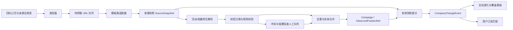

# 国内校招官方信息采集架构

| 属性 | 内容 |
|---|---|
| 状态 | Accepted；Phase 1 与公共数据底座已实现 |
| 日期 | 2026-08-18 |
| 上游策略 | [国内校招数据源策略](../product/DATA-SOURCE-STRATEGY.md) |
| 影响范围 | crawler、job、subscription、运营采集管理 |

> 2026-08-18 实施进度：首批 10 家公司已进入版本化来源注册表；招商银行完整分页适配器已通过技术测试；公司/活动/多届别/轻量岗位/快照/变化事件模型及安全迁移已实现。快照差分写服务尚未实现，所有正式来源仍保持关闭等待最终审核。详见[工程记录](../engineering/DOMESTIC-CAMPUS-INGESTION.md)。

## 1. 背景与假设

当前 Greenhouse 链路证明了公开 ATS 采集可运行，但默认来源是海外岗位；通用企业官网适配器只能解析页面标题，无法支撑国内校招。新架构基于以下假设：

- 产品服务中国大陆求职者，优先校招正式岗和实习；
- 团队规模小、成本敏感，先使用模块化单体和模板族适配器；
- 官方公告覆盖优先于平台岗位数量；
- 最终一致和最多 24 小时发现延迟可接受；
- 不绕过登录、验证码、robots、条款限制或其他访问控制。

## 2. 备选方案与取舍

| 方案 | 优点 | 代价/风险 | 决定 |
|---|---|---|---|
| 批量抓 BOSS/猎聘等平台 | 岗位多、启动快 | 协议明确限制抓取，反爬维护重，官方公告和届别字段反而不完整 | 拒绝 |
| 企业官方来源 + 公共就业平台发现 | 权威、可回链申请、适合校招活动分类 | 需要来源注册表、多个模板族和人工复核 | 采用 |
| 购买授权聚合数据 | 覆盖扩张快 | 成本、许可范围和供应商锁定 | 达到规模后复审 |
| 纯人工运营 | 准确、可处理公众号 | 无法规模化且延迟不可控 | 只做核验和兜底 |

## 3. 架构决定

采用“来源注册表驱动的官方优先采集管道”。所有自动任务只能处理已登记、已评估、处于启用状态的来源。



### 3.1 模块

| 模块 | 职责 |
|---|---|
| Source Registry | 公司、官方域名、入口、ATS 模板族、合规状态、刷新频率和负责人 |
| Discoverer | 从注册入口、站点地图、官网公告、可信公共平台和已知公众号 URL 发现候选链接 |
| Fetch Queue | 去重、限速、优先级、计划时间、重试上限和死信 |
| Adapter Family | 按企业自建站/Moka/北森/大易等模板族获取列表与详情 |
| Snapshot Store | 保存抓取、完整性、比较状态，响应/集合哈希、解析器版本和必要证据 |
| Parser/Classifier | 识别活动、公告、岗位、届别、季节、实习类型、城市和截止时间 |
| Entity Resolver | 公司别名、同源 ID、跨源候选和冲突处理 |
| Snapshot Differ | 只比较连续有效快照，生成新增、关闭、变化和重开事实 |
| Verification Queue | 低置信度、截止时间冲突、来源权威性不明和模板变更的人工复核 |
| Coverage Monitor | 来源登记、健康、发现率、发现延迟、字段完整度和失效复核 |

采集层遵守一条不可变约束：对已启用的目标公司官方校招来源执行完整遍历。生产适配器不得接受岗位方向关键词或单源岗位数上限；分类是入库后的检索能力，不是采集前的删减条件。

### 3.2 来源状态机

```text
candidate -> reviewing -> approved -> enabled
                         -> rejected
enabled -> degraded -> paused -> enabled
enabled/degraded -> retired
```

只有 `enabled` 来源进入自动调度。`degraded` 允许有限重试但不触发“没有新岗位”的订阅结论；`paused/rejected` 不发请求。

## 4. 数据模型增量

### CompanySourceRegistry（版本化配置）

当前机器可读事实源是 `config/company_sources.json`，使用稳定字符串 `company_id/source_id`，记录官方入口、域名、来源类型、适配器、合规状态、证据、审核日期、刷新频率和启用状态。只有注册表与运行配置同时允许的来源进入调度；本阶段不伪造整数来源外键。

### Company（公共公司主数据）

```text
id, parent_company_id, registry_id, name, aliases
industry, category, ownership_type, website, status
first_verified_at, last_observed_at, created_at, updated_at
```

集团与分支用 `parent_company_id` 表达；`verified/monitoring` 必须有 `first_verified_at`，避免未核验公司进入“今日新收录”口径。

### RecruitmentCampaign + CampaignGraduationYear

```text
RecruitmentCampaign:
  id, company_id, source_id, campaign_key, name
  season, campaign_year, recruitment_type, internship_type
  graduation_years_status, status, start_at, deadline, official_url
  first_seen_at, last_seen_at, classification_confidence/evidence

CampaignGraduationYear:
  campaign_id, graduation_year
```

`(company_id, campaign_key)` 唯一。活动年份与毕业届别分开；届别使用关联表，以保证 SQLite/PostgreSQL 的筛选语义一致。公告先出现、岗位未开放时可先建立 Campaign，公告证据保存在官方 URL 与分类证据中；独立多公告/复核模型后续扩展。

### ObservedPositionRef（公共轻量岗位引用）

```text
id, company_id, campaign_id, source_id, dedupe_key, identity_kind
external_job_id, canonical_url, title, locations, category
recruitment_type, internship_type, graduation_years
first_seen_at, last_seen_at, closed_at, status
content_fingerprint, missing_count, classification_confidence/evidence
```

身份顺序为外部 ID → 规范化 URL → 轻量字段指纹；身份键与内容指纹分开。公共表不保存完整 JD。用户主动收藏后的完整快照仍属于私人 `Job`，其 owner 归属和公共引用关联放到私人数据迁移阶段。

### SourceSnapshot（来源快照）

```text
id, company_id, source_id, run_key, crawl_log_id
previous_valid_snapshot_id, status, completeness_status, comparison_status
is_baseline, fetched_at, completed_at
source_total, fetched_total, indexed_total, excluded_total, failed_total
position_keys, position_set_hash, response_hash, parser_version, error
```

抓取、完整性和比较状态互相独立。只有 `count_matched` 或 `pagination_verified` 的成功快照可建立 baseline/compared；首个 baseline 不生成可计数事件；失败、不完整或被抑制的快照不推进缺失次数。`run_key`、单来源 baseline 和 previous→compared 后继均有幂等约束。

### CompanyChangeEvent（首页事实）

```text
id, company_id, campaign_id, snapshot_id, source_id, dedup_key
event_type, added_count, reopened_count, closed_count, changed_count
reporting_date_cn, occurred_at, computation_status, evidence
```

新增、重开、关闭和内容变化分别计数；首页聚合只能读取可追溯事件。`occurred_at` 按 UTC 契约写入，`reporting_date_cn` 由服务转换为 Asia/Shanghai 日期。跨公司、跨来源引用由复合外键拒绝。

## 5. 采集流程

1. 调度器根据招聘季和来源优先级创建检查任务；
2. 请求前校验来源状态、robots/条款快照、域名和速率预算；
3. Discoverer 产生规范 URL，队列以 URL + 来源 + 内容版本幂等；
4. Adapter 获取公开列表并写 `SourceSnapshot` 与候选轻量引用，不默认抓取完整详情；
5. Parser 先区分活动、公告证据和岗位引用，再做校招分类；
6. 规则引擎将国外岗位和纯社招岗位写入带原因的隔离记录；届别冲突、未知岗位类别等低置信度数据保留并进入复核；
7. Resolver 合并实体但保留各来源轻量引用、快照和冲突证据；
8. Snapshot Differ 只比较连续有效快照，在同一事务中更新引用并写 `CompanyChangeEvent`；
9. 首次有效快照仅建 baseline；相同快照不制造事件；不完整/失败快照不改变缺失次数；
10. 订阅系统只消费已核验、来源健康且可追溯的变化事件；
11. Coverage Monitor 更新来源与公司池指标。

## 6. 中国地区与校招过滤

进入公共目录至少满足：

- `country_code = CN`，或官方原文明示中国大陆城市/远程面向中国；
- 属于 `campus_full_time`、`internship` 或明确的毕业生项目；
- 至少有公司官方来源，或暂时只有可信公共机构来源但标记为待官方核验；
- 有可追溯原文链接和首次/最近核验时间。

国外岗位、纯社招和无法确认地区的内容可写入隔离区用于排错，但不得进入默认岗位目录和用户订阅。

## 7. 适配器策略

适配器按模板族而不是按公司组织：

```text
adapters/
  official/
    base.py
    generic_jsonld.py
    moka.py
    beisen.py
    dayee.py
    custom/
discoverers/
  sitemap.py
  announcement_index.py
  public_employment.py
verification/
  classifier.py
  resolver.py
  review_queue.py
```

每个模板族必须通过固定契约测试：列表分页/游标穷尽、部门与城市等入口遍历、详情、空结果、关闭状态、字段缺失、模板变更、限速和禁止访问。生产配置不允许岗位关键词过滤或 `max_jobs` 截断；未知类别必须保留。选择器变化不得导致“成功但 0 条”被默认为真实无岗位。

来源公开总岗位数时，每次任务必须记录并对账 `source_total/fetched/parsed/persisted/excluded_by_reason/parse_failed`。对账不一致时来源进入 `degraded` 和人工复核，不得发送新增或“无新增”通知。来源不公开总数时，使用分页结束证据、首尾页快照和定期人工抽检确认完整性。

## 8. 合规门禁

- 来源审核必须记录 `robots_checked_at`、`terms_checked_at`、结论和证据链接；
- 无法确认允许时 fail closed，进入人工评估；
- 禁止登录态采集、验证码处理、代理池、UA 轮换规避和客户端拟人；
- BOSS、猎聘等平台没有书面授权时不得注册为自动来源；
- 用户手工保存的平台链接属于私人对象，不进入公共目录或平台训练数据；
- 公众号只处理已知公开文章 URL，不自动化搜索微信客户端，不默认长期保存全文。

## 9. 可靠性与可观测性

每次任务记录 `source_total/discovered/fetched/parsed/persisted/created/updated/excluded_by_reason/parse_failed/reviewed` 数量，而不只记录最终新增数。告警条件至少包括：

- 高优先级来源超过两个预期窗口未成功；
- 历史有岗位的来源突然连续返回 0 条；
- 来源公开岗位总数与已入库、已隔离和解析失败记录无法 100% 对账；
- 内容哈希变化但解析结果不变或字段完整度骤降；
- 高峰期公司池发现延迟 P95 超过 24 小时；
- 同公司同活动的届别或截止时间出现冲突；
- 人工复核积压超过约定窗口。

## 10. 分阶段落地

1. D0：停用海外默认源，历史海外岗位进入隔离/清理清单；
2. D1：来源注册表、活动/公告/岗位模型、分类器和覆盖看板；
3. D2：3 个模板族 + 10 个自建站，在 100 家公司池中达到试点指标；
4. D3：订阅按届别/季节/实习类型消费已核验变更；
5. D4：公众号运营入口与授权数据合作。

## 11. 复审触发器

出现任一情况时重新评审本决定：

- 获得 BOSS、猎聘或其他平台的正式 API/书面数据授权；
- 目标公司池超过 1000 家且人工复核成为主要成本；
- 24 小时发现延迟不能满足用户价值；
- 公众号成为超过 20% 的唯一官方发布渠道；
- 单体调度和队列无法满足来源数或任务量。
