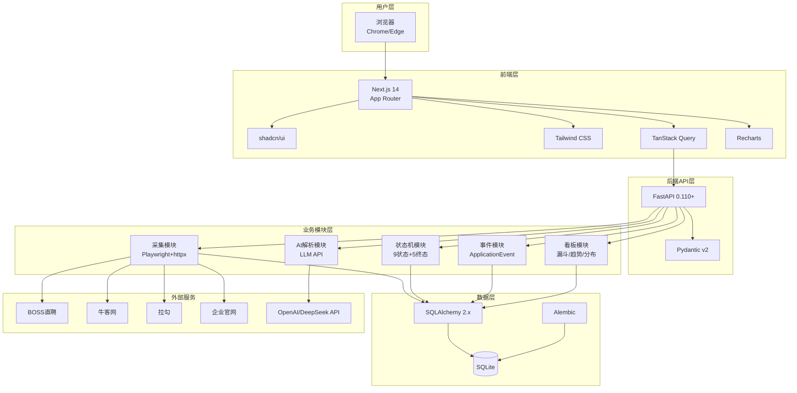
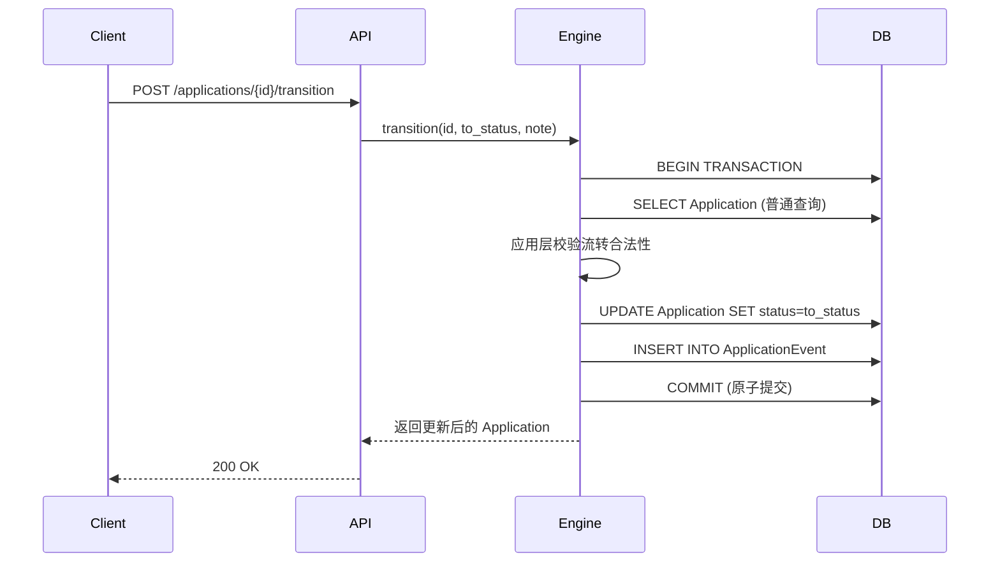

# 系统架构设计

> 阶段 2 地基产出。本文档明确分层、技术选型细化、部署拓扑、目录结构落地，可直接指导 TASK-007~011。
>
> ---
> **版本**：v3.1（v4 愿景校准版）
> **v3.1 修订说明**（2026-07-27）：统一当前本地开发端口为前端 `3100`、后端 `8100`，并补充 Webpack 启动约束及本地运行手册。
> **v3 修订说明**（2026-06-24，配合 `PROJECT-CHARTER.md` v4「双面产品+演进蓝图」愿景）：
> 1. **新增 §九「演进预留」章节**：定义 M0→M1 的架构接缝（多租户、API 三层命名空间、鉴权占位、采集合规、AI 配额）。这些在 M0 **只做注释/命名/抽象层**，不写死代码，但让 M1 升级是"增量"而非"重构"。
> 2. **§3.1 目录结构补全营销面路由**：`/`（落地页）、`/pricing`（定价页）属 brand register，与产品面路由并列。
> 3. **§5.2 路径 C 预留强化**：从“仅部署抽象”扩展为“完整演进路径”，交叉引用 `ROADMAP.md`。
>
> ---
> **版本**：v2（主智能体校准版）
> **v2 修订说明**：v1 结构完整，但存在 3 处代码级错误 + 4 处不足，v2 集中修订：
> 1. **【严重】SQLite 悲观锁错误**：v1 用 `SELECT ... FOR UPDATE`，但 SQLite 不支持行级锁。v2 改为"事务隔离 + 应用层校验"，悲观锁方案延后到 PostgreSQL 迁移后
> 2. **【严重】openai SDK API 过时**：v1 用 `openai.ChatCompletion.create`（0.x API，2023-11 前版本）。v2 改为 1.0+ 的 `AsyncOpenAI` 用法
> 3. **【中】异步/同步混用**：v1 `async def` 里用同步 Session，会阻塞事件循环。v2 明确"Demo 阶段全同步策略"
> 4. **【中】采集事务粒度过大**：v1 单次采集所有岗位一个大事务，SQLite 长事务会锁库。v2 改为批量提交
> 5. **【小】补充本地状态管理库**（Zustand）
> 6. **【小】secrets 示例措辞**（用占位符而非看起来真实的 Key）
> 7. **【小】采集合规架构预留**（crawler/ 目录补 robots.py、rate_limiter.py）

---

## 一、架构总览

### 1.1 一句话架构定位

> **单体应用，模块化分层，本地 Demo 优先**——SQLite 本地存储、FastAPI 后端、Next.js 前端、APScheduler 采集调度，为未来 PostgreSQL 迁移预留抽象。

### 1.2 架构图



### 1.3 关键设计取舍

| 决策 | 选择 | 理由 |
|------|------|------|
| 应用形态 | 单体应用 | Demo 阶段，单体足够；微服务增加复杂度，无收益 |
| 数据库 | SQLite | 零配置、本地优先、单用户场景足够；为 PG 迁移预留抽象层 |
| 前后端分离 | 是 | 前端 Next.js + 后端 FastAPI，通过 REST API 通信 |
| 采集调度 | APScheduler 内嵌 | 无需外部依赖，本地 Demo 足够；未来可拆为独立进程 |
| AI 解析 | 可选降级 | LLM 不可用时回退到快捷交互层，不影响核心功能 |

---

## 二、技术栈细化

| 层 | 技术 | 版本 | 关键库 | 选型理由 |
|----|------|------|-------|---------|
| 前端 | Next.js | 14.x (App Router) | shadcn/ui, Tailwind CSS, TanStack Query, Zustand, Recharts | App Router 支持 RSC；shadcn/ui 组件质量高；TanStack Query 管理服务端状态；**Zustand 管理本地交互状态**（筛选/批量选中/快捷按钮）；Recharts 图表库轻量 |
| 后端 | FastAPI | 0.110+ | Pydantic v2, SQLAlchemy 2.x (同步), APScheduler | 自动生成 OpenAPI 文档；Pydantic v2 性能提升；SQLAlchemy 2.x；APScheduler 轻量调度 |
| 采集 | Playwright (sync) + httpx (sync) | 最新 | beautifulsoup4, lxml, APScheduler | **v2 明确全同步**（SQLite 不适合异步高并发）；Playwright sync API；httpx.Client 同步 |
| 数据库 | SQLite | 3.x | SQLAlchemy ORM (同步 Session), Alembic | 零配置；SQLAlchemy 抽象层便于迁移；Alembic 管理迁移 |
| AI | DeepSeek / OpenAI API | - | openai SDK 1.0+ (`AsyncOpenAI`) | F-C.5 邮件解析；DeepSeek 默认（成本低），OpenAI 备选；**v2 用 1.0+ API** |
| 测试 | pytest | 8.x | pytest-asyncio（AI 模块用）, httpx (TestClient) | FastAPI 官方推荐 |

**关键库说明**：

| 库 | 用途 | 替代方案 | 选择理由 |
|----|------|---------|---------|
| SQLAlchemy | ORM | Tortoise ORM | SQLAlchemy 更成熟，FastAPI 官方示例多 |
| Pydantic v2 | 数据校验 | attrs, marshmallow | FastAPI 原生支持，性能好 |
| TanStack Query | 前端数据获取 | SWR | 功能更全，缓存策略更灵活 |
| Recharts | 图表 | Chart.js, ECharts | React 生态，声明式 API，轻量 |
| Playwright | 动态页面采集 | Selenium | 更快、更稳定、API 更好 |
| APScheduler | 定时调度 | celery, cron | 轻量、内嵌、无需外部依赖 |

---

## 三、系统分层与模块划分

### 3.1 目录结构

```
招聘信息搜集系统/
├── src/
│   ├── api/                    # API 层（FastAPI 路由）
│   │   ├── routes/
│   │   │   ├── public/         # 【v3 演进预留】公开层（营销面+公开数据）
│   │   │   │   ├── landing.py  # 落地页动态内容（如有）
│   │   │   │   └── stats.py    # 公开统计数据（Demo 演示用）
│   │   │   ├── app/            # 【v3 演进预留】应用层（产品面，M0 无鉴权但位置留好）
│   │   │   │   ├── jobs.py     # 岗位相关 API
│   │   │   │   ├── applications.py # 投递管理 API
│   │   │   │   ├── dashboard.py    # 看板统计 API
│   │   │   │   ├── subscriptions.py# 订阅 API
│   │   │   │   └── crawler.py      # 采集管理 API
│   │   │   └── admin/          # 【v3 演进预留】管理层（M0 空路由组，M2 实现）
│   │   ├── deps.py             # 依赖注入（DB session 等）
│   │   └── middleware/         # 【v3 演进预留】中间件占位
│   │       ├── auth.py         # 鉴权占位（M0 no-op，M1 接 OAuth）
│   │       └── tenant.py       # 多租户占位（M0 no-op，M1 注入 tenant_id）
│   │
│   ├── schemas/                # 【v3 调整】schemas 提到 api 同级，路由按层组织
│   │   ├── job.py              # 岗位请求/响应模型
│   │   ├── application.py      # 投递请求/响应模型
│   │   ├── dashboard.py        # 看板响应模型
│   │   └── subscription.py     # 订阅请求/响应模型
│   │
│   ├── core/                   # 核心业务层
│   │   ├── statemachine/
│   │   │   ├── states.py       # 状态定义（9个状态）
│   │   │   ├── transitions.py  # 流转规则
│   │   │   └── engine.py       # 状态机引擎
│   │   ├── events/
│   │   │   ├── models.py       # ApplicationEvent 事件模型
│   │   │   └── service.py      # 事件写入服务
│   │   └── ai/
│   │       ├── parser.py       # LLM 邮件解析
│   │       └── fallback.py     # 降级策略
│   │
│   ├── crawler/                # 采集层
│   │   ├── adapters/
│   │   │   ├── base.py         # 适配器基类
│   │   │   ├── boss.py         # BOSS直聘适配器
│   │   │   ├── nowcoder.py     # 牛客网适配器
│   │   │   ├── lagou.py        # 拉勾适配器
│   │   │   └── company.py      # 企业官网适配器
│   │   ├── scheduler.py        # APScheduler 调度
│   │   ├── parser.py           # 清洗与字段提取
│   │   ├── dedup.py            # 去重
│   │   ├── verifier.py         # 岗位有效性核验
│   │   ├── robots.py           # robots.txt 合规检查（v2 新增）
│   │   └── rate_limiter.py     # 采集速率限制（v2 新增，合规控制）
│   │
│   ├── db/                     # 数据层
│   │   ├── models.py           # SQLAlchemy ORM
│   │   ├── session.py          # 连接管理
│   │   └── migrations/         # Alembic 迁移
│   │
│   ├── config.py               # 配置（采集频率/LLM Key/阈值）
│   └── main.py                 # 入口
│
├── web/                        # 前端（Next.js）
│   ├── app/
│   │   ├── (marketing)/        # 【v3 新增】营销面路由组（brand register）
│   │   │   ├── page.tsx        # 落地页 /
│   │   │   └── pricing/
│   │   │       └── page.tsx    # 定价页 /pricing
│   │   ├── (app)/              # 【v3 新增】产品面路由组（product register）
│   │   │   ├── layout.tsx      # 应用内布局（含应用导航）
│   │   │   ├── dashboard/
│   │   │   │   └── page.tsx    # 看板（落地页 CTA 指向此）
│   │   │   ├── jobs/
│   │   │   │   ├── page.tsx    # 岗位列表
│   │   │   │   └── [id]/page.tsx # 岗位详情
│   │   │   ├── applications/
│   │   │   │   ├── page.tsx    # 投递管理
│   │   │   │   └── [id]/page.tsx # 投递详情/时间线
│   │   │   ├── saved/
│   │   │   │   └── page.tsx    # 收藏/待投递（Tabs）
│   │   │   ├── todo/
│   │   │   │   └── page.tsx    # 待办视图
│   │   │   ├── subscriptions/
│   │   │   │   └── page.tsx    # 订阅管理
│   │   │   └── crawler/
│   │   │       └── page.tsx    # 采集管理
│   │   ├── layout.tsx          # 根布局
│   │   └── manifest.ts         # 【v3 新增】PWA manifest
│   ├── components/
│   │   ├── ui/                 # shadcn/ui 组件（两面共享）
│   │   ├── marketing/          # 【v3 新增】营销面组件（hero/feature/pricing-card）
│   │   ├── jobs/               # 岗位相关组件（产品面）
│   │   ├── applications/       # 投递相关组件（产品面）
│   │   └── dashboard/          # 看板相关组件（产品面）
│   ├── public/
│   │   ├── manifest.json       # PWA 配置
│   │   └── icons/              # PWA 图标
│   └── lib/
│       ├── api.ts              # API 客户端
│       └── utils.ts            # 工具函数
│
├── tests/                      # 测试
│   ├── test_api/
│   ├── test_core/
│   ├── test_crawler/
│   └── conftest.py
│
├── config/                     # 配置文件
│   └── sources.yaml            # 采集源配置
│
├── data/                       # 本地数据
│   └── jobpulse.db             # SQLite 数据库文件
│
├── .env                        # 环境变量（不提交 git）
├── .env.example                # 环境变量示例
├── pyproject.toml              # Python 项目配置
├── package.json                # Node.js 项目配置
└── README.md
```

### 3.2 模块职责边界

| 模块 | 职责 | 不做什么 | 依赖 |
|------|------|---------|------|
| **api/** | HTTP 路由、请求校验、响应序列化 | 业务逻辑 | core/ |
| **core/statemachine/** | 状态流转规则、校验、执行 | 数据持久化 | db/ |
| **core/events/** | ApplicationEvent 写入、查询 | 状态流转 | db/ |
| **core/ai/** | LLM 邮件解析、降级策略 | 状态流转 | 外部 LLM API |
| **crawler/** | 采集、清洗、去重、核验 | 投递管理 | db/ |
| **db/** | ORM、连接、迁移 | 业务逻辑 | SQLAlchemy |
| **web/** | UI 展示、用户交互 | 业务逻辑 | api/ |

---

## 四、关键流程的架构实现

### 4.1 状态机流转的原子性

**核心要求**：Application.status 更新 + ApplicationEvent 写入必须在**同一事务**内。

> ⚠️ **v2 关键修正**：v1 用 `SELECT ... FOR UPDATE` 悲观锁，但 **SQLite 不支持行级锁**（SQLite 用数据库级锁 + WAL 模式）。
> v2 策略：**Demo 阶段（SQLite）用事务隔离 + 应用层校验**；悲观锁方案**延后到 PostgreSQL 迁移后**启用。
> 单用户 Demo 场景并发概率极低，事务原子性已足够保证一致性。

**伪代码（v2，SQLite 适配版）**：

```python
# core/statemachine/engine.py

class StateMachineEngine:
    def transition(
        self,
        application_id: int,
        to_status: str,
        note: str = None,
        is_correction: bool = False,
        correction_reason: str = None
    ) -> Application:
        """
        状态流转（原子操作，SQLite 适配）
        策略：事务隔离 + 应用层校验（Demo 阶段单用户，无需悲观锁）
        """
        with db.session.begin():  # 事务开始（SQLite 数据库级锁保证原子性）
            # 1. 读取当前状态（普通查询，非 FOR UPDATE）
            app = db.session.query(Application).get(application_id)
            if app is None:
                raise ApplicationNotFoundError(application_id)
            from_status = app.status

            # 2. 应用层校验流转合法性（替代数据库锁的并发控制）
            if not self._is_valid_transition(from_status, to_status, is_correction):
                raise InvalidTransitionError(from_status, to_status)

            # 3. 更新状态
            app.status = to_status
            app.updated_at = datetime.utcnow()

            # 4. 写入事件日志（同一事务，原子提交）
            event = ApplicationEvent(
                application_id=application_id,
                event_type='correction' if is_correction else 'status_change',
                from_status=from_status,
                to_status=to_status,
                is_correction=is_correction,
                correction_reason=correction_reason,
                note=note,
                occurred_at=datetime.utcnow()
            )
            db.session.add(event)

            # 5. 事务提交（自动）—— Application + ApplicationEvent 原子落库
            return app
```

**并发控制策略（分阶段）**：

| 阶段 | 数据库 | 并发方案 | 理由 |
|------|--------|---------|------|
| **Demo（当前）** | SQLite | 事务隔离 + 应用层校验 | 单用户，SQLite 数据库级锁已保证原子性；行级锁在 SQLite 无意义 |
| **未来上线** | PostgreSQL | `SELECT ... FOR UPDATE` 悲观锁 | 多用户并发，需要行级锁防竞态 |

**PostgreSQL 迁移时的升级点**（仅预留，Demo 不实现）：
```python
# 未来在 get_engine() 检测到 PostgreSQL 时启用
app = db.session.query(Application).with_for_update().get(application_id)
```

**时序图**：



### 4.2 ApplicationEvent 的写入策略

**写入时机**：
- 每次状态变更触发事件写入（同一事务）
- 纠错事件标记 `is_correction=true`

**索引设计**（TASK-007 详细设计）：

```sql
-- 漏斗查询索引
CREATE INDEX idx_event_type_not_correction 
ON ApplicationEvent(event_type) 
WHERE is_correction = false;

-- 待办查询索引
CREATE INDEX idx_event_scheduled 
ON ApplicationEvent(event_type, scheduled_at) 
WHERE scheduled_at IS NOT NULL AND occurred_at IS NULL;

-- 投递记录查询索引
CREATE INDEX idx_event_application 
ON ApplicationEvent(application_id, occurred_at);
```

**漏斗查询示例**：

```python
# 查询投递漏斗
funnel = db.session.query(
    ApplicationEvent.to_status,
    func.count(func.distinct(ApplicationEvent.application_id))
).filter(
    ApplicationEvent.event_type == 'status_change',
    ApplicationEvent.is_correction == False
).group_by(
    ApplicationEvent.to_status
).all()
```

### 4.3 采集流程的事务边界

> ⚠️ **v2 关键修正**：
> 1. v1 用 `async def` + 同步 `db.session`，会阻塞事件循环。v2 明确**全同步策略**
> 2. v1 单次采集所有岗位一个大事务，SQLite 长事务会锁库。v2 改为**批量提交**（每批 20 条）

**全同步策略说明**（Demo 阶段）：
- FastAPI 路由用 `def`（非 `async def`），FastAPI 会自动放线程池，不阻塞主线程
- SQLAlchemy 用同步 `Session`
- httpx 用同步客户端（`httpx.Client`），Playwright 用同步 API（`sync_playwright`）
- **理由**：SQLite 本身不适合高并发异步；Demo 单用户场景同步更简单可靠；未来迁 PostgreSQL 时再评估异步改造

**单次采集流程**：

```
抓取 → 清洗 → 去重 → 入库（批量提交）
```

**事务策略**：
- **抓取**：不事务化（网络 I/O，无法回滚）
- **清洗+去重**：不事务化（纯计算）
- **入库**：**批量事务化**（每批 20 条一个事务），部分失败不影响已成功的

**伪代码（v2，全同步 + 批量提交）**：

```python
# crawler/scheduler.py

BATCH_SIZE = 20  # 每批入库条数

def crawl_source(source: str):
    """单次采集流程（全同步）"""
    try:
        # 1. 抓取（不事务化，同步 I/O）
        raw_jobs = fetch_source(source)  # 用 httpx.Client 或 sync_playwright

        # 2. 清洗 + 去重（不事务化，纯计算）
        parsed_jobs = []
        for raw_job in raw_jobs:
            job_data = parser.parse(raw_job)
            if job_data:  # 清洗失败的不入库
                parsed_jobs.append(job_data)

        # 3. 批量入库（每批一个事务，部分失败不影响整体）
        success_count = 0
        fail_count = 0
        for i in range(0, len(parsed_jobs), BATCH_SIZE):
            batch = parsed_jobs[i:i+BATCH_SIZE]
            try:
                with db.session.begin():  # 每批一个短事务
                    for job_data in batch:
                        existing = dedup.find_duplicate(job_data)
                        if existing:
                            dedup.merge(existing, job_data)
                        else:
                            db.session.add(Job(**job_data))
                    success_count += len(batch)
            except Exception as batch_error:
                # 单批失败不中断整个采集，记录日志继续
                fail_count += len(batch)
                logger.warning(f"[CRAWL] batch {i//BATCH_SIZE} failed: {batch_error}")

        # 4. 记录采集日志
        log_crawl_result(source, success=True,
                        total=len(raw_jobs), saved=success_count, failed=fail_count)

    except Exception as e:
        # 整体失败（如抓取失败）
        log_crawl_result(source, success=False, error=str(e))
        raise
```

**为什么批量提交**：
- SQLite 长事务会持有写锁，阻塞其他读写
- 批量提交（每批 20 条）让锁持有时间极短
- 部分失败时已成功的批次保留，符合采集场景"尽量多保留有效数据"

**失败重试策略**：
- 网络异常：立即重试 1 次，失败后记录日志
- 反爬被封：降低频率，切换 User-Agent
- 页面结构变更：标记为"需人工检查"

### 4.4 AI 解析的降级链

**核心要求**：LLM 不可用时回退到快捷交互层，不影响核心功能。

> ⚠️ **v2 关键修正**：v1 用 `openai.ChatCompletion.create(...)`，这是 openai SDK **0.x API**（2023-11 前版本，今天会直接报错）。v2 改为 **1.0+ 的 `AsyncOpenAI` 用法**。
> 注：虽然 §4.3 主张全同步，但 LLM 调用是慢 I/O（几秒），用异步避免阻塞；入库时回到同步 Session。

**降级链设计**：

```
LLM 可用 → 解析 → 用户确认 → 入库
    ↓ (不可用/超时/限流/置信度低)
正则解析 → 用户确认 → 入库
    ↓ (正则也失败)
返回 None → 快捷交互层（用户手动选择）→ 入库
```

**伪代码（v2，openai 1.0+ API）**：

```python
# core/ai/parser.py
from openai import AsyncOpenAI  # openai SDK 1.0+

class AIParser:
    def __init__(self):
        # 注意：AsyncOpenAI 用于 LLM 慢 I/O；入库回到同步 Session
        self.client = AsyncOpenAI(api_key=config.OPENAI_API_KEY)
        self.rate_limiter = RateLimiter(max_per_minute=config.LLM_MAX_PER_MINUTE)
        self.cache = TTLCache(ttl=3600)  # 1 小时缓存

    async def parse_email(self, email_text: str) -> Optional[ParsedResult]:
        """
        解析邮件文本，提取公司+岗位+新状态
        三级降级：LLM → 正则 → None
        """
        # 0. 缓存命中
        cache_key = hash(email_text)
        if cache_key in self.cache:
            return self.cache[cache_key]

        # 1. 限流检查
        if not self.rate_limiter.allow():
            logger.warning("[AI] rate limited, fallback to regex")
            return self._regex_parse(email_text)

        # 2. 尝试 LLM 解析
        try:
            result = await self._call_llm(email_text)
            if result and result.confidence >= 0.7:
                self.cache[cache_key] = result
                return result
            # 置信度低，降级
        except (LLMTimeoutError, LLMRateLimitError, LLMAuthError) as e:
            logger.warning(f"[AI] LLM unavailable: {e}, fallback to regex")
        except Exception as e:
            logger.error(f"[AI] LLM unexpected error: {e}", exc_info=True)

        # 3. 降级到正则解析
        result = self._regex_parse(email_text)
        if result:
            self.cache[cache_key] = result
            return result

        # 4. 最终降级：返回 None，前端走快捷交互层
        return None

    async def _call_llm(self, text: str) -> Optional[ParsedResult]:
        """调用 LLM API（openai 1.0+ 语法）"""
        try:
            response = await asyncio.wait_for(
                self.client.chat.completions.create(
                    model=config.LLM_MODEL,
                    messages=[
                        {"role": "system", "content": EMAIL_PARSE_PROMPT},
                        {"role": "user", "content": text}
                    ],
                    response_format={"type": "json_object"},  # 强制 JSON 输出
                ),
                timeout=config.LLM_TIMEOUT
            )
            return self._parse_response(response.choices[0].message.content)
        except asyncio.TimeoutError:
            raise LLMTimeoutError()

    def _regex_parse(self, text: str) -> Optional[ParsedResult]:
        """正则解析（降级，零成本零依赖）"""
        company = self._extract_company(text)  # 关键词匹配
        status = self._extract_status(text)    # 笔试/面试/Offer 关键词
        if company and status:
            return ParsedResult(company=company, status=status, confidence=0.5)
        return None
```

**关键设计点**：
- **LLM 调用用异步**（`AsyncOpenAI`），但**入库回到同步 Session**（在 API 层用 `asyncio.to_thread` 或 FastAPI 的同步路由处理）
- **强制 JSON 输出**（`response_format`），避免解析 LLM 自由文本
- **三级降级**：LLM（高置信度）→ 正则（低置信度）→ None（用户手动）

**成本控制**：
- **缓存**：相同邮件文本 1 小时内不重复调用（TTLCache）
- **限流**：每分钟最多 10 次 LLM 调用（RateLimiter，超出直接降级）
- **超时**：LLM 调用 5 秒超时（`asyncio.wait_for`）
- **模型选择**：默认 DeepSeek（成本更低），OpenAI 作为备选

---

## 五、部署拓扑

### 5.1 本地 Demo（当前路径 B）

**本地部署图**：

```
┌─────────────────────────────────────────────────────────┐
│                    本地开发环境                           │
│                                                         │
│  ┌─────────────┐    ┌─────────────┐    ┌─────────────┐ │
│  │  Next.js    │    │  FastAPI    │    │  APScheduler│ │
│  │  (Port 3100)│───▶│  (Port 8100)│    │  (内嵌)     │ │
│  └─────────────┘    └──────┬──────┘    └──────┬──────┘ │
│                            │                   │        │
│                            ▼                   ▼        │
│                     ┌─────────────┐    ┌─────────────┐ │
│                     │  SQLite     │    │  采集源     │ │
│                     │  (data/*.db)│    │  (外部网站) │ │
│                     └─────────────┘    └─────────────┘ │
│                                                         │
│  启动方式：                                              │
│  1. 后端：uvicorn（Port 8100）                            │
│  2. 前端：Next.js + Webpack（Port 3100）                 │
│  3. 采集：APScheduler 自动运行（内嵌在 FastAPI 进程中）    │
└─────────────────────────────────────────────────────────┘
```

**启动命令**：

```powershell
# 后端
Set-Location 招聘信息搜集系统
python -m uvicorn src.main:app --host 127.0.0.1 --port 8100 --reload

# 前端
Set-Location web
npm run dev -- --webpack --hostname 127.0.0.1 --port 3100

# 访问
# 前端：http://127.0.0.1:3100
# 后端健康检查：http://127.0.0.1:8100/health
# API 文档：http://127.0.0.1:8100/docs
```

分别在前端和后端运行终端按 `Ctrl+C` 即可关闭服务。完整运行手册见 [`docs/operations/LOCAL-DEVELOPMENT.md`](../operations/LOCAL-DEVELOPMENT.md)。

**SQLite 文件位置**：
- 开发环境：`data/jobpulse.db`
- 测试环境：`data/jobpulse_test.db`

### 5.2 未来上线（路径 C / M1，演进预留，Demo 不实现）

> **v3 更新**：本节从“仅部署抽象”升级为“完整演进路径锚点”。详细里程碑与触发条件见 `docs/product/ROADMAP.md`。

**M1 部署拓扑**（Pro SaaS）：

```
┌─────────────┐     ┌─────────────┐     ┌─────────────┐
│   Vercel    │     │  云服务器    │     │  云数据库    │
│  (前端)     │────▶│  (后端+采集) │────▶│ (PostgreSQL)│
└─────────────┘     └─────────────┘     └─────────────┘
```

**抽象层设计**：
- 数据库连接：通过 `config.py` 切换 SQLite/PostgreSQL
- 环境变量：通过 `.env` 文件切换 dev/demo/prod
- 采集频率：通过配置文件调整

---

## 六、配置与 secrets 管理

### 6.1 配置项清单

| 配置项 | 类型 | 默认值 | 说明 |
|--------|------|--------|------|
| `DATABASE_URL` | str | `sqlite:///data/jobpulse.db` | 数据库连接字符串 |
| `CRAWL_INTERVAL_MINUTES` | int | 60 | 采集间隔（分钟） |
| `CRAWL_MAX_CONCURRENT` | int | 3 | 最大并发采集数 |
| `CRAWL_USER_AGENT` | str | `JobPulse/1.0` | User-Agent |
| `NO_RESPONSE_DAYS` | int | 14 | 无回应关闭阈值（天） |
| `LLM_MODEL` | str | `gpt-3.5-turbo` | LLM 模型 |
| `LLM_TIMEOUT` | int | 5 | LLM 调用超时（秒） |
| `LLM_MAX_PER_MINUTE` | int | 10 | LLM 每分钟最大调用数 |
| `PAGE_SIZE` | int | 20 | 每页条数 |
| `LOG_LEVEL` | str | `INFO` | 日志级别 |

### 6.2 secrets 管理

**方式**：`.env` 文件，不提交 git

**.env.example**（v2：用占位符，避免看起来像真实 Key）：

```bash
# 数据库
DATABASE_URL=sqlite:///data/jobpulse.db

# LLM API（替换 <your-key-here> 为你的真实 Key）
OPENAI_API_KEY=<your-openai-key-here>
DEEPSEEK_API_KEY=<your-deepseek-key-here>

# 采集配置
CRAWL_INTERVAL_MINUTES=60
CRAWL_MAX_CONCURRENT=3

# 日志级别（DEBUG/INFO/WARNING/ERROR）
LOG_LEVEL=INFO
```

**安全要求**：
- `.env` 必须在 `.gitignore` 中（绝不提交真实 Key）
- 占位符用 `<your-key-here>`，不要用看起来真实的 `sk-xxx`
- Demo 演示前确认 `.env` 未被意外提交（`git status` 检查）

**.gitignore**：

```
.env
data/*.db
```

### 6.3 不同环境的配置差异

| 环境 | 数据库 | 采集频率 | LLM | 日志级别 |
|------|--------|---------|-----|---------|
| dev | `data/jobpulse_test.db` | 手动触发 | 可选 | DEBUG |
| demo | `data/jobpulse.db` | 60分钟 | 启用 | INFO |
| prod | PostgreSQL | 30分钟 | 启用 | WARNING |

---

## 七、跨切面关注点

### 7.1 日志策略

| 日志类型 | 级别 | 格式 | 存储 |
|---------|------|------|------|
| 采集日志 | INFO | `[CRAWL] {source} {status} {count} {duration}` | 控制台 + 文件 |
| 状态变更日志 | INFO | `[STATE] {app_id} {from} → {to}` | 控制台 + ApplicationEvent |
| AI 调用日志 | INFO | `[AI] {input_len} {output} {latency} {cost}` | 控制台 + 文件 |
| 错误日志 | ERROR | `[ERROR] {module} {traceback}` | 控制台 + 文件 |

### 7.2 错误处理

**统一异常体系**：

```python
# src/core/exceptions.py

class JobPulseError(Exception):
    """基础异常"""
    pass

class InvalidTransitionError(JobPulseError):
    """状态流转非法"""
    pass

class CrawlError(JobPulseError):
    """采集异常"""
    pass

class LLMError(JobPulseError):
    """LLM 调用异常"""
    pass
```

**API 错误响应格式**：

```json
{
    "detail": {
        "code": "INVALID_TRANSITION",
        "message": "不允许从 已投递 流转到 已收藏",
        "from_status": "已投递",
        "to_status": "已收藏"
    }
}
```

### 7.3 可观测性（Demo 阶段最小监控）

| 指标 | 采集方式 | 阈值 |
|------|---------|------|
| 采集成功率 | 采集日志统计 | < 80% 告警 |
| API 响应时间 | FastAPI 中间件 | > 1s 告警 |
| 状态机流转错误 | 应用日志 | 出现即告警 |

### 7.4 数据迁移（SQLite → PostgreSQL 预留）

**抽象层设计**：

```python
# src/db/session.py

from sqlalchemy import create_engine
from sqlalchemy.orm import sessionmaker

def get_engine(database_url: str = None):
    """获取数据库引擎（支持 SQLite/PostgreSQL）"""
    url = database_url or config.DATABASE_URL
    if url.startswith("sqlite"):
        engine = create_engine(url, connect_args={"check_same_thread": False})
    else:
        engine = create_engine(url)
    return engine
```

**迁移步骤（未来）**：
1. 安装 psycopg2
2. 修改 `DATABASE_URL` 为 PostgreSQL 连接字符串
3. 运行 Alembic 迁移
4. 数据导出导入（SQLite → PostgreSQL）

---

## 八、与后续任务的衔接说明

| 后续任务 | 本任务提供的输入 |
|---------|----------------|
| **TASK-007 数据库** | §3 目录结构 + §4.1/4.2 事务方案 + §7.4 迁移预留 + §9.1 多租户预留 |
| **TASK-008 API** | §3 API 层结构 + §4.1 状态机 API 设计 + §9.2 三层命名空间 |
| **TASK-009 采集** | §3 crawler 层 + §4.3 采集事务 + §9.4 合规预留 |
| **TASK-010 AI** | §4.4 降级链 + §9.5 配额预留 |
| **TASK-011 安全门禁** | §4 + §7 跨切面 + §9 演进预留 |
| **TASK-016b craft-marketing** | §3 营销面路由结构（`(marketing)` 路由组）|

---

## 九、演进预留（M0 → M1 架构接缝）

> **v3 新增章节**。配合 `PROJECT-CHARTER.md` v4「演进蓝图」与 `ROADMAP.md`。
>
> **核心原则**：M0 阶段**只做注释/命名/抽象层**，不写死代码。每项预留都能指认对应的 M1 需求。这些接缝在 M0 成本几乎为零（几行注释 + 命名规范），但让 M1 的升级是"增量"而非"重构"。
>
> **作品集价值**：这是架构前瞻性的展示点——"我想到了演进路径并做了架构预留"比"我做了个 Demo"高级。

### 9.1 多租户数据隔离预留

**M0 状态**：不实现，但 schema 标注预留位。

**预留方式**：在 `database-schema.md` 的每张业务表（Job/Application/ApplicationEvent/Subscription 等）定义中，加迁移注释：

```python
# db/models.py

class Application(Base):
    __tablename__ = "applications"
    id = Column(Integer, primary_key=True)
    # tenant_id = Column(Integer, ForeignKey("tenants.id"), nullable=True)
    # ↑ M1 多租户预留：M0 注释，M1 取消注释并建表。M0 单用户场景 nullable，
    #   M1 迁移时回填默认 tenant_id 后加 NOT NULL 约束。
    # 迁移脚本：alembic revision --autogenerate -m "add tenant_id"
    status = Column(String(32), nullable=False)
    ...
```

**M1 激活步骤**：
1. 新建 `tenants` 表（id, name, plan, created_at）
2. 取消注释 `tenant_id` 列，建迁移
3. 回填现有数据为默认 tenant（作者本人）
4. 加 NOT NULL 约束 + 索引
5. 所有查询注入 `WHERE tenant_id = :current_tenant_id`

### 9.2 API 三层命名空间

**M0 状态**：路由按三层组织（§3.1 已调整目录结构），M0 的 `/app/*` 无鉴权但位置就位。

| 层 | 路径前缀 | M0 | M1 | M2 |
|----|---------|----|----|-----|
| **public** | `/api/public/*` | 营销面公开数据 | 同 + 公开统计 | 同 |
| **app** | `/api/app/*` | 产品面，无鉴权 | OAuth 鉴权 + tenant 注入 | + RBAC |
| **admin** | `/api/admin/*` | 空路由组（位置占位） | 简单后台 | 组织/用量管理 |

**鉴权中间件占位**（M0 no-op，M1 接真实逻辑）：

```python
# api/middleware/auth.py

async def auth_middleware(request: Request, call_next):
    """
    M0: no-op（单用户，无鉴权需求）
    M1: 解析 Authorization header → 校验 JWT → 注入 request.state.user
    M2: 同 M1 + 注入 request.state.role（owner/admin/member）
    """
    # M0 占位：直接放行
    request.state.user = None  # M1 改为真实 user 对象
    request.state.tenant_id = None  # M1 改为从 user 推导
    return await call_next(request)
```

### 9.3 数据库抽象层（已实现）

`get_engine()`（§7.4）已支持 SQLite/PostgreSQL 切换。M1 迁移步骤：
1. 创建 PostgreSQL 实例
2. 修改 `DATABASE_URL`
3. `alembic upgrade head`
4. 数据导出（SQLite）→ 导入（PostgreSQL）

### 9.4 采集合规预留（已占位）

`crawler/robots.py` + `crawler/rate_limiter.py` 已在目录结构（v2 新增）。M0 实现 fail-closed robots 检查 + 速率限制；M1 额外加：
- API 优先策略（优先用平台官方 API，降级到爬虫）
- 合规审计日志（记录每次采集的 robots 检查结果）

### 9.5 AI 解析配额预留

`AIParser.rate_limiter`（§4.4）已存在（M0 全局限流）。M1 改造为按账户配额：
- M0：全局 `LLM_MAX_PER_MINUTE=10`
- M1：按 tenant 的 plan 查配额表（Free=0/月、Pro=100/月、Team=300/月）

**预留点**：rate_limiter 的限流键从"全局"改为"tenant_id"是一行代码改动，前提是 §9.1/9.2 已激活。

### 9.6 前端双面路由隔离（已实现）

§3.1 已用 Next.js Route Groups 实现：
- `(marketing)/` —— brand register，营销面
- `(app)/` —— product register，产品面

两面共享根 `layout.tsx` 和 `components/ui/`，但各有独立布局与组件目录。M1 可在 `(app)` 层加鉴权 guard 而不污染 `(marketing)`。

### 9.7 演进预留清单（M0 必须 vs 可选）

| 预留项 | M0 必须 | 理由 |
|--------|---------|------|
| schema 多租户注释 | ✅ 必须 | 零成本，M1 省重构 |
| API 三层命名空间 | ✅ 必须 | 零成本，M1 加鉴权不破坏路由 |
| 鉴权中间件 no-op | ✅ 必须 | 零成本，M1 填充逻辑 |
| get_engine 抽象 | ✅ 已实现 | v2 已完成 |
| 采集合规占位 | ✅ 已实现 | v2 已完成 |
| AI rate_limiter | ✅ 已实现 | v2 已完成 |
| 前端双面路由 | ✅ 必须 | 零成本，M1 加 guard 不破坏 |
| PWA manifest | ✅ 必须 | 零成本，演示加分 |

---

*文档版本：v3.1 | 最后更新：2026-07-27 | 上游：`PROJECT-CHARTER.md` v4 | 演进细节：`ROADMAP.md`*
