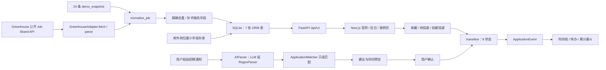

# JobPulse｜项目简历与面试手册

> 用途：产品经理、AI 产品经理及数据/AI 产品实习岗位的简历投递与项目面试准备<br>
> 项目角色：产品经理（个人主导，用户已确认）<br>
> 项目周期：2026.05—2026.07（用户已确认）<br>
> 当前形态：共享演示数据的 SaaS Demo、产品案例与前后端部署记录<br>
> 事实审计日期：2026-08-03；当前 JD 专项更新：2026-08-19<br>
> Git 基线：`35b3b6e`；仓库无 tag；本次手册修改尚未提交

这份手册优先回答三件事：简历中的话如何证明、项目关键机制怎样工作、哪些结果不能声称。代码、测试和当前实现优先于旧文档；用户确认只用于角色、周期和面试背景，不替代系统或业务证据。

---

## 使用与速览

- 投递产品经理：使用“产品经理主投版”，重点复习问题定义、范围取舍、状态/事件设计和两个 P0 缺口案例。
- 投递 AI 产品经理：在主投版基础上准备 AI 解析链路、结构化输出、降级、人工确认、隐私和评测缺口。
- 当前目标 JD：鱼快创领“数据/AI 产品实习生”，先读“当前面试专项”，再回看 Q8—Q15 的项目证据。
- 快速面试准备：先读“面试覆盖图”，再练 Q1—Q16；Q17—Q21 用于压力自测。
- 历史岗位复盘：海威融创需求分析实习生不是当前目标 JD，只在文末保留事实纠偏后的专项准备。
- 所有数字先查“声明台账与证据索引”；无法解释数据集、日期和分母时，不在面试中使用。

公开入口：

- SaaS 官网：<https://jobpulse-product-demo.tongqtang.chatgpt.site>
- 产品后台：<https://jobpulse-product-demo.tongqtang.chatgpt.site/dashboard>
- 产品案例：<https://jobpulse-product-demo.tongqtang.chatgpt.site/case-study>
- API 健康检查：<https://jobpulse-api-production.up.railway.app/health>

2026-08-03 的命令行复验中，API 健康检查返回 HTTP 200；三个前端地址对自动请求返回 HTTP 403。因此可证明“有公开部署和历史验收记录”，但面试前仍需用普通浏览器人工确认当前可访问性。

### 项目定位

**一句话介绍**：面向高频跨平台求职场景，把分散岗位、收藏与待投递、投递状态、近期安排和进展复盘连接为一条可追溯流程的招聘信息聚合与投递管理 Demo。

**核心问题**：招聘平台擅长发现岗位，Excel/Notion、邮箱和日历可以分别保存进度或时间，但跨渠道后的重复录入、状态历史和下一步行动仍可能分散。项目要验证的不是“用户是否需要另一个表格”，而是专用流程能否降低持续维护成本。

**当前结论**：仓库证明了产品定义、实现闭环、数据质量控制和工程交付；尚未证明用户愿意迁移、持续使用、付费或获得更好求职结果。

### 最强卖点、最弱证据与高风险追问

| 维度 | 结论 |
|---|---|
| 最强卖点 | 个人主导完成从问题研究、MVP 取舍、状态/事件设计到前后端、测试、部署与作品集表达的闭环 |
| 最强实现证据 | 9 状态/5 终态、事件时间线、计划待办、AI/正则降级、公开 ATS 采集、120 项自动化测试 |
| 最弱证据 | 真人访谈、可用性测试、持续使用、留存、付费和模型准确率均无结果 |
| 最可能质疑 | “公开记录是否冒充访谈”“20/26 是否冒充成功率”“SaaS 是否有用户”“AI 是否只是正则”“个人项目如何证明协作” |

---

## 声明台账与文档冲突

状态语义：

- **已验证**：源码、测试、可复现命令或发布产物直接证明。
- **有支持**：实现与文档一致，但缺完整运行或外部效果证据。
- **用户确认**：仓库无法证明，由用户明确确认的个人事实。
- **仅设计/文档**：有方案或产物，不能证明已经执行或产生效果。
- **规划**：Roadmap、实验和下一步。
- **无法核验**：材料不足且用户未确认。
- **相互矛盾**：不同材料对同一事实不一致。

### 核心声明台账

| 声明 | 状态 | 证据或确认来源 | 可用范围 | 正确边界 |
|---|---|---|---|---|
| 项目由候选人个人主导 | 用户确认 | 2026-08-03 用户确认；Git 历史主要为同一作者 | 简历、口述 | 不扩展为带团队或跨部门协作 |
| 周期为 2026.05—2026.07 | 用户确认 | 2026-08-03 用户确认 | 简历、口述 | 仓库最近提交为 2026-07-31，不称持续运营至今 |
| 当前主投产品经理、AI 产品经理；当前面试岗位为鱼快创领“数据/AI 产品实习生” | 用户确认 | 2026-08-03 确认主投方向；2026-08-19 提供当前面试 JD | 简历选择、问答优先级 | JD 图片只证明岗位要求，不证明候选人已经具备全部能力 |
| 19 条公开求职记录 | 有支持 | [公开情景研究](../research/online-scenario-role-walkthrough-2026-07-28.md) | 简历研究动作、面试 | 12 条国内 + 7 条英语社区；不是访谈，不能推断比例 |
| 6 个主要竞品、20 条 Job Stories | 有支持 | [竞品分析](../research/competitor-analysis.md)、[JTBD](../product/JTBD.md) | 简历、面试 | 是桌面研究和需求产物，不证明用户认同 |
| 9 状态、5 终态 | 已验证 | [models.py](../../src/db/models.py)、[transitions.py](../../src/core/statemachine/transitions.py)、测试 | 简历、面试 | 前端主动纠错入口仍缺 |
| 状态与计划事件原子提交 | 已验证 | [applications.py](../../src/api/routes/app/applications.py)、[engine.py](../../src/core/statemachine/engine.py)、P0 测试 | 简历、面试 | SQLite 未使用行级锁，不代表高并发能力 |
| 4 个 Greenhouse 来源 | M0 已验证、M1 已停用 | [sources.yaml](../../config/sources.yaml)、[greenhouse.py](../../src/crawler/adapters/greenhouse.py) | 简历、面试 | 只作为历史链路证据；不再作为国内校招实时供给 |
| 24 条确定性岗位快照 | 已验证 | [demo_data.py](../../src/db/demo_data.py)、[验收报告](../qa/ACCEPTANCE-REPORT.md) | 简历、面试 | 是明确标记的 Demo 数据，不是真实在招库存 |
| 56 条岗位、100% JD/链接、98% 要求 | 有支持 | [可信岗位采集专项](../engineering/CREDIBLE-JOB-INGESTION.md) | 面试展开 | 仅适用于专项当次 24 Demo + 32 公开岗位数据集 |
| 120 项后端测试通过 | 已验证 | `python -m pytest -q`、[tests](../../tests/) | 简历、面试 | 同时有 257 条弃用警告；不等于无缺陷 |
| 32 个业务端点、7 张 ORM 表 | 已验证 | [routes](../../src/api/routes/app/)、[models.py](../../src/db/models.py) | 面试实现深挖 | 是实现规模，不是用户价值或性能结果 |
| 11 个页面文件、14 个构建路由项 | 已验证 | [web/app](../../web/app/)、`npm run build` | 面试 | 14 项包含 `_not-found`、icon、manifest 等技术路由，不称 14 个产品页面 |
| 修复后 20/26 | 有支持 | [专家走查](../research/online-scenario-role-walkthrough-2026-07-28.md)、[脚本](../../web/scripts/role-walkthrough-26.mjs) | 面试复盘 | 是专家预设结果覆盖，不是用户任务成功率 |
| 已公开部署 | 有支持 | [部署记录](../qa/DEPLOYMENT-2026-07-22.md)、API 当前 200 | 简历可写“完成公开部署记录” | 前端当前自动请求 403，不能保证此刻所有访客可访问 |
| 真人访谈、可用性和 7 天试用 | 规划 | [验证计划](../research/user-validation-plan.md)、[空结果模板](../research/user-interview-results-3-participants.md) | 仅下一步 | 真人样本当前为 0 |
| 账号、通知发送、支付、多租户 | 规划 | [Roadmap](../product/ROADMAP.md) | 仅下一步 | 不写成 SaaS 已有能力 |

### 文档冲突处理

| 冲突 | 审计结论 |
|---|---|
| 手册残留 Git 冲突标记 | 已清理；保留锁定的三点精简版和有实现依据的“四类核心难题”素材 |
| 旧项目章程写独立定价页、PWA 和更强 SaaS 营销 | 当前代码只有首页定价边界区和 Web manifest；没有独立定价路由、支付或离线 Service Worker |
| MRD/旧章程把市场空白写得过强 | 降级为桌面研究判断；公开材料不能证明市场比例或迁移意愿 |
| 验收报告写纠错通过，PRD 写前端纠错入口缺失 | 后端/API 纠错与事件展示存在，前端没有主动发起纠错的交互入口 |
| 旧手册写“线上首页 HTTP 200” | 这是历史验收；本次自动请求前端为 403，只保留部署事实并要求人工复验 |
| 历史面试专项写 Axure、MySQL/SQL Server、客户培训、团队配合和 100% 回归 | 仓库不能证明，已在历史专项中改成能力缺口或可迁移方法 |

---

## 简历表达锁定区

本区各岗位版本共用同一事实基线，只调整条目顺序、关键词和强调重点；任何版本均不得改变项目角色、研究性质、数据口径和交付边界。

### 统一项目卡片

**项目名称**：JobPulse 招聘信息聚合与投递管理 SaaS Demo

**项目角色**：产品经理（个人主导）

**项目时间**：2026.05—2026.07

**项目形态**：共享演示数据的 SaaS Demo + 产品作品集 + 公开部署记录

**项目介绍**：面向高频跨平台求职场景中的岗位信息分散、投递状态难维护和关键安排容易遗漏等问题，设计并交付覆盖岗位发现、求职意向、投递推进、近期安排和进展复盘的招聘管理产品。

### 产品经理主投版

**适配关键词**：公开内容研究、竞品分析、需求分析、产品规划、信息架构、业务流程、原型设计、PRD、项目推进、功能验收、交付。

- **用户研究与问题定义｜** 收集并编码 19 条国内外公开求职记录（非访谈），拆解 6 款招聘及投递管理产品，归纳跨平台重复搜索、收藏后缺少行动、状态依赖人工回忆和通知时间分散等行为线索，沉淀 20 条 Job Stories 及核心用户任务链路。
- **需求分析与产品规划｜** 围绕“降低求职维护成本”拆解需求池，根据核心任务相关性、证据强度和实现成本确定首版范围，规划“发现岗位—形成意向—创建投递—更新状态—管理安排—复盘进展”6 阶段主链路，覆盖岗位、收藏、投递、待办、订阅和看板 6 个核心模块。
- **产品方案与交互设计｜** 完成信息架构、业务流程、页面原型及 PRD，设计包含 9 种状态、5 种终态的投递状态模型；通过事件时间线连接状态历史、看板和近期安排，使一次状态确认能够同步更新多个产品模块。
- **项目推进与上线交付｜** 将产品方案拆解为可实现功能，完成需求校验、核心流程联调和功能验收，交付官网、产品后台和产品案例页 3 类界面，并形成前后端公开部署与验收记录。
- **项目链接：** <https://jobpulse-product-demo.tongqtang.chatgpt.site>

> 这组表达能证明个人主导的 0→1 产品定义、设计与交付，不能证明真实用户增长、留存、付费或团队协作。

### 产品运营版（补充素材，非当前主投）

- **用户路径分析｜** 人工编码 19 条国内外公开求职记录（非访谈）并研究 6 个竞品，梳理“发现—收藏—待投递—投递—复盘”用户旅程，以 20 条 Job Stories 明确各环节需求和待验证阻碍。
- **流程与运营机制｜** 建设岗位聚合、收藏、9 状态投递管理、近期待办、订阅和复盘看板，建立 P0/P1/P2 需求池、状态规则及演示数据恢复机制。
- **数据质量运营｜** 建立来源、JD、任职要求、官方链接、重复采集等质量口径；专项验收数据集为 56 条岗位，JD 与官方链接完整率 100%、结构化要求覆盖率 98%。
- **迭代与发布闭环｜** 跟进数据不足、详情缺失及视频交互问题，按影响评估、方案调整和回归验证完成迭代；维护 PRD、数据字典、验收与部署资料，形成可重复演示条件。

### AI 产品经理版

**适配关键词**：AI 场景、业务流程、Prompt、结构化输出、置信度、模型降级、人工确认、隐私与成本。

- **AI 场景定义｜** 针对招聘通知需手动维护进度的问题，将 AI 定位为“信息提取与状态建议”，明确减少字段录入但不替用户执行关键操作；实际效率仍待真人基线验证。
- **需求与交互设计｜** 定义公司、岗位、建议状态、明确时间、置信度和依据等结构化输出，补充字段缺失、模糊时间及无法解析等边界，设计前端确认流程。
- **模型与风险策略｜** 设计 LLM—本地正则—无法解析三级降级，配置 0.7 决策阈值、每分钟 10 次限流、5 秒超时和哈希缓存；采用 Human-in-the-loop，用户确认后才更新投递状态。
- **联调与质量验证｜** 完成解析、投递匹配、状态机、事件时间线和前端交互联调，以自动化测试覆盖无 Key、低置信度、非法状态、限流、时间提取和事务回滚；尚无黄金集、准确率和调用成本实验。

### 数据产品版（补充素材，非当前主投）

- **数据需求与指标定义｜** 围绕岗位可信度和投递进展，定义来源、JD/任职要求完整率、官方链接、投递阶段、近期安排及重复采集等指标口径。
- **数据链路设计｜** 设计采集、字段映射、清洗、标准化、精确去重、核验、入库和展示链路，配置 4 个 Greenhouse 来源并统一公司、地点、经验等字段。
- **模型与分析设计｜** 设计岗位、收藏、投递及事件等 7 张核心表，通过约束和事务保证一致性；基于事件数据设计累计漏斗、有效进展趋势和近期待办。
- **质量验收｜** 专项验收 56 条岗位时，JD 与官方链接完整率为 100%、任职要求结构化覆盖率为 98%；当前 120 项测试覆盖采集、状态、事件和异常降级。

### 产品助理 / 项目支持版（补充素材，非当前主投）

- **需求与流程梳理｜** 人工编码 19 条国内外公开求职记录（非访谈）并研究 6 个竞品，将公开行为证据与产品假设分级，再转化为目标场景、功能范围和可验收目标，形成项目章程、MRD、PRD 和流程说明。
- **项目计划与推进｜** 按研究、定义、设计、实现、测试、发布和复盘七阶段拆解任务，维护优先级、依赖、风险、阻塞及决策记录，控制需求变更和交付范围。
- **问题闭环与资料建设｜** 跟进数据不足、JD/链接缺失、视频交互及外部服务异常等问题，完成定位、调整和回归；沉淀接口契约、数据字典、验收清单和部署手册。
- **交付保障｜** 以人工评审、自动化测试和构建门禁控制质量，完成 120 项后端测试并形成官网、后台、案例页及部署记录；不包装成真实团队协作。

### 项目经理 / PMO / 项目协调版

**适配岗位**：项目经理、项目助理、项目协调、PMO、项目管理实习生。

**项目名称**：JobPulse 招聘信息聚合与投递管理｜个人产品交付项目

**项目角色与周期**：**项目负责人（个人项目）**｜2026.05—2026.07

**项目规模**：**6 个核心模块**｜**2 个 P0 闭环缺口**｜**120 项后端测试**｜**26 项专家模拟走查**

**项目介绍**：面向高频跨平台求职者的信息分散、进度难维护和关键安排易遗漏问题，个人主导项目立项、范围规划、实施推进、风险处理、质量验收与交付复盘，形成官网、产品后台、案例页及公开部署记录。

**定位建议**：优先突出**范围与计划管理、风险与变更管理、质量与交付管理**；AI 模型、架构和数据库仅作为方案背景，不作为项目经理版本的叙述主线。

#### 项目管理事实摘要

> 数据冲突和统一口径沿用上文“文档冲突处理”表；本版本只使用已经锁定的事实，不将旧口径、规划项或相互矛盾的数据写入简历。

| 关键事实 | 审计状态 | 简历使用边界 |
|---|---|---|
| 项目由个人主导，周期为 2026.05—2026.07 | 用户确认 | 可写项目负责人和个人主导，不写带领研发团队或跨部门协调 |
| 6 个核心模块、2 个 P0 缺口关闭、120 项后端测试 | 已验证 | 可作为范围、问题闭环和质量规模；测试通过不等于无缺陷 |
| 完成 26 项专家模拟走查，形成三类界面及公开部署记录 | 有支持 | 20/26 是预设结果覆盖，不是用户成功率；公开部署不等于正式 SaaS 上线 |
| M1/M2、多租户、支付、真实通知和商业化能力 | 规划中 | 只能说明演进思路，不得写成已经实施或交付 |
| 团队、客户、供应商、预算、工期基线和商业结果 | 无法核验 | 不写人员协调、客户管理、预算控制、按期交付、降本增效或收入增长 |

#### 项目经理能力矩阵

| 核心能力 | 项目证据 | 证据强度 | 能力缺口 |
|---|---|---|---|
| 目标与价值管理 | 以 19 条公开求职记录、6 个竞品和 20 条 Job Stories 定义问题、目标场景及成功标准 | 有支持 | 无真人访谈、真实使用和业务价值数据 |
| 范围与计划管理 | 用 IN/OUT、P0/P1/P2 和 Roadmap 锁定 6 个核心模块、交付物及后置能力 | 已验证 | 无正式排期基线和计划偏差数据 |
| 进度与资源管理 | 通过章程、MRD、PRD、设计、实现、测试、部署和验收材料追踪交付状态 | 有支持 | 无团队工时、资源负荷和预算数据 |
| 干系人沟通与团队领导 | 用户确认项目由个人主导，跨前后端环节维护需求、接口和验收信息 | 用户确认 | 无真实团队、客户、供应商或跨部门协作证据 |
| 风险、问题与变更管理 | 建立风险与缺陷记录，关闭 2 个 P0 闭环缺口和 4 项已登记 P2 缺陷 | 已验证 | 无组织级变更审批或多人升级机制 |
| 质量与交付管理 | 以验收清单、120 项后端测试、前端构建和 26 项专家模拟走查控制质量 | 已验证 | 缺少真实用户 UAT 签字及持续运营数据 |
| 复盘与组织沉淀 | 沉淀章程、PRD、数据字典、接口契约、缺陷台账、验收报告及部署说明 | 已验证 | 个人项目资料尚未证明已被团队复用 |

**数字证据索引**：19 条公开记录见[公开情景研究](../research/online-scenario-role-walkthrough-2026-07-28.md)，6 个竞品见[竞品调研](../research/competitor-analysis.md)，20 条 Job Stories 见[痛点与 JTBD](../product/JTBD.md)；6 个核心模块见[产品 PRD](../product/PRD.md)，2 个 P0 缺口见[P0 闭环专项](../engineering/P0-CLOSED-LOOP.md)，4 项 P2 缺陷见[缺陷台账](../qa/DEFECT-REGISTER.md)，120 项测试与 26 项走查见[验收报告](../qa/ACCEPTANCE-REPORT.md)。角色与周期来自用户确认，不由仓库材料反推。

#### 通用项目经历主投版

- **目标与范围管理｜** 围绕跨平台求职信息分散与进度易遗漏问题，基于 19 条公开记录和 6 个竞品明确核心任务；按 P0/P1/P2 划定 6 个核心模块，并将鉴权、支付、多租户等能力后置。
- **计划与进度推进｜** 将项目组织为章程、MRD、PRD、设计、实现、测试与部署交付链，明确前后环节依赖及完成标准；通过 Roadmap 和验收报告维护范围、交付状态与验收基线。
- **风险与变更管理｜** 建立风险、缺陷和遗留项台账，按影响等级跟踪数据完整性、外部服务及核心流程问题；关闭通知时间未入待办、库外投递无法补录 2 个 P0 缺口，并同步验收规则。
- **质量与交付管理｜** 以验收清单、自动化测试、Lint 及生产构建设置质量门禁，完成 120 项后端测试和 26 项专家模拟走查；问题复验后形成官网、产品后台、案例页及公开部署记录。
- **复盘与项目沉淀｜** 复盘专家走查、部署回归和未满足场景，区分已交付、仅方案与后续规划；沉淀项目章程、PRD、数据字典、接口契约、缺陷台账、验收报告及部署说明。

#### 项目经理三点精简版

- **范围与计划管理｜** 基于 19 条公开记录和 6 个竞品明确项目目标，以 P0/P1/P2 及 IN/OUT 控制 6 个核心模块范围，并通过 Roadmap、交付链和验收标准管理前后依赖。
- **风险与变更管理｜** 建立风险、缺陷和遗留项台账，按影响等级跟踪并关闭 2 个 P0 闭环缺口；将处理结果同步至产品范围、实现方案和验收规则，保留完整复验证据。
- **质量与交付管理｜** 以验收清单、120 项后端测试、前端构建和 26 项专家模拟走查设置质量门禁，完成问题复验并形成官网、产品后台、案例页及公开部署记录。

> **使用边界**：本版本证明个人项目中的目标、范围、计划、风险、质量和交付管理能力。不能替代真实团队领导、跨部门推进、客户/供应商管理、预算控制或商业结果经验；这些缺口应由课程团队项目、比赛、学生组织、志愿活动或实习经历补足。

### 三点精简版

- **用户研究与产品规划｜** 编码 19 条公开求职记录（非访谈）、拆解 6 款竞品并沉淀 20 条 Job Stories，识别跨平台求职中的信息分散与维护中断线索，完成目标场景、需求拆解及首版范围规划。
- **产品方案与交互设计｜** 规划覆盖 6 个核心模块的求职推进主链路，完成信息架构、业务流程、页面原型及 PRD，设计包含 9 种状态、5 种终态的投递状态模型。
- **项目推进与上线交付｜** 将方案拆解为可实现功能，完成需求校验、联调和功能验收，交付官网、产品后台和案例页 3 类界面，并形成前后端公开部署与验收记录。

### 简历声明—追问映射

| 简历声明 | P0 追问 | 核心证据 |
|---|---|---|
| 19 条公开记录、6 个竞品、20 条 Job Stories | Q2 | research、competitor、JTBD；公开材料不是访谈 |
| 六阶段主链路与六模块 | Q3 | PRD、页面路由、M0 范围 |
| 9 状态、5 终态、事件连接多个模块 | Q4、Q7 | models、transitions、events、dashboard/todo |
| 三类界面、联调、验收和部署 | Q5、Q16 | web/app、tests、QA、deployment |
| AI 结构化输出与人工确认 | Q8、Q9 | parser、schemas、matcher、transition API |
| 56 条与完整度 | Q11、Q18 | CREDIBLE-JOB-INGESTION；限定专项口径 |

---

## 面试覆盖图

| 优先级 | 必须覆盖的对象 | 已连接问题 |
|---|---|---|
| P0 | 产品定位、目标使用者、研究证据边界 | Q1—Q2、Q17 |
| P0 | 主投版四条声明及数字 | Q2—Q5、Q18 |
| P0 | 9 状态、事件、事务和前端纠错缺口 | Q4、Q7、Q21 |
| P0 | AI 解析链路、0.7 阈值、降级与人工确认 | Q8—Q9、Q19 |
| P0 | 交付、测试、部署和当前可访问性 | Q5、Q16、Q20 |
| P0 | 当前数据/AI 产品 JD：AI 产品化、可行性、评测、数据分析、原型验证和到岗条件 | D1—D10、D16 |
| P1 | 收藏/待投递取舍、MVP 范围变化 | Q3、Q6 |
| P1 | 公开 ATS、规范化、去重、数据质量和合规 | Q10—Q11、Q18 |
| P1 | 漏斗口径、指标与真实业务缺口 | Q12 |
| P1 | SQLite/模块化单体的阶段取舍 | Q13 |
| P1 | 个人主导、项目推进、复盘与下一步 | Q14—Q16 |
| P1 | 当前数据/AI 产品 JD：低空物流迁移思路、协作、复杂问题表达、研究写作和自驱学习 | D11—D15、D17 |

P0/P1 已全部连接到证据、问题和安全边界；通用方法论已删减到这些项目问题需要的部分。

---

## 项目真实故事与决策

### 从问题到范围

项目起点来自个人求职场景，但个人体验不能直接代表市场。后续桌面研究纳入 12 条国内公开记录和 7 条英语社区记录，观察到表格/Notion 台账、维护中断、通知与日程分散等行为。它们证明相关现象存在，不能证明发生比例、损失大小或迁移意愿。

竞品和替代方案审计后，方向从“再做一个岗位聚合站”收敛为“降低投递状态和下一步安排的维护成本”。Excel/Notion 仍是最强替代品，邮箱/日历也能承接重要通知，因此项目必须用状态历史、待办生成和低成本确认体现差异，而不是依赖更多字段或更漂亮的看板。

M0 主链路为：

> 发现岗位 → 收藏/待投递 → 创建投递 → 更新状态 → 形成近期安排 → 看板复盘

明确排除账号、多租户、支付、自动投递、邮件收发、订阅通知、任意历史导入和生产级监控。这些能力改变隐私、成本和工程边界，只有真人验证出现复用信号后才值得进入 M1。

### 四个关键决策

1. **收藏与待投递分离**：收藏表达信息兴趣，待投递表达行动承诺；创建 Application 后结束对应 `to_apply`，收藏可继续保留。
2. **状态与事件分离**：`Application.status` 回答当前状态，`ApplicationEvent` 记录历史、计划、纠错和漏斗依据。
3. **AI 只建议、不执行**：解析端点只返回结构化建议并只读匹配；确认后才调用状态流转端点。
4. **公开 ATS + 确定性快照**：公开 API 证明采集链路，快照保证离线演示；两者在来源和表述上分开。

### 项目地图与真实调用链



### 主要失败路径

- 无 Key、LLM 超时、限流、非法 JSON、非法状态或低于 0.7：降级 `RegexParser`；正则仍失败则 `parsed=false`。
- 匹配到 0 条或多条进行中投递：`ApplicationMatcher` 返回 `None`，不猜测目标记录。
- 非法状态流转：`is_valid_transition` 拒绝；纠错必须 `is_correction=True` 且填写原因。
- 状态事件或计划事件任一步失败：同一 Session 回滚，避免状态变了但待办没写入。
- 公开来源失败：记录 `CrawlLog(failed)`；不删除已有岗位，快照仍可演示。
- robots 无法读取：fail-closed；BOSS、牛客默认关闭，不绕过登录或验证码。
- 线上访客共享数据：二次确认后恢复标准场景；这不是用户隔离。

---

## 面试口述

### 快速介绍

我个人主导了 JobPulse，一个招聘信息聚合与投递管理 Demo。项目基于 19 条公开求职记录和 6 个竞品做桌面研究，没有把它包装成真人访谈；方向从岗位聚合收敛为降低状态维护成本。产品用收藏/待投递分离、9 状态和事件时间线连接投递、待办与漏斗，并把 AI 限定为通知解析建议，用户确认后才更新数据。当前 120 项后端测试和前端构建可复验，但真人使用、留存和模型准确率仍待验证。

### 标准展开

JobPulse 解决的是跨平台求职过程中岗位、投递状态和通知时间分散的问题。研究阶段我先从个人场景出发，再编码 19 条公开记录并分析 6 个竞品和替代方案。公开材料显示有人用 Excel、Notion、邮箱和日历维护进度，也有人因重复录入而停止维护，所以我没有把产品定位为“更多岗位”，而是聚焦“更低成本地维护下一步行动”。

范围上，我把核心链路拆成发现、意向、投递、状态、安排和复盘六个阶段。最重要的产品设计是收藏与待投递分开，以及当前状态和历史事件分开：状态用于快速查询，事件用于多轮面试、纠错、待办和累计漏斗。通知解析通过可选 LLM 或本地正则提取公司、岗位、状态和明确时间，但解析接口不写库，只有用户确认后才进入状态机并原子写入事件。

交付上，项目包含 FastAPI、SQLite、Next.js、公开 Greenhouse 适配器、24 条确定性快照、官网、后台和案例页。专项验收曾形成 56 条数据集，完整度数字只适用于那次口径。当前能证明的是实现和交付质量；真人样本、持续使用、付费和求职效果都没有结果。

### 完整复盘顺序

1. 个人场景只是起点，公开研究只能形成假设。
2. Excel/Notion、邮箱和日历是强替代，促使方向从聚合转向低维护成本。
3. P0 只保留能形成进度闭环的能力，账号、支付、自动投递和通知发送后置。
4. 状态/事件、AI 建议/人工确认、公开 ATS/确定性快照是三个核心边界。
5. 专家走查发现通知时间和库外补录两个缺口，修复后覆盖从 18/26 到 20/26，但不是用户成功率。
6. 当前 120 项测试与构建证明交付；257 条弃用警告、前端纠错入口和浏览器可访问性仍是缺口。
7. 下一步先做 3 次探索访谈和 5 人可用性测试，再决定同步、账号与通知。

---

## 项目核心问题与高质量回答

### Q1（P0）你做的到底是什么，服务谁，解决什么问题？

JobPulse 是共享演示数据的招聘信息聚合与投递管理 Demo，不是已有客户和付费收入的生产 SaaS。目标对象是同时使用多个求职渠道、需要维护较多投递记录的行为人群，而不是所有大学生。

产品把岗位发现、收藏/待投递、正式投递、状态变化、计划事件和复盘放在同一流程中。价值假设是减少重复录入和回查成本，但当前没有真人任务耗时或持续使用数据，因此只能说“设计并交付了解决方案”，不能说“已经解决用户问题”。

**证据**：[PRD](../product/PRD.md)、[当前页面](../../web/app/)、[验收报告](../qa/ACCEPTANCE-REPORT.md)。

### Q2（P0）19 条研究、6 个竞品和 20 条 Job Stories 是怎么来的？可靠吗？

19 条由两部分组成：12 条国内公开求职记录和 7 条英语社区记录。纳入标准是可追溯、能观察到实际行为或替代工具；排除了只有情绪、纯营销和无法判断情境的内容。6 个主要竞品覆盖招聘平台、求职社区/工具和直接替代方案，20 条 Job Stories 是把场景、动机和期望结果结构化后的需求产物。

它们适合证明“现象存在”和帮助发现反例，例如有人只在进入面试后记录、有人认为表格已经足够；不适合证明问题发生比例、总体需求或功能价值。三份 AI 合成角色也只用于预演访谈和压力测试，不能计入样本。

**取舍**：当时缺真人招募条件，先用公开材料提高假设质量；代价是迁移意愿和真实损失无法回答。下一步要用真人访谈和可用性基线推翻或修正结论。

### Q3（P0）你如何确定六阶段主链路和 MVP 范围？

我没有用缺少 Reach 数据的 RICE 打伪精确分数，而是按三个条件判断：是否直接影响核心任务、证据是否支持、实现是否引入新的高风险边界。由此保留“发现—意向—投递—状态—安排—复盘”，把账号、多租户、支付、自动投递、邮件收发和复杂分析放到 M1/M2。

一个关键范围变化是从“岗位聚合”转向“状态维护”。公开研究显示岗位发现已有强平台，真正差异需要出现在收藏与行动意图区分、通知到计划事件和历史可追溯上。订阅在 M0 只做规则 CRUD，没有通知发送，因此不能说订阅闭环已完成。

**证据**：[PRD 范围](../product/PRD.md)、[Roadmap](../product/ROADMAP.md)、[P0 闭环专项](../engineering/P0-CLOSED-LOOP.md)。

### Q4（P0）9 状态、5 终态和事件模型如何支撑产品？

`Application.status` 有 9 个 code：`applied`、`test`、`interviewing`、`offer_pending`、`offer_accepted`、`offer_declined`、`rejected`、`no_response`、`withdrawn`。5 个终态是 `offer_accepted`、`offer_declined`、`rejected`、`no_response` 和 `withdrawn`。

`transitions.py` 定义向前流转、任意进行中状态到拒绝/无回应/撤回，以及 `interviewing → interviewing` 多轮自环。常规流转不能从终态回去；录错时使用 `is_correction=True` 并强制填写原因。

状态只回答“现在在哪里”，`ApplicationEvent` 记录从哪里到哪里、面试/测评计划、实际发生时间、纠错原因和备注。这样时间线、待办和漏斗读取同一历史依据，避免页面各自维护一套状态。

**边界**：后端支持纠错，前端当前只展示纠错事件，没有主动发起纠错的 UI。

### Q5（P0）“项目推进与上线交付”具体交付了什么？

交付包括三类界面、FastAPI 后端、SQLite 数据模型、公开 ATS 适配、确定性 Demo 数据、产品/架构/验收文档和部署记录。仓库中有 11 个 `page.tsx`；Next.js 构建显示 14 个路由项，但其中含技术路由，不能说成 14 个产品页面。

质量门禁包括 `pytest`、ESLint、Next.js build、Sites build，以及 26 项专家角色走查脚本。Git 当前没有 tag，本次手册也尚未提交，因此不能虚构版本发布号。2026-07-22 有公开部署和当时线上验收记录；2026-08-03 API 仍返回 200，但前端对自动请求为 403，所以面试前必须人工检查。

**结果类型**：这是系统交付和质量结果，不是用户行为或商业结果。

### Q6（P1）为什么把收藏、待投递和已投递拆开？

三者代表不同承诺：收藏是“值得保留”，待投递是“准备行动”，Application 是“已经提交”。若混在一个状态里，收藏数量会被误当作待办，创建投递后也无法区分是否还需要行动。

实现上，`UserJobAction` 保存 `favorited` 和 `to_apply`；创建 Application 时结束活跃 `to_apply` 的 `ended_at`，但不删除收藏。这样既保留意图历史，又避免同一岗位继续出现在待投递清单。

**取舍**：概念数量增加，用户可能不理解差异；当前只有专家走查，没有真人概念测试，因此前端文案是否足够清楚仍待验证。

### Q7（P0）一次状态确认如何写入状态、事件和待办？失败时怎样？

前端调用 `POST /applications/{app_id}/transition`。路由先读取 Application，再调用 `src/core/statemachine/engine.py` 的 `transition()`：读取当前状态、校验 `TRANSITIONS` 或纠错原因、更新 `Application.status`，并向同一 Session 添加 `ApplicationEvent`，但不在引擎内部提交。

路由 `flush()` 后读取刚写入的状态事件；若请求带 `scheduled_at`，再根据 `scheduled_event_type` 调用 `add_interview()` 或 `add_test()`。所有对象最后只 `commit()` 一次，因此状态事件与计划事件任一失败时，Session 可以整体回滚。

批量流转是另一种语义：每条 Application 独立提交，部分失败不阻断其他记录，响应分别给出 succeeded 和 failed。面试时应区分单条原子事务与批量部分成功。

### Q8（P0）AI 解析的完整调用链是什么？

输入是用户主动粘贴的文本，不是邮箱账号。`POST /applications/parse-email` 创建 `AIParser`，调用 `parse_email()`；它先检查空文本，再用文本哈希查询 TTL 缓存。无 API Key 或 AI 限流超限时直接走 `RegexParser`。

有 Key 时，`_call_llm()` 通过 OpenAI 兼容客户端调用模型，5 秒超时并要求 JSON Object。`_parse_llm_response()` 解析 `company`、`title`、`suggested_status`、`interview_time`、`confidence` 和 `reasoning`；非法 JSON、非法状态、异常或置信度低于 0.7 时回退正则。

解析成功后，`ApplicationMatcher.match()` 只查询非终态投递，先做规范化公司精确匹配；多条候选时只有岗位名唯一精确匹配才返回 id，否则返回 `None`。解析路由只返回建议，不写 Application 或 Event。

### Q9（P0）0.7 是准确率吗？如何避免 AI 错误污染数据？

0.7 是代码中的决策阈值，不是模型准确率。项目没有脱敏黄金集、混淆矩阵或人工标注结果，不能声称 70% 准确率或 AI 提升效率。

风险控制分四层：Pydantic 把置信度限制在 `[0,1]`；`SUGGESTABLE_STATUSES` 限制可建议状态；低置信度、异常和非法输出降级；解析与执行分开，用户确认后仍需经过状态机。即使模型输出了不允许的回退状态，transition 仍会拒绝。

**隐私边界**：日志不记录通知原文，缓存 key 使用文本哈希；但如果未来配置外部模型，Top-level 风险仍包括通知中的个人信息外发、供应商留存和费用，需要单独披露与授权。

### Q10（P1）公开岗位数据如何采集，为什么不用 BOSS/牛客？

`CrawlService.crawl_source()` 负责调度适配器。启用来源先通过 `should_crawl()`，随后 `fetch()` 和 `parse()`；结果进入 `normalize_job()`，再由 `_save_jobs()` 做同源去重、跨源精确匹配、补齐缺失字段和分批提交，最后写 `CrawlLog`。异常会回滚当前事务并记录 failed，适配器始终关闭。

M0 曾启用四个 Greenhouse 公开 Job Board API 来源验证岗位详情和官方申请链接；因它们主要是海外岗位，M1 已全部停用。BOSS、牛客适配器继续默认关闭；普通网页采集的 robots 无法读取时 fail-closed。下一阶段改为国内校招官方来源注册表和模板族适配器，不能再把这四个来源描述成当前实时供给。

**边界**：这不等于获得平台授权或长期可用保证；接口、条款和岗位链接都可能变化。

### Q11（P1）56 条和 100% 是怎么统计的？去重如何做？

56 条来自可信岗位采集专项当次数据集：24 条确定性 Demo 快照和 32 条公开 ATS 岗位。完整 JD、官方投递链接和官方来源链接在这 56 条中为 100%，结构化要求为 98%。它不是当前线上库存，也不是长期 SLA。

同源和跨源去重都使用规范化后的公司、岗位和地点精确相等。数据库另外有 `(source, company, title, location)` 唯一索引。合并时只补缺失字段，不覆盖已有内容；禁止 substring 模糊合并，避免把相似岗位误当同一岗位。

**取舍**：精确规则可解释、误合并风险低，但会漏掉别名和轻微标题变化。语义去重只有在积累标注的正负样本后才值得评估。

### Q12（P1）看板漏斗为什么按事件统计？当前有哪些指标？

当前状态会覆盖历史。若一条投递已经到面试，只看 `Application.status` 无法证明它是否经历测评；漏斗因此从非纠错的 `status_change` 事件中按 `application_id` 去重，统计“曾到达阶段”。相邻转化率在前一阶段为 0 时返回 0，避免除零。

当前可验证的是岗位总量、当日采集、投递总量、进行中状态、累计漏斗、有效进展事件、分布和未来待办。这些指标能证明数据口径实现，不能证明看板帮助用户调整策略。

没有 DAU、留存、周复盘、转化、收入和 Offer 提升。下一阶段应先记录真人任务完成、耗时、错误与 7 日维护行为，再决定北极星指标和增长实验。

### Q13（P1）为什么选择模块化单体、FastAPI 和 SQLite？何时需要迁移？

项目阶段是个人 Demo，需要快速交付、低部署成本和同一事务内维护状态/事件。FastAPI 提供 Pydantic 校验和 OpenAPI；SQLAlchemy 保留数据库抽象；SQLite 零配置，适合共享演示的小规模写入。前后端分离便于独立构建官网/后台和 API。

没有采用微服务，因为当前没有独立伸缩、团队边界或服务治理需求。没有直接上 PostgreSQL，是用并发能力换部署简单。SQLite 不支持 `SELECT FOR UPDATE` 行级锁，当前依赖应用校验、事务和唯一索引；进入真实多用户前应迁移 PostgreSQL，并补 user/tenant、鉴权、备份、监控和并发冲突策略。

### Q14（P1）个人主导项目如何说明个人贡献和推进能力？

用户已确认项目由个人主导、周期为 2026.05—2026.07。可说明的个人贡献包括问题研究、范围判断、PRD/原型、状态和数据规则、实现推进、缺陷修复、测试与交付资料。Git 主要是同一作者，也与个人项目定位一致。

不能把 AI 工具写成研发同事，不能声称主持正式 Sprint、跨部门协调或客户沟通。更准确的推进方式是阶段门禁：需求与验收条件明确后进入实现，变更通过 PRD/架构/缺陷记录同步，代码通过测试和构建后再进入演示。

如果面试官问协作，直接承认本项目不能证明正式团队协作，再用其他真实经历补充；不要用“模拟 RACI”替代实际合作。

### Q15（P1）最能体现问题解决的迭代是什么？

专家角色走查发现两个会破坏主链路的缺口：通知文本能建议状态但明确时间没有进入近期安排；岗位库之外的投递无法进入统一时间线。

修复时没有扩成邮箱同步或任意导入。第一个缺口通过扩展 `interview_time`、确认请求和计划事件，在同一事务写入状态与面试/测评待办；第二个缺口增加 `/applications/manual`，以公司和岗位为必填，原子创建 manual Job、Application 和初始 Event。

修复后专家预设结果覆盖由 18/26 变为 20/26。这个结果证明两个预设缺口关闭，不证明真人体验提升。仍未满足的包括历史导入、未知通知自动建档、订阅通知、实习专项字段和细分转化。

### Q16（P0/P1）项目现在是什么状态，下一步做什么？

当前是共享 Demo 和产品案例：核心流程、后端、前端、确定性数据、公开 ATS、测试和部署记录存在；没有账号隔离、支付、真实运营和生产 SLA。Git 无 tag，本次手册未提交；前端当前自动访问 403，API health 200。

下一步不是继续堆功能，而是先完成 3 次探索访谈，验证真实维护方式、迁移阻力和反例；再用 5 人可用性测试对比现有表格/邮箱流程，记录任务完成、耗时和错误。如果出现持续使用信号，再邀请 3—5 人做 7 天试用，并决定历史导入、账号同步和通知哪个优先。

---

## 压力追问

### Q17 你是不是把公开帖子包装成用户访谈？

不是。19 条是公开内容研究，三份角色材料是 AI 合成，26 项是专家模拟走查；真人访谈结果文件目前仍为空。简历明确写“公开记录（非访谈）”，不会使用“用户表示”“X/X 用户需要”或发生比例。

### Q18 56 条岗位 100% 完整，是否说明系统长期数据质量很好？

不能。它只说明可信采集专项当次 56 条数据集的字段检查结果。数据包含 24 条确定性 Demo 快照，公开岗位也会过期；长期质量仍需要增量刷新、链接复核、失败监控和下架策略。

### Q19 线上没有 LLM，这还能叫 AI 产品吗？

可以讨论 AI 产品设计与实现边界，但不能包装模型效果。仓库实现了结构化输出、模型适配、阈值、限流、降级、匹配和人工确认；线上为控制费用和隐私默认正则。项目能证明 AI 场景、流程和安全设计，不能证明模型准确率、效果提升或商业价值。

### Q20 你称它 SaaS，是不是已经有用户和客户？

没有。SaaS 只描述目标产品形态和演示界面，当前是共享数据的 Demo；没有登录、多租户、支付、客户和真实运营。更安全的项目名称是“招聘信息聚合与投递管理 SaaS Demo”。

### Q21 你说状态机支持纠错，为什么前端找不到纠错按钮？

因为实现边界不完整。后端 `transition()` 支持 `is_correction` 和必填原因，时间线也能展示纠错事件，但当前前端没有主动发起纠错的交互入口。面试时应主动说明这是 PRD 与验收材料中的剩余缺口，不能说“纠错功能完整上线”。

---

## STAR 素材

### 可信岗位数据

- **S**：初版岗位少，缺完整 JD、来源和官方链接，无法形成可信演示。
- **T**：不绕过登录、验证码和反爬，建立可追溯采集，同时保证离线演示。
- **A**：比较受限平台、企业官网和公开 ATS，选择 Greenhouse 公共 API；实现适配、字段提取、规范化、精确去重和质量展示，并建立 24 条明确标记的快照。
- **R**：专项当次形成 56 条数据集，JD 与官方链接为 100%、结构化要求为 98%；结果只适用于该数据集。

### 状态与计划事件原子化

- **S**：通知解析能建议状态，但时间没有进入近期安排；若分两次写入，可能出现状态成功、待办失败。
- **T**：在保留人工确认的前提下，让状态和明确时间成为同一业务动作。
- **A**：状态机只向 Session 添加状态事件，路由再添加 interview/test 计划事件，最后统一提交；失败整体回滚，并补事务失败测试。
- **R**：通知确认后状态、时间线和近期安排读取一致事件；120 项测试当前通过。没有真人效率数据。

---

## 风险与不能说的内容

| 错误说法 | 风险 | 推荐说法 |
|---|---|---|
| 访谈了 3/19 名用户 | 研究类型造假 | 编码 19 条公开记录，真人访谈待执行 |
| 用户成功率 20/26 | 分母是专家预设结果 | 修复后专家预设结果覆盖 20/26 |
| 提升维护效率、留存或 Offer 率 | 无基线与真人结果 | 完成解决方案与质量验证，用户效果待验证 |
| 当前线上有 56 条真实岗位 | 56 含 Demo 且是历史专项 | 专项当次为 24 Demo + 32 公开岗位 |
| 系统 100% 可用/稳定运行 | 无 SLA，前端当前自动请求 403 | 本地测试与构建通过，部署可访问性需人工复验 |
| AI 准确率 70% | 0.7 是阈值 | 尚无黄金集和准确率实验 |
| 自动同步邮件/日历 | 只解析用户粘贴文本 | 粘贴通知后给建议，确认后更新 |
| 订阅通知已上线 | 只有规则 CRUD | 已保存订阅条件，通知发送仍是规划 |
| 抓取 BOSS、牛客大量数据 | 受限来源默认关闭 | 使用公开 Greenhouse API，不绕过访问限制 |
| 正式商业化 SaaS | 无账号、支付、客户或收入 | 共享演示数据的 SaaS Demo |
| 带领研发、设计团队 | 个人项目无团队证据 | 个人主导完成研究、设计、实现和验收 |
| 熟练 Axure/MySQL/SQL Server/PowerDesigner | 仓库无对应产物 | 使用 Figma；当前实现 SQLite + SQLAlchemy |
| 完成客户培训、生产运维 | 无客户/培训/生产证据 | 完成本地开发、部署和演示运维文档 |
| 完整 PWA | 仅 Web manifest | 未实现 Service Worker 和离线能力 |
| 14 个产品页面 | 14 含技术路由 | 11 个页面文件，构建输出 14 个路由项 |

---

## 鱼快创领 数据/AI 产品实习生｜当前面试专项

> 本节依据用户在 2026-08-19 提供的 JD 截图整理。截图内容只作为岗位要求和面试方向，不作为候选人经历证据；未从截图推断公司业务现状、面试流程或候选人的学历、专业、到岗时间和出勤条件。

### JD 核心要求与项目证据

| JD 能力 | JobPulse 可证明 | 匹配判断 | 面试边界或缺口 |
|---|---|---|---|
| AI 技术预研与产品化可行性 | 完成文本通知的 LLM/正则方案、结构化输出、阈值、降级和人工确认设计 | 直接证明迁移能力 | 不是图片识别、视频理解或多模态项目 |
| 数据分析、竞品调研与资料整理 | 编码 19 条公开记录、拆解 6 个竞品，完成 56 条专项数据质量分析 | 直接证明 | 公开记录不是访谈，56 条不是长期线上库存 |
| 功能设计、原型验证与部分开发 | 有 PRD、14 张 Figma 原型、前后端实现、120 项测试和 26 项专家走查 | 直接证明 | 是个人项目，没有与工程师协作或真人 UAT 证据 |
| 编程与 AI 辅助编程 | 仓库包含 Python/FastAPI、SQLAlchemy、TypeScript/Next.js 实现及自动化测试 | 有支持 | 需按真实情况说明独立完成与 AI 辅助的边界，不能声称每行代码均独立编写 |
| 低空智能物流场景与技术路线 | 可迁移问题拆解、范围取舍、技术路线比较和 PoC 验收方法 | 迁移能力 | 无低空物流、智能交通或行业项目经验 |
| 前瞻研究与学术论文写作 | 有研究、架构、可行性、验收和复盘文档 | 迁移能力 | 无正式学术论文、文献综述或投稿证据 |
| 专利、软著和项目申报材料 | 无直接项目证据 | 缺失 | 不得把 PRD、代码仓库或作品集包装成专利、软著或政府申报经验 |
| 沟通表达与推进 | 能用产品规则、接口契约、测试和决策记录说明复杂问题 | 有支持 | 不能由个人项目推导出真实跨团队推动能力 |

### 回答结构

每道项目题优先按“**先结论—再场景—讲判断与动作—给证据—主动交代边界**”回答。技术题不要堆模型名；先说明解决什么任务、输入输出、判断标准、失败路径和人工兜底，再补实现细节。

### D1（P0）为什么想面试数据/AI 产品实习生？为什么适合这个岗位？

**回答主线**：先补充真实的专业、研究方向和岗位动机，再用 JobPulse 证明“把技术能力翻译为产品流程”的经历：从求职通知维护问题出发，定义 AI 结构化解析、人工确认、异常降级和验收规则，并完成原型、实现与测试。最后主动说明目前直接经验集中在文本 LLM 应用，视觉多模态和低空物流需要补课。

**避免**：只说“AI 很热门”或把没有做过的图像、视频和低空项目包装成兴趣成果。若专业、研究方向与 JD 不完全一致，应解释可迁移基础，不修改事实迎合。

### D2（P0）请用 1—2 分钟介绍最能代表你的 AI 产品项目。

**回答主线**：JobPulse 是个人主导的招聘信息聚合与投递管理 Demo，目标是把分散岗位、投递状态和关键安排连接成可追溯流程。AI 功能只处理用户粘贴的招聘通知，输出公司、岗位、建议状态、明确时间、置信度与依据；未配置模型或异常时降级到正则，用户确认后才写入状态和计划事件。当前可证明 120 项后端测试和前端构建，不能证明真人效率或模型准确率。

**追问入口**：产品范围见 Q3，AI 链路见 Q8，阈值和风险见 Q9，交付证据见 Q5。

### D3（P0）这个功能为什么需要 AI？直接用规则不行吗？

**回答主线**：先按输入稳定性拆解。固定模板中的状态词和时间可由正则低成本处理；自由文本存在表达变化，适合由 LLM 输出结构化建议。但状态更新属于高影响动作，因此模型不能直接执行。项目采用“LLM 优先—正则降级—无法解析”的分层路线，并以人工确认作为最终门禁。

**关键边界**：不能说 AI 已经提高效率，也不能把 0.7 阈值说成 70% 准确率；当前没有真人基线和黄金评测集。

### D4（P0）你会如何判断一项新 AI 技术能不能产品化？

**回答框架**：先明确用户任务和不用 AI 的基线，再依次检查输入数据是否可得、输出能否定义、模型能力是否覆盖、评测集与通过线、时延和调用成本、隐私合规、失败后果、人工兜底及系统集成成本。先做小范围 PoC；只有任务指标、风险和成本同时过门禁，才进入产品实现。

**项目例证**：JobPulse 将 AI 限定为“解析建议”而非自动改状态，并增加结构化校验、低置信度降级、限流、缓存和人工确认。该案例证明方法，不证明视觉模型可行性。

### D5（P0）如果让你评估一个大模型或多模态模型，你会看哪些指标？

**回答框架**：离线层先按任务建立人工标注的黄金集，统计字段级准确性、漏提和误提，并拆分正常、模糊、缺字段和异常输入；在线或原型层再看任务完成、人工修正、拒答/降级、时延、成本和严重错误。高风险动作需要单独设置错误红线，不能只看一个综合分数。

**项目边界**：JobPulse 目前只有 fake LLM、异常降级和事务测试，没有真实模型黄金集、准确率、成本或 Prompt 对比实验；面试时可讲评测方案，不能说已经完成。

### D6（P0）你的项目不是视觉多模态，如何迁移到图片识别或视频理解？

**回答主线**：先承认直接缺口。当前项目只接收文本，架构文档明确把截图 OCR 和视觉模型放在未来范围。迁移时会先定义具体任务和输出，例如图片字段提取或视频事件识别，再比较 OCR/专用模型与视觉大模型基线，准备标注样本，按准确性、时延、成本和误判后果设计 PoC，并保留人工复核。

**避免**：罗列模型名称代替产品判断；未做过的训练、微调、视频抽帧或部署不能使用完成时表达。

### D7（P0）你做过什么数据分析？数据结论如何支持产品决策？

**回答主线**：可讲两层证据。研究层编码 19 条公开求职记录并拆解 6 个竞品，用来识别问题线索和收敛 MVP，但不推断发生比例；质量层对专项 56 条岗位数据检查完整 JD、官方链接和任职要求结构化结果，推动采集、映射、去重和展示规则完善。进一步分析看板口径时，以事件数据计算累计漏斗和有效进展，避免用当前状态快照还原历史。

**边界**：56 条包含 24 条 Demo 快照和 32 条公开 ATS 岗位，不是生产数据；完整度结果只适用于当次专项。

### D8（P0）你如何开展竞品调研，而不是只做功能列表？

**回答主线**：先围绕同一用户任务选择直接竞品和参照产品，再比较目标用户、核心流程、状态表达、下一步行动、数据来源和商业边界；将差异转为“用户在哪一步仍需绕行”的证据，最后只保留能影响范围、交互或优先级的结论。JobPulse 的关键取舍是从单纯岗位聚合收敛到投递维护闭环。

**边界**：竞品材料属于桌面研究，不证明市场份额、用户满意度或真实市场空白。

### D9（P0）你如何做产品功能设计和原型验证？

**回答主线**：从主任务、状态和异常路径拆解页面职责，用 PRD 的规则与 AC 约束 Figma 原型，再通过需求—原型—验收追踪检查一致性。JobPulse 形成 14 张 Figma 画面，并用 26 项专家模拟走查发现“通知时间未进入近期安排”和“库外投递无法补录”两个闭环缺口，修复后完成复验。

**边界**：26 项是专家预设结果检查，不是真人可用性测试；20/26 不能称为用户成功率，仍需补真实用户原型测试。

### D10（P0）你的编程能力怎么样？如何使用 AI 辅助编程又保证质量？

**回答主线**：只列能够现场解释的语言、框架和代码模块。JobPulse 可展示 Python/FastAPI、SQLAlchemy、TypeScript/Next.js、接口与测试产物。AI 辅助流程应按真实情况说明：先写清任务、约束和验收标准，再让工具生成或解释局部实现；逐项审查数据边界、异常处理和副作用，最后用自动化测试、Lint、构建和人工复验验收。

**准备要求**：面试前选 2—3 段能逐行解释的代码，例如 AI 解析降级、状态/计划事件事务、岗位规范化去重；不能用“项目能运行”代替对个人贡献的说明。

### D11（P1）如果让你研究低空智能物流，但此前没有行业经验，你会怎么开始？

**回答主线**：明确说明没有直接行业项目，再讲调研路径。先把宽泛方向收敛为一个具体业务任务，识别使用者、流程、约束和失败后果；同步梳理业务方案、数据条件与候选技术路线，形成假设—证据—待验证问题表；选择最小 PoC，定义成功、停止和升级条件，再用评审结果更新路线图。

**准备缺口**：面试前需要补充一份真实的低空物流桌面研究和术语表。本手册目前只证明研究方法可迁移，不证明行业认知已经完成。

### D12（P1）你怎么和产品经理、工程师一起把新技术落地？

**回答主线**：JobPulse 是个人项目，不能冒充真实团队协作。可说明个人项目中的接口管理方法：产品侧定义任务、范围、规则和 AC，工程侧明确输入输出、错误语义、依赖和技术限制，联调时用测试用例和缺陷台账关闭差异。真实协作案例应优先从课程项目、比赛、学生组织或实习补充。

**若暂时没有团队案例**：诚实说明缺口，并描述会使用负责人、决策记录、待决问题、接口契约和验收签字推进；必须使用将来时。

### D13（P1）请把一个复杂技术问题讲给非技术同事听。

**推荐案例**：用“招聘通知确认后为什么要把状态和面试时间放在一次事务里”作答。可以类比为一张业务单据：状态更新和日程创建必须同时成功，否则用户会看到“已进入面试”却没有面试提醒。实现上统一提交，任一步失败整体回滚；产品上减少了数据互相矛盾的风险。

**观察点**：先讲业务后果和决策，再补事务、事件表等术语；不要从代码类名开始解释。

### D14（P1）项目里最大的错误判断或返工是什么？你怎么推进下去？

**回答主线**：初版把“通知解析出状态”当作闭环，却漏掉明确时间进入近期安排，也默认投递必须来自系统岗位库。专家走查暴露两个问题后，重新评估核心任务，将其升为 P0，补充验收规则、事务约束、前端入口和测试，再完成复验。结果证明缺口关闭，不证明真人体验提升。

**追问准备**：为什么此前没发现、变更影响了哪些模块、如何防止再次遗漏，分别用任务链、依赖图和需求—验收追踪回答。

### D15（P1）有没有专利、软著、论文或政府/行业项目申报经验？

**安全回答**：当前材料没有正式专利、软著、学术论文或项目申报成果，应直接说明。可展示的迁移基础是技术调研、PRD、架构方案、数据字典、验收报告和决策记录；这些能证明结构化写作，但不能替代知识产权检索、权利要求书、学术论证或申报书经验。

**后续表达**：如果被问如何上手，可说会先学习指定模板和历史样例，确认受众、评价标准、证据清单、术语口径和版本责任人，再组织材料并接受专业人员审核；不要声称能够独立完成法律或学术质量把关。

### D16（P0，HR/用人经理前置确认）你的学历、专业、到岗和出勤条件是否符合？

面试前必须准备明确、可核验的短答案：当前学历与专业、是否在读硕士、研究/课题方向、最早到岗日期、能否在南京每周 5 天并连续实习至少 3 个月、是否自带电脑，以及 120—150 元/天和“不提供住宿”是否可接受。同时列清论文、专利、竞赛、开源或 AI 作品；**有就写，没有就直接说没有**，JobPulse 可作为 AI 相关作品提交。

### D17（P1）请举例说明你的学习能力、好奇心和自驱性。

**回答主线**：不要直接说“学习能力强”，选择一个确实从不熟悉到形成交付物的案例，按“为什么必须学—如何找可信资料—第一次哪里失败—如何验证—最终留下什么”展开。JobPulse 可选公开 ATS 适配、AI 结构化解析或事务一致性中的真实一例，并展示对应代码、测试和决策文档。

**效率追问**：若被问如何同时处理多项任务，可讲按核心任务影响、证据强度和实现风险划分 P0/P1/P2，用完成标准和质量门禁控制切换；不要编造工期缩短百分比或团队人效结果。

### 当前 JD 专项禁区

| 禁止说法 | 原因 | 推荐说法 |
|---|---|---|
| 做过图片识别、视频理解或多模态产品 | 当前项目只实现文本解析 | 有文本 LLM 产品化经验，视觉多模态是直接缺口和下一步学习方向 |
| 有低空物流或智能交通项目经验 | 无材料支持 | 可迁移技术预研、场景拆解和 PoC 方法，行业知识需补充 |
| 和产品经理、工程师共同完成项目 | JobPulse 为个人项目 | 个人主导跨产品、前后端和测试环节；真实协作另举真实案例 |
| 做过专利、软著、论文或政府申报 | 无对应成果 | 有结构化产品与技术文档，正式写作类型尚无经验 |
| 模型准确率 70% 或 AI 已提升效率 | 0.7 是决策阈值，且无真人基线 | 已实现阈值、降级和人工确认；准确率与效率仍待评测 |
| 26 项走查说明用户体验很好 | 不是用户测试 | 26 项专家预设结果检查用于发现和复验流程缺口 |

---

## 海威融创需求分析实习生｜历史面试专项复盘

> 用户已确认：这是曾经面试过的岗位，不是当前目标 JD。本节用于复盘当时可能的追问；不把岗位要求倒写成已有经历。

### 岗位要求与项目证据差距

| 岗位要求 | JobPulse 可证明 | 缺口 |
|---|---|---|
| 客户需求沟通与调研提纲 | 有公开研究、问题提纲和需求结构化方法 | 无真实客户沟通和真人访谈 |
| 业务流程和系统原型 | 有主流程、状态机、14 张 Figma 画面与实现页面 | 无 Axure 证据 |
| 数据库建模与 SQL/存储过程 | 有 SQLite、SQLAlchemy 7 表、索引和查询逻辑 | 无 MySQL/SQL Server、独立 SQL 脚本和存储过程证据 |
| 需求/概要/详细设计文档 | 有 PRD、system architecture、database schema、API contract | 不应冒充正式企业 SRS 评审流程 |
| 跟进开发与功能测试 | 个人主导完成任务拆解、120 项测试和构建 | 无真实研发团队协作和 UAT 用户签字 |
| 客户培训与系统运维 | 有本地开发、部署边界、Demo 重置和验收文档 | 无客户培训、值班、生产 SLA 或故障工单 |

### H1 如果客户需求很模糊，你会怎么处理？

先说明项目没有真实客户沟通经验。可迁移的方法是把“想要智能求职工具”拆成最近一次真实任务、当前替代方式、失败后果、频率和约束，再把结论转为 Job Story、流程和验收标准。JobPulse 的公开研究演示了编码方法，但不能替代客户现场澄清；如果进入真实岗位，会补访谈纪要、确认人和待决问题列表。

### H2 你如何把流程转成原型？

当前证据是 Figma 高保真画面、Mermaid 流程和可运行 Next.js 页面，不是 Axure。可以讲“发现—意向—投递—状态—安排—复盘”如何映射到导航、页面职责、成功/空/错误状态和移动端；如果岗位强制 Axure，应诚实说明工具缺口，同时展示对交互标注和状态设计的可迁移能力。

### H3 你做过哪些数据库设计和 SQL？

项目使用 SQLAlchemy 定义 SQLite 的 7 张表、检查约束、唯一/部分索引和关系；漏斗等查询由 SQLAlchemy 生成 SQL。可以解释 `Application` 与 `ApplicationEvent`、同一岗位一个进行中投递和事件去重口径。不能说熟练 MySQL/SQL Server、写过存储过程或完成性能优化，因为没有对应脚本、执行计划和基线。

### H4 如何避免需求文档被误解？

JobPulse 用 PRD 描述范围、规则和 AC，用 architecture/database/API 文档说明系统、字段和错误语义，再将关键规则落实到 Pydantic、数据库约束和测试。比如“同一岗位只能有一个进行中投递”同时有应用校验、部分唯一索引和测试。缺口是没有真实团队评审记录，因此只能证明文档—实现—测试追踪，不能证明跨角色沟通效果。

### H5 如何跟进开发和做功能确认？

这是个人主导项目，没有研发团队。实际做法是阶段门禁和任务流水线：需求/AC 明确后实现，测试与构建通过后验收，缺陷进入台账再回归。26 项专家走查不是 UAT 用户测试，更不能说完成 100% 路径回归；准确说法是修复后覆盖 20/26，仍有 6 项未满足。

### H6 如何做客户培训和日常运维？

项目没有客户培训或生产运维经历。可以展示本地启动、部署边界、Demo 重置、外部依赖降级和成本风险文档，说明具备交付准备意识；若岗位追问真实案例，应明确缺口，不编造培训人数、故障响应或 SLA。

### H7 如何体现团队配合和服务意识？

JobPulse 不能证明正式团队配合。它能证明个人主导下的文档一致性、问题返工、风险边界和交付完整性。团队合作应使用其他真实经历回答；如果没有，应说明愿意用评审纪要、RACI/负责人、决策日志和验收签字建立协作，但明确这是未来做法，不是假装已经实践。

---

## 证据索引与安全复验

### 关键证据

| 主题 | 文件 |
|---|---|
| 项目范围与当前功能 | [PRD](../product/PRD.md) |
| 目标用户与研究限制 | [公开行为证据](../research/public-job-search-evidence.md)、[公开情景与走查](../research/online-scenario-role-walkthrough-2026-07-28.md) |
| 真人研究当前状态 | [待执行结果模板](../research/user-interview-results-3-participants.md)、[验证计划](../research/user-validation-plan.md) |
| 状态和事件 | [models.py](../../src/db/models.py)、[transitions.py](../../src/core/statemachine/transitions.py)、[engine.py](../../src/core/statemachine/engine.py) |
| AI 解析与匹配 | [AIParser](../../src/core/ai/parser.py)、[schemas.py](../../src/core/ai/schemas.py)、[matcher.py](../../src/core/ai/matcher.py) |
| 数据采集与合规 | [crawler service](../../src/crawler/service.py)、[Greenhouse adapter](../../src/crawler/adapters/greenhouse.py)、[sources.yaml](../../config/sources.yaml) |
| 数据质量专项 | [CREDIBLE-JOB-INGESTION](../engineering/CREDIBLE-JOB-INGESTION.md) |
| P0 闭环修复 | [P0-CLOSED-LOOP](../engineering/P0-CLOSED-LOOP.md) |
| 当前验收与缺陷 | [ACCEPTANCE-REPORT](../qa/ACCEPTANCE-REPORT.md)、[DEFECT-REGISTER](../qa/DEFECT-REGISTER.md) |
| 部署边界 | [DEPLOYMENT-2026-07-22](../qa/DEPLOYMENT-2026-07-22.md) |

### 复验命令

```powershell
# Git 与发布状态
git status --short --branch
git log -8 --date=short --pretty=format:'%h %ad %s'
git tag --sort=-creatordate

# 规模口径
rg -n '@router\.(get|post|patch|put|delete)' src/api/routes/app
rg -n '^class [A-Za-z_]+\(Base\)' src/db/models.py
Get-ChildItem -LiteralPath web\app -Recurse -Filter page.tsx

# 无外部副作用的质量检查
python -m pytest -q
Set-Location web
npm run lint
npm run build
npm run build:sites
```

角色走查脚本会重置本地演示数据，需要先启动隔离数据库下的前后端。本次手册任务不运行真实采集、外部 LLM、邮件、通知、支付或线上写入；有状态走查沿用 2026-07-28 的脚本和验收记录。

### 当前证据缺口

- 真实协作者和正式团队协作：用户只确认个人主导，手册不声称无人协作或带团队。
- 真人访谈、可用性、持续使用和商业结果：当前无结果。
- AI 黄金集、准确率、修正率、调用成本和 Prompt 对比：未执行。
- 前端主动纠错、历史导入、未知通知自动建档、订阅通知、多用户和支付：未实现。
- 前端当前公开可访问性：自动请求为 403，需普通浏览器人工确认。
- MySQL/SQL Server、独立 SQL、Axure、客户培训和生产运维：仓库无证据。
