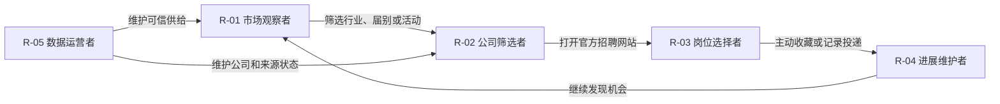
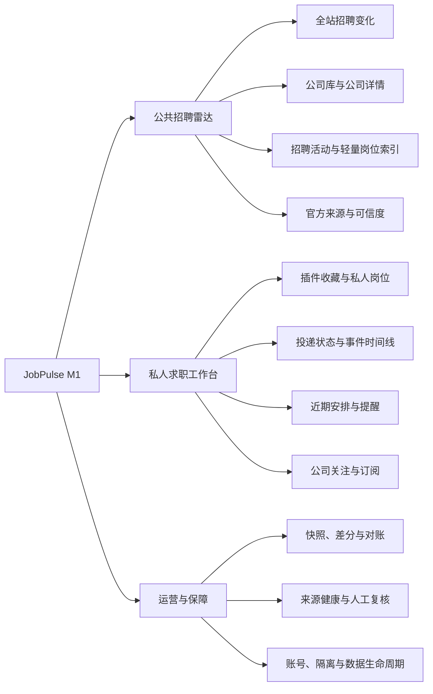
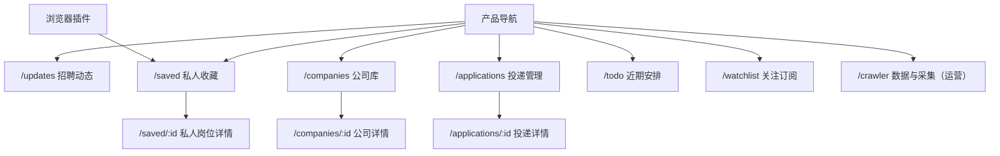
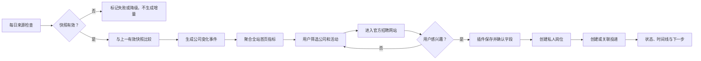
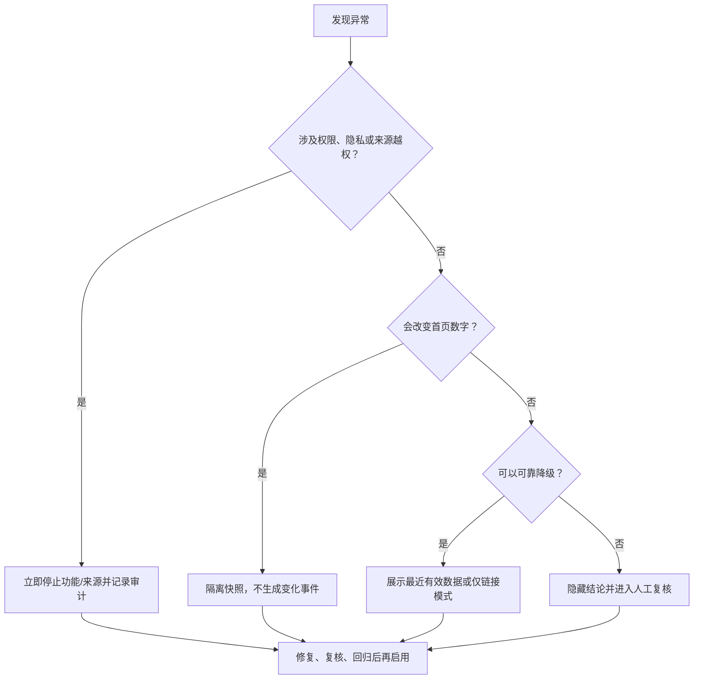

# JobPulse M1 产品需求文档

| 文档属性 | 内容 |
|---|---|
| 版本 | V2.1（公司招聘雷达方向） |
| 日期 | 2026-08-18 |
| 状态 | 产品方案与高保真已完成；公共数据底座已实现，快照差分待开发 |
| 产品负责人 | 项目所有者（姓名待确认） |
| 协作角色 | 产品、UX/视觉、前端、后端、数据运营、测试与安全 |
| 当前实现基线 | [M0 PRD](PRD.md) · [验收报告](../qa/ACCEPTANCE-REPORT.md) |
| 数据源策略 | [国内校招数据源策略](DATA-SOURCE-STRATEGY.md) |
| 实施拆分 | [M1 实施计划](M1-IMPLEMENTATION-PLAN.md) |
| 高保真资产 | [Figma 高保真原型索引](../design/HIGH-FIDELITY-PROTOTYPE-INDEX.md) |

> **一句话摘要**：JobPulse M1 是面向中国大陆校招求职者的公司招聘雷达。公共侧持续记录整个目标公司池的招聘变化，帮助用户判断“今天哪些公司开始招聘、增加或关闭了多少岗位”；用户进入企业官网浏览具体职位，并通过后续浏览器插件把真正感兴趣的岗位保存到私人求职工作台。

---

## 一、产品简介

### 1.1 文档目的

本文档是 JobPulse M1 目标产品的需求与验收事实源，回答以下问题：

1. M1 相较 M0 改变了什么；
2. 公共公司招聘数据与用户私人岗位数据如何分层；
3. 首页、公司库、公司详情、插件收藏和投递管理如何形成闭环；
4. 采集、统计、设计、研发和测试如何判断结果可信。

M0 已实现能力仍以 [PRD.md](PRD.md) 为准；市场和竞争背景以 [MRD](MRD.md) 为准；采集边界以 [国内校招数据源策略](DATA-SOURCE-STRATEGY.md) 为准。M1 目标能力未上线前，不得在作品集、演示或发布说明中描述为当前已实现。

### 1.2 背景与用户问题

中国大陆校招信息分散在企业招聘官网、招聘公告、公众号、高校就业平台和招聘平台。求职者通常需要反复完成三件事：

- 判断最近有哪些公司开始招聘或新增岗位；
- 进入不同企业官网浏览和筛选职位；
- 把少量真正感兴趣的岗位重新记录到表格、Notion 或备忘录。

M0 采用“公共岗位库”作为发现入口，但继续完整保存所有公司、所有岗位的 JD 会产生新的问题：

- 大量岗位与用户目标无关，公共列表噪声不断增加；
- JD 内容长、格式不统一、关闭状态难维护，数据过期后容易误导；
- 对动态官网逐岗位读取详情的请求量和解析成本高；
- 产品容易退化为另一个岗位聚合器，与成熟招聘平台正面竞争岗位数量；
- 用户仍需回到企业官网完成筛选和申请，完整复制 JD 的边际价值有限。

因此 M1 将核心问题调整为：

> 如何用可信、可追溯的全站变化数据告诉用户“校招市场今天发生了什么”，再让用户只把真正感兴趣的岗位带入自己的求职工作台？

### 1.3 产品定位与核心闭环

产品定位：

> 国内校招公司雷达 + 官方招聘导航 + 私人岗位与投递工作台。

核心闭环：

`查看全站招聘变化 → 筛选公司与招聘活动 → 进入企业官网 → 收藏感兴趣岗位 → 管理投递与下一步`

公共侧回答“市场和公司发生了什么”；私人侧回答“我决定跟进什么、现在到哪一步”。

### 1.4 本期核心目标

M1 必须做到：

- 首页展示整个目标公司数据库的每日变化，而不是某一家公司的个人化摘要；
- 新收录公司、开始招聘公司、有更新公司、新增岗位和关闭岗位使用不同口径；
- 公共数据库只保存公司、招聘活动、轻量岗位引用、来源快照和变化证据；
- 只有用户主动收藏的岗位才保存完整 JD、备注和投递信息；
- 所有全站指标可下钻到公司、来源快照和变化事件；
- 首次建立快照不制造“今日新增”，失败快照不制造“无新增”；
- 官方来源和合规状态可见，受限制来源不通过 Playwright 或其他工具绕过；
- 保留 M0 的私人投递状态、事件时间线和近期安排，并补齐账号与数据归属。

### 1.5 本期范围

| 范围 | 优先级 | M1 交付目标 |
|---|---:|---|
| 全站招聘变化首页 | P0 | 六项核心指标、分类分布、变化流和口径说明 |
| 公司库与公司详情 | P0 | 公司筛选、招聘状态、活动历史、官方入口和来源健康 |
| 招聘活动与轻量岗位索引 | P0 | 届别、招聘季、正式/实习类型、岗位类别、首次/最后发现 |
| 官方来源快照与差分 | Ops-P0 | 定时采集、基线、幂等差分、失败降级和证据追溯 |
| 公司关注与更新订阅 | P1 | 站内关注、匹配结果与来源异常暂停 |
| 浏览器插件与私人收藏 | P1 | 用户主动保存单个岗位；允许域名解析，受限域名只存链接 |
| 私人投递与近期安排 | P0 | 复用并演进 M0 状态机、时间线、通知建议和待办 |
| 账号、数据隔离与生命周期 | P0 | 登录、所有权、导出、删除、迁移、备份和恢复 |
| 数据运营与覆盖看板 | Ops-P0 | 来源登记、健康、对账、延迟、复核积压和停止开关 |

### 1.6 本期不做

- 不建设面向用户的“全量完整 JD 公共岗位库”；
- 不用关键词或数量上限提前裁剪目标公司公开校招岗位的轻量索引；
- 不声称覆盖“全网所有公司”或“全网 100%”；
- 不替用户在企业官网提交简历、沟通、接受 Offer；
- 不绕过登录、验证码、客户端签名、访问控制、服务协议或反自动化措施；
- 不未经授权批量采集 BOSS、猎聘、牛客等平台；
- 不自动搜索微信客户端或长期复制公众号文章全文；
- 不建设简历制作、AI 改写、面经、课程、公司点评或自动海投；
- 不在本批次建设团队协作、导师端、原生 App 或支付系统；
- 不在全站数据闭环完成前并行开发邮箱、日历和复杂推荐。

### 1.7 证据边界与当前基线

| 类型 | 当前事实 | 不能推导出的结论 |
|---|---|---|
| 官方来源注册 | 已登记首批 10 家公司的官方入口与审核状态 | 不代表 10 家都已允许或完成自动采集 |
| 真实来源验证 | 招商银行列表曾完成应届生 13、实习生 22、合计 35 条对账 | 不是固定岗位数，也不代表已开启生产调度 |
| 合规结论 | 腾讯招聘协议明确限制程序抓取，已标记禁止自动化 | 不能因为 Playwright 能打开页面就改为允许 |
| 自动化测试 | 当前后端基线为 171 项测试通过 | 不证明来源长期稳定、页面易用或用户价值 |
| 用户研究 | 尚无本方向的真人任务测试和持续使用数据 | 不能声称用户更喜欢公司雷达或愿意安装插件 |
| Figma 原型 | M1 高保真用于评审目标体验 | 不等同于前端已经实现 |

### 1.8 名词术语

| 术语 | 定义 |
|---|---|
| 目标公司池 | 有明确版本、范围和优先级的公司集合；指标只在该集合内计算 |
| 新收录公司 | 公司首次完成官方入口核验并进入可展示公司库 |
| 开始招聘公司 | 在统计窗口内首次出现新的有效招聘活动，不等同于新收录公司 |
| 有更新公司 | 统计窗口内至少产生一条有效公司变化事件的去重公司 |
| 新增岗位 | 成功快照中首次出现的稳定官方岗位 ID 或规范化 URL；首个基线不计新增 |
| 关闭岗位 | 官方明确关闭，或满足经过审核的连续缺失规则后，从有效变为关闭的轻量岗位引用 |
| 页面有更新 | 页面指纹发生变化，但系统不能可靠计算岗位差额；不得计入新增岗位 |
| 招聘活动 | 某公司面向特定招聘季、年份、届别或实习类型的招聘计划 |
| 轻量岗位索引 | 官方岗位 ID、标题、城市、类别、URL、首次/最后发现和状态；不保存完整 JD |
| 来源快照 | 一次成功或失败的来源检查记录，包括岗位集合摘要、数量、响应哈希和解析器版本 |
| 私人岗位 | 用户主动收藏或录入的岗位，可保存完整 JD、备注、简历版本和投递状态 |
| 今日 | 默认按 Asia/Shanghai 自然日从 00:00 到当前时刻计算；页面必须显示数据截止时间 |

---

## 二、用户角色描述

### 2.1 角色划分原则

角色按用户当前任务划分，而不是按学校、年龄或专业划分。届别、城市、行业和岗位类别是筛选条件；只有会改变默认入口、信息优先级和主要动作的任务差异才成为产品角色。

### 2.2 角色表

| 角色 ID | 名称 | 进入条件 | 核心目标 | 产品策略 | 退出条件 |
|---|---|---|---|---|---|
| R-01 | 市场观察者 | 想了解今天整体校招变化 | 快速判断市场热度和主要变化 | 全站指标、分类分布、可信更新时间 | 选择行业、届别或公司继续查看 |
| R-02 | 公司筛选者 | 有目标行业或公司范围 | 找到正在招聘且适合自己的公司 | 公司库、招聘状态、活动历史和官方入口 | 进入公司官网或关注公司 |
| R-03 | 岗位选择者 | 正在企业官网浏览职位 | 只保存真正感兴趣的岗位 | 插件单页收藏、字段确认和来源保留 | 保存、忽略或返回公司库 |
| R-04 | 进展维护者 | 已收藏或投递至少一个私人岗位 | 记录状态、时间、材料和下一步 | 私人岗位、状态机、时间线与近期安排 | 投递结束或开始新一轮发现 |
| R-05 | 数据运营者 | 负责来源、覆盖和异常处理 | 保证首页数字可信且来源可停止 | 来源健康、对账、复核队列和审计 | 异常解决、来源暂停或升级 |

### 2.3 角色状态迁移图



**图 1：M1 角色迁移。** 数据运营者不进入普通用户主导航，但决定公共数据能否展示和计数。

### 2.4 角色体验矩阵

| 体验环节 | R-01 市场观察者 | R-02 公司筛选者 | R-03 岗位选择者 | R-04 进展维护者 | R-05 数据运营者 |
|---|---|---|---|---|---|
| 默认入口 | 招聘动态 | 公司库 | 企业官网 / 插件 | 私人收藏 / 投递 | 数据与采集 |
| 首要信息 | 今日变化、数据截止时间 | 招聘状态、活动、官方入口 | 岗位标题、要求、来源 | 当前状态、下一步 | 来源健康、对账、失败原因 |
| 主要动作 | 筛选、查看变化 | 关注、进入官网 | 收藏、确认字段 | 投递、更新、安排 | 审核、重试、暂停 |
| 主要风险 | 指标口径被误解 | 过期活动仍显示 | 插件过度读取 | 维护成本与隐私 | 静默失败制造错误数字 |
| 成功信号 | 能解释今天发生什么 | 找到值得查看的公司 | 只保存目标岗位 | 下一步清楚可追溯 | 指标可回溯且异常被隔离 |

---

## 三、产品概述

### 3.1 产品目标

1. 用全站可信变化降低用户逐个检查公司官网的成本；
2. 用公司与招聘活动组织校招信息，而不是把用户淹没在完整岗位列表中；
3. 用轻量岗位索引准确计算新增和关闭，同时控制公共数据噪声；
4. 用用户主动收藏建立私人岗位和投递闭环；
5. 用来源、快照和变化证据保证所有数字可解释、可降级、可停止。

### 3.2 成功指标

#### 3.2.1 供给与数据质量指标

| KR | 指标与计算口径 | M1 门槛 |
|---|---|---:|
| KR-01 公司入口覆盖 | 已核验至少一个官方入口的目标公司 / 目标公司总数 | 试点池 100% |
| KR-02 官方活动发现率 | 人工审计中被系统发现的官方招聘活动 / 审计发现总活动 | ≥95% |
| KR-03 发现延迟 | 官方可见到系统生成有效变化事件的时长 | 高峰期 P95 ≤24 小时 |
| KR-04 岗位对账率 | 已索引 + 已隔离 + 带原因失败 / 来源公开岗位总数 | 有公开总数的来源 100% |
| KR-05 指标可追溯 | 首页数字可下钻到有效变化事件的数量 / 首页数字总量 | 100% |
| KR-06 采集健康 | 启用来源按计划成功完成有效快照 / 应执行任务 | ≥98% |
| KR-07 虚假新增 | 基线、重试或页面排序变化造成的重复新增 | 0 |

#### 3.2.2 用户价值实验指标

| KR | 指标与计算口径 | 研究门槛 |
|---|---|---:|
| KR-08 首页理解 | 能正确解释六项首页指标的参与者 | 至少 4/5 |
| KR-09 公司发现任务 | 从首页找到指定类型正在招聘公司的独立完成率 | 至少 4/5 |
| KR-10 官网到收藏 | 打开官网后成功收藏一个目标岗位的完成率 | 至少 4/5 |
| KR-11 收藏质量 | 收藏后无需大幅修改关键字段的记录 | ≥80%，至少 30 条 |
| KR-12 持续使用 | 7 天内至少 3 天查看变化或维护进展的试用用户 | ≥60%，小样本方向指标 |

#### 3.2.3 尚未验证的假设

- 用户需要“公司招聘变化”多于“另一个完整岗位搜索库”；
- 全站每日变化能够提高回访，而不是只有招聘季开始时才有价值；
- 用户愿意从 JobPulse 进入企业官网并安装插件；
- 轻量岗位标题和类别足以支撑变化统计与公司判断；
- 公司关注和私人收藏能自然连接到现有投递工作台；
- 目标公司池的边界不会被用户理解为全网覆盖。

### 3.3 产品功能结构



**图 2：M1 功能结构。** 公共招聘雷达不保存完整 JD；私人工作台只保存用户主动选择的数据。

### 3.4 页面与信息架构



**图 3：M1 信息架构。** `/updates` 是产品默认入口；营销官网仍使用 `/`，不承载业务数据。

### 3.5 总体业务流程



**图 4：总体业务流程。** 采集失败不会生成“无新增”；用户收藏前不保存完整岗位内容。

### 3.6 功能摘要与优先级

| 功能 ID | 功能 | 用户价值 | 复杂度 | 优先级 | 当前状态 |
|---|---|---:|---:|---:|---|
| F-M1-01 | 全站招聘变化首页 | 高 | 中 | P0 | 高保真已完成，待开发 |
| F-M1-02 | 公司库与公司详情 | 高 | 中 | P0 | 高保真已完成，待开发 |
| F-M1-03 | 招聘活动与轻量岗位索引 | 高 | 高 | P0 | 方案已确认 |
| F-M1-04 | 官方导航与来源可信度 | 高 | 中 | P0 | 来源注册表初版已完成 |
| F-M1-05 | 公司关注与招聘订阅 | 中 | 中 | P1 | M0 规则 CRUD 可复用 |
| F-M1-06 | 浏览器插件与私人收藏 | 高 | 高 | P1 | 高保真已完成，待真人验证 |
| F-M1-07 | 私人投递与近期安排 | 高 | 中 | P0 | M0 主流程已实现，待多用户化 |
| F-M1-08 | 账号、隔离与数据生命周期 | 高 | 高 | P0 | 待开发 |
| F-M1-09 | 数据运营与质量保障 | 高（运营） | 高 | Ops-P0 | 注册表与首个适配器已完成 |

---

## 四、功能需求说明

### 4.1 F-M1-01 全站招聘变化首页（P0）

| 项目 | 内容 |
|---|---|
| 目标 | 让 R-01 在一分钟内理解整个目标公司数据库今天发生了什么 |
| 主要角色 | R-01 市场观察者 |
| 前置条件 | 至少存在一个成功基线快照和一个可计算变化的后续快照 |
| 触发条件 | 用户进入 `/updates`、切换日期或筛选维度 |

#### 4.1.1 业务规则

- `M1-F01-FR-01`：首页默认展示整个目标公司池，不为某一家特定公司定制主视图。
- `M1-F01-FR-02`：顶部展示新收录公司、开始招聘公司、有更新公司、新增岗位、关闭岗位、当前招聘公司六项指标。
- `M1-F01-FR-03`：六项指标分别计算，不得把新收录公司等同于开始招聘公司。
- `M1-F01-FR-04`：新增岗位只来自成功快照与上一有效快照的稳定 ID/URL 集合差分；首个快照只建立基线。
- `M1-F01-FR-05`：失败、未完成对账或来源处于降级状态的快照不产生新增、关闭或“无新增”结论。
- `M1-F01-FR-06`：只能确认页面变化时生成“页面有更新”事件，但不增加新增岗位数。
- `M1-F01-FR-07`：首页显示数据截止时间、成功覆盖公司数、异常来源数和指标口径入口。
- `M1-F01-FR-08`：变化流按事件发生/首次发现时间倒序，并按公司聚合，避免同一公司刷屏。
- `M1-F01-FR-09`：支持按日期、届别、招聘性质、公司行业和岗位类别筛选；组合条件采用 AND。
- `M1-F01-FR-10`：页面文案使用“系统今日新发现”解释新增，不宣称官方一定在当天发布。

#### 4.1.2 页面与结构

- 页首：标题、统计窗口、数据截止时间、口径说明。
- 指标区：六张核心指标卡，支持点击下钻。
- 分布区：按届别、招聘性质、行业和岗位类别展示变化分布。
- 动态区：公司聚合变化列表，包含变化类型、数量、活动标签和官方入口。
- 健康提示：来源异常或覆盖不完整时显示非阻断提示。

#### 4.1.3 状态与异常

| 状态 | 要求 |
|---|---|
| 首次无基线 | 说明“正在建立观察基线”，不显示 0 个新增作为结论 |
| 成功有变化 | 展示指标、分布和公司动态 |
| 成功无变化 | 展示“本统计窗口暂无已核验变化”，同时显示覆盖范围 |
| 部分来源失败 | 使用已成功来源计算，并明确缺失公司/来源数量 |
| 全部来源失败 | 不显示旧数字为今天结果，提供最近一次有效数据和重试说明 |
| 指标口径说明 | 使用抽屉或弹层解释定义、统计窗口和已知限制 |

#### 4.1.4 交互规则

- 点击指标卡进入带预设条件的公司变化列表。
- 点击公司变化进入公司详情；“查看官网”在新标签页打开官方入口。
- 筛选条件写入 URL，刷新和分享后保持。
- 图表不是唯一信息载体，颜色之外必须显示数字和文本标签。
- 移动端优先显示核心指标、筛选按钮和变化列表，复杂图表可折叠。

#### 4.1.5 数据、持久化与事件

主要读取 `Company`、`RecruitmentCampaign`、`ObservedPositionRef`、`SourceSnapshot`、`CompanyChangeEvent`。聚合结果可以缓存，但事实源必须是有效变化事件。

| 事件 | 触发 | 必要参数 | 禁止参数 |
|---|---|---|---|
| `recruitment_updates_viewed` | 首页成功展示 | date_window、coverage_count、partial | 完整岗位内容 |
| `recruitment_filter_applied` | 用户应用筛选 | filter_types、result_company_count | 用户自由文本原文 |
| `company_change_opened` | 打开变化详情 | company_id、change_type | JD、联系人信息 |
| `metric_definition_opened` | 查看指标口径 | metric_code | 无 |

#### 4.1.6 验收标准

- `M1-F01-AC-01`：首次成功采集只建立基线，六项指标中新增岗位不包含基线全部岗位。
- `M1-F01-AC-02`：连续两次相同快照后，新增和关闭岗位均为 0。
- `M1-F01-AC-03`：模拟新增 3 个稳定岗位 ID 后，首页新增岗位为 3，且可下钻到对应公司和来源快照。
- `M1-F01-AC-04`：失败快照不会覆盖上一有效快照，也不会生成关闭岗位。
- `M1-F01-AC-05`：页面变化但无法识别岗位差额时，只增加“页面有更新”事件。
- `M1-F01-AC-06`：所有指标卡显示口径提示和数据截止时间。
- `M1-F01-AC-07`：390×844 视口无横向溢出，核心变化可在三次交互内到达官网。

#### 4.1.7 依赖

F-M1-03、F-M1-04、F-M1-09；全站统计 API；设计系统与图表无障碍规范。

#### 4.1.8 高保真原型

对应 Figma 画板：`M1-P01 全站招聘变化首页（桌面）`、`M1-P06 全站招聘变化首页（移动）`。最终链接与导出图登记在[高保真原型索引](../design/HIGH-FIDELITY-PROTOTYPE-INDEX.md)。

### 4.2 F-M1-02 公司库与公司详情（P0）

| 项目 | 内容 |
|---|---|
| 目标 | 让 R-02 按行业、招聘状态和届别找到值得进入官网查看的公司 |
| 主要角色 | R-02 公司筛选者 |
| 前置条件 | 公司已进入目标公司池并至少登记一个官方入口 |
| 触发条件 | 从导航、指标下钻或变化流进入公司库/详情 |

#### 4.2.1 业务规则

- `M1-F02-FR-01`：公司库展示标准公司名、行业/类型、当前招聘状态、活动标签、最近核验时间和官方入口状态。
- `M1-F02-FR-02`：支持关键词、行业、公司性质、招聘状态、届别、招聘性质筛选。
- `M1-F02-FR-03`：公司详情按招聘活动组织变化和轻量岗位，不展示完整 JD。
- `M1-F02-FR-04`：同一集团与分支机构保留父子关系，避免把分支岗位误算为无关公司。
- `M1-F02-FR-05`：来源健康异常时，公司详情不得展示“当前没有岗位”的确定结论。
- `M1-F02-FR-06`：官方入口始终可见；二级来源必须标记权威等级，不能覆盖官方事实。
- `M1-F02-FR-07`：公司类型与行业采用受控枚举；未知值保留并进入运营复核。

#### 4.2.2 页面与结构

- 公司库：标题、覆盖摘要、搜索筛选、公司卡片/表格和分页。
- 公司卡：公司名称、行业、招聘标签、今日变化、最近核验、关注和官网动作。
- 公司详情：公司摘要、当前活动、变化时间线、轻量岗位类别分布、官方招聘入口、来源健康。

#### 4.2.3 状态与异常

| 状态 | 要求 |
|---|---|
| 正在招聘 | 显示已核验活动和最近变化 |
| 暂无活动 | 仅在来源健康且快照有效时展示 |
| 来源异常 | 显示“暂时无法确认”，不显示“没有招聘” |
| 仅人工来源 | 显示最近人工核验时间和官方链接 |
| 无筛选结果 | 保留筛选并允许一键清空 |

#### 4.2.4 交互规则

- 公司卡整体可进入详情，官网和关注为独立动作。
- 点击活动标签可过滤时间线和轻量岗位。
- 官方链接在离站前说明将进入企业网站，不伪装成站内申请。
- 移动端公司筛选使用抽屉，已应用条件显示为可删除标签。

#### 4.2.5 数据、持久化与事件

主要对象为 `Company`、`CompanySource`、`RecruitmentCampaign`、`CompanyChangeEvent`。公司关注属于私人数据，使用 `user_id + company_id` 唯一约束。

#### 4.2.6 验收标准

- `M1-F02-AC-01`：组合筛选结果同时满足所有已启用条件。
- `M1-F02-AC-02`：来源异常公司显示“暂时无法确认”，不显示“0 岗位”。
- `M1-F02-AC-03`：公司详情的每条变化都能打开对应官方入口或来源证据。
- `M1-F02-AC-04`：集团与分支岗位不会被重复计入公司总数。
- `M1-F02-AC-05`：未登录用户可读取公开公司信息；关注动作要求登录。

#### 4.2.7 依赖

F-M1-03、F-M1-04、F-M1-08；公司目录 API；标准公司与别名数据。

#### 4.2.8 高保真原型

对应 Figma 画板：`M1-P02 公司库（桌面）`、`M1-P03 公司详情（桌面）`。

### 4.3 F-M1-03 招聘活动与轻量岗位索引（P0）

| 项目 | 内容 |
|---|---|
| 目标 | 在不保存公共完整 JD 的前提下，准确表达公司招聘范围和岗位变化 |
| 主要角色 | R-01、R-02、R-05 |
| 前置条件 | 来源已批准、适配器返回完整列表或可靠页面变化证据 |
| 触发条件 | 来源快照成功、人工公告确认或运营纠错 |

#### 4.3.1 业务规则

- `M1-F03-FR-01`：招聘活动与岗位引用分开建模；公告先发布而岗位尚未开放时也可建立活动。
- `M1-F03-FR-02`：招聘季支持秋招、春招、提前批、补录、滚动招聘和未知。
- `M1-F03-FR-03`：招聘性质支持正式校招、毕业生项目和实习；实习细分暑期、日常、寒假和未知。
- `M1-F03-FR-04`：毕业届别支持 2027、2028 等多值；活动年份与毕业届别分开保存。
- `M1-F03-FR-05`：岗位类别支持技术、产品、设计、运营、市场、销售、商业、供应链、制造、财务、法务、人力、行政、研究、医疗、教育、客服和其他。
- `M1-F03-FR-06`：无法判断的字段保存 `unknown`、证据和置信度，不从发现日期推断届别。
- `M1-F03-FR-07`：生产列表采集不得使用岗位方向关键词或最终数量上限。
- `M1-F03-FR-08`：轻量岗位至少保留公司、来源、外部 ID/规范化 URL、标题、城市、类别、首次/最后发现、状态和指纹。
- `M1-F03-FR-09`：完整 JD 不进入公共索引；用户主动收藏后进入私人岗位快照。

#### 4.3.2 差分与关闭规则

1. 首个有效快照建立基线；
2. 后续有效快照按外部 ID，缺失时按规范化 URL，再缺失时按轻量字段指纹比较；
3. 新集合减旧集合生成新增；
4. 旧集合减新集合不能立即视为关闭，优先使用官方关闭标记；无明确标记时满足连续缺失阈值后关闭；
5. 快照未对账或来源异常时不推进缺失次数；
6. 岗位重新出现时生成重新开放事件，不制造新的首次发现记录。

#### 4.3.3 数据模型

```text
Company
  id, parent_company_id, registry_id, name, aliases
  industry, ownership_type, status, first_verified_at

RecruitmentCampaign
  id, company_id, source_id, campaign_key, name, season, campaign_year
  recruitment_type, internship_type, graduation_years_status
  status, start_at, deadline, official_url

CampaignGraduationYear
  campaign_id, graduation_year

ObservedPositionRef
  id, company_id, campaign_id, source_id, dedupe_key, identity_kind
  external_job_id
  canonical_url, title, locations, category
  first_seen_at, last_seen_at, closed_at, status, content_fingerprint

SourceSnapshot
  id, company_id, source_id, run_key, previous_valid_snapshot_id
  status, completeness_status, comparison_status, is_baseline
  fetched_at, completed_at, source_total
  fetched_total, indexed_total, excluded_total, failed_total
  position_set_hash, response_hash, parser_version

CompanyChangeEvent
  id, company_id, campaign_id, snapshot_id, event_type
  added_count, reopened_count, closed_count, changed_count
  occurred_at, reporting_date_cn, evidence
```

#### 4.3.4 验收标准

- `M1-F03-AC-01`：2027/2028 多届别不会被压缩为单一字符串。
- `M1-F03-AC-02`：暑期实习和日常实习可以分别筛选，未知类型仍被保留。
- `M1-F03-AC-03`：岗位类别未知不会导致岗位引用丢失。
- `M1-F03-AC-04`：页面排序变化不产生新增或关闭事件。
- `M1-F03-AC-05`：同一岗位重新开放时保留原首次发现时间并生成重新开放事件。

#### 4.3.5 依赖

F-M1-04、F-M1-09；数据库迁移；分类规则与人工复核。

### 4.4 F-M1-04 官方导航与来源可信度（P0）

| 项目 | 内容 |
|---|---|
| 目标 | 让用户知道数据来自哪里、最后何时核验，并安全进入官方招聘入口 |
| 主要角色 | R-01、R-02、R-05 |
| 前置条件 | 来源已进入版本化注册表 |
| 触发条件 | 展示公司、变化、活动或官网跳转 |

#### 4.4.1 业务规则

- `M1-F04-FR-01`：来源注册表记录官方域名、入口、来源类型、适配器、robots/条款状态、审核日期、证据、刷新频率和负责人。
- `M1-F04-FR-02`：只有 `enabled + allowed` 来源进入自动调度；无法确认时 fail closed。
- `M1-F04-FR-03`：Playwright 只用于允许自动访问但依赖浏览器渲染的页面，不用于绕过验证码、登录、签名或协议限制。
- `M1-F04-FR-04`：官方官网优先；政府/高校平台可用于发现和二级核验；聚合平台不得覆盖官方字段。
- `M1-F04-FR-05`：腾讯等明确限制自动抓取的来源只保留人工核验、用户提交链接或未来书面授权入口。
- `M1-F04-FR-06`：官网跳转记录来源类型，但不记录外部账号、搜索内容或简历行为。

#### 4.4.2 页面、状态与交互

- 公司和变化卡显示“官方来源”“最近核验”“数据异常”等状态标签。
- 进入官网使用明确动作文案“前往官方招聘网站”。
- 来源异常说明影响范围和最近一次有效时间。
- 普通用户不显示内部请求、解析器或法律评审细节；运营页提供完整证据。

#### 4.4.3 验收标准

- `M1-F04-AC-01`：单独修改运行配置不能启用注册表未批准来源。
- `M1-F04-AC-02`：禁止来源不会发起 Playwright 或 HTTP 自动采集请求。
- `M1-F04-AC-03`：每个公开变化至少关联一个来源和核验时间。
- `M1-F04-AC-04`：官网链接必须使用登记官方域名或明确标记的二级来源。

#### 4.4.4 依赖

来源注册表、调度器、域名校验、安全与合规评审。

### 4.5 F-M1-05 公司关注与招聘订阅（P1）

| 项目 | 内容 |
|---|---|
| 目标 | 让定向求职者只接收自己关注公司的可信变化 |
| 主要角色 | R-02、R-04 |
| 前置条件 | 用户已登录，来源健康且存在有效变化事件 |
| 触发条件 | 关注公司、保存筛选或新变化事件生成 |

#### 4.5.1 业务规则

- 用户可关注公司，并按届别、招聘性质和岗位类别进一步限制。
- 同一变化事件与同一订阅只生成一次匹配。
- 匹配先进入站内更新列表，通知渠道后置。
- 来源失败、降级或对账异常时暂停该来源通知，不发送“没有变化”。
- 用户可取消关注、暂停规则和查看最近一次成功匹配时间。

#### 4.5.2 状态与异常

| 状态 | 要求 |
|---|---|
| 正常 | 显示关注条件和最近匹配 |
| 暂停 | 不生成新通知，保留历史 |
| 来源异常 | 说明暂停原因和受影响公司 |
| 无匹配 | 只说明当前有效快照没有匹配，不等同于公司没有招聘 |

#### 4.5.3 验收标准

- `M1-F05-AC-01`：重复执行匹配任务不会产生重复通知。
- `M1-F05-AC-02`：取消关注后停止新增匹配，但历史记录保留。
- `M1-F05-AC-03`：来源异常期间不发送否定性结论。
- `M1-F05-AC-04`：A 用户的关注规则和匹配对 B 用户不可见。

#### 4.5.4 依赖

F-M1-01、F-M1-02、F-M1-08；后台任务与站内通知。

### 4.6 F-M1-06 浏览器插件与私人岗位收藏（P1）

| 项目 | 内容 |
|---|---|
| 目标 | 让 R-03 在企业官网只保存真正感兴趣的单个岗位 |
| 主要角色 | R-03 岗位选择者 |
| 前置条件 | 用户已登录并主动点击插件；当前页面为 HTTP(S) 岗位页 |
| 触发条件 | 点击浏览器工具栏中的“保存到 JobPulse” |

#### 4.6.1 业务规则

- `M1-F06-FR-01`：插件不后台批量扫描网站，只处理用户当前主动选择的页面。
- `M1-F06-FR-02`：允许解析的官方域名可提取公司、岗位、城市、JD、要求、来源 URL 和官方岗位 ID。
- `M1-F06-FR-03`：受限制或不支持的网站只保存 URL，并要求用户手工确认公司和岗位名。
- `M1-F06-FR-04`：插件不得绕过登录、验证码、付费墙、访问控制或网站限制。
- `M1-F06-FR-05`：保存前展示确认界面，用户可编辑字段并选择收藏、待投递或已投递。
- `M1-F06-FR-06`：私人岗位按 `user_id + external_job_id/canonical_url` 去重；重复保存更新最近查看时间，不覆盖用户备注和状态。
- `M1-F06-FR-07`：完整 JD 属于私人数据，不进入公共检索、全站指标或其他用户页面。
- `M1-F06-FR-08`：权限采用最小域名范围，新增域名需要明确说明和版本审核。

#### 4.6.2 插件确认流程

`点击插件 → 判断域名策略 → 提取允许字段或仅保存 URL → 展示确认 → 用户选择意图 → 创建/更新私人岗位 → 返回成功与下一步`

#### 4.6.3 状态与异常

| 状态 | 要求 |
|---|---|
| 支持自动提取 | 展示已提取字段和来源 |
| 仅链接模式 | 明确说明限制，要求补充公司与岗位名 |
| 未登录 | 打开安全登录流程，完成后返回当前草稿 |
| 重复岗位 | 展示已保存状态，允许打开原记录 |
| 解析失败 | 保留 URL 和用户输入，不显示伪造字段 |
| 服务失败 | 草稿可复制或重试，不在页面注入敏感错误 |

#### 4.6.4 数据、持久化与事件

私人 `Job` 保存用户确认后的字段、来源 URL、内容指纹和可选 `observed_position_ref_id`。原始页面全文不默认长期保存；产品事件不得包含 JD、备注或页面正文。

#### 4.6.5 验收标准

- `M1-F06-AC-01`：用户没有点击插件时不读取或发送当前页面内容。
- `M1-F06-AC-02`：受限制域名只保存链接和用户确认字段。
- `M1-F06-AC-03`：重复收藏不会删除原备注、投递状态或简历引用。
- `M1-F06-AC-04`：插件权限清单不包含完成当前功能不需要的全站浏览历史权限。
- `M1-F06-AC-05`：保存成功后用户可直接进入私人收藏或建立投递。

#### 4.6.6 依赖

F-M1-08；浏览器扩展发布流程；域名策略；私人岗位 API。

#### 4.6.7 高保真原型

对应 Figma 画板：`M1-P05 插件收藏确认（侧边栏）`。

### 4.7 F-M1-07 私人投递与近期安排（P0）

| 项目 | 内容 |
|---|---|
| 目标 | 让 R-04 把已选择岗位持续转化为可追溯的投递和下一步 |
| 主要角色 | R-04 进展维护者 |
| 前置条件 | 用户已登录并拥有私人岗位或最小手工信息 |
| 触发条件 | 创建投递、更新状态、粘贴招聘通知或添加计划时间 |

#### 4.7.1 业务规则

- 复用 M0 的投递状态机、事件时间线、招聘通知建议和近期安排。
- 同一用户、同一私人岗位最多一个进行中投递；其他用户不受影响。
- 用户可从插件收藏、手工录入或历史导入建立投递。
- 招聘通知只生成建议，确认前不改变状态或计划。
- 状态与明确时间在同一事务中写入；失败时整体回滚。
- 私人岗位和投递不得出现在公共公司库或其他用户搜索中。

#### 4.7.2 页面与结构

- 私人收藏：收藏、待投递、已投递分组，显示来源和最近动作。
- 投递管理：状态、公司、岗位、更新时间和下一步。
- 投递详情：当前状态、事件时间线、通知解析、计划和简历版本引用。
- 近期安排：逾期、今日、未来和待确认。

#### 4.7.3 验收标准

- `M1-F07-AC-01`：两个用户不能读取、修改或导出对方私人岗位和投递。
- `M1-F07-AC-02`：从插件保存到创建投递不需要重新录入公司和岗位。
- `M1-F07-AC-03`：通知建议确认失败时状态和计划均不改变。
- `M1-F07-AC-04`：删除私人岗位前明确关联投递影响，不产生孤儿事件。

#### 4.7.4 高保真原型

对应 Figma 画板：`M1-P04 私人收藏与投递准备（桌面）`；投递详情继续复用并调整现有 P05–P07、P12–P14 设计。

### 4.8 F-M1-08 账号、隔离与数据生命周期（P0）

| 项目 | 内容 |
|---|---|
| 目标 | 让真实用户安全拥有、导出和删除自己的私人求职数据 |
| 主要角色 | R-03、R-04 |
| 前置条件 | M1 进入真实用户环境 |
| 触发条件 | 登录、访问私人页面、导出、删除或撤销权限 |

#### 4.8.1 业务规则

- 支持至少一种可恢复登录方式，服务端从有效会话推导用户身份。
- 私人 API 默认要求登录，禁止信任客户端传入任意 `user_id`。
- 公开公司、活动和变化使用独立只读端点。
- 私人岗位、收藏、投递、事件、关注、通知、导入、提醒和文件均有明确所有权。
- 生产使用 PostgreSQL 和版本化迁移；SQLite 只保留本地 Demo/测试。
- 用户可导出私人核心数据并请求删除账号；导出和删除不依赖付费状态。
- Demo、测试和生产使用不同数据库、身份应用与密钥；生产禁用 Demo 重置和匿名写入。
- 备份必须通过隔离恢复演练证明可用。

#### 4.8.2 状态与异常

| 状态 | 要求 |
|---|---|
| 未登录访问私人页 | 引导登录并保留安全返回路径 |
| 会话过期 | 清理本地私人数据，重新登录后恢复 |
| 无权访问 | 返回 404 或统一拒绝，不暴露对象存在性 |
| 导出处理中 | 显示状态和过期时间，不同步阻塞请求 |
| 删除待确认 | 重新验证身份并展示影响 |
| 迁移版本不一致 | 生产健康检查不报告就绪 |

#### 4.8.3 验收标准

- `M1-F08-AC-01`：跨用户列表、详情、修改、批量、导出和删除隔离测试全部通过。
- `M1-F08-AC-02`：伪造、过期和撤销令牌不能访问私人 API。
- `M1-F08-AC-03`：生产配置无法调用 Demo 重置或匿名写入。
- `M1-F08-AC-04`：空 PostgreSQL 和上一版本数据库都能迁移到最新。
- `M1-F08-AC-05`：导出包含私人核心关系，删除在承诺窗口内完成并留最小审计。

#### 4.8.4 依赖

鉴权 ADR、PostgreSQL、迁移工具、对象存储、后台任务、安全测试门禁。

### 4.9 F-M1-09 数据运营与质量保障（Ops-P0）

| 项目 | 内容 |
|---|---|
| 目标 | 让 R-05 能发现错误数字的原因，并在伤害用户前停止来源 |
| 主要角色 | R-05 数据运营者 |
| 前置条件 | 来源注册、定时任务和快照模型可用 |
| 触发条件 | 查看运营页、收到告警、处理复核或来源状态变化 |

#### 4.9.1 业务规则

- 运营首页展示公司池登记率、启用来源、成功率、对账率、发现延迟和复核积压。
- 每次任务记录 `source_total/fetched/indexed/excluded/failed`；不能对账时不生成用户增量。
- 历史有岗位的来源突然返回 0、字段完整度骤降、总数变化异常或连续失败时自动降级。
- 运营人员可暂停来源、重新运行、查看证据和记录处置原因。
- 人工修正不改写原始快照；通过新复核记录覆盖展示结论。
- 高风险配置变化写审计，普通用户不能访问运营接口。

#### 4.9.2 页面与结构

- 覆盖摘要：目标公司、已核验入口、启用来源、异常来源。
- 来源列表：状态、最近成功、下次运行、对账和错误摘要。
- 变化审计：首页指标到事件、快照、轻量岗位的下钻链路。
- 人工复核：届别未知、类型冲突、页面变化无法计算、来源条款待审。

#### 4.9.3 验收标准

- `M1-F09-AC-01`：来源对账失败后不产生首页新增或关闭数字。
- `M1-F09-AC-02`：暂停来源后调度器不发请求，已有历史仍可追溯。
- `M1-F09-AC-03`：首页任意指标可在运营页定位到组成事件和快照。
- `M1-F09-AC-04`：人工修正保留原值、修正值、原因、人员和时间。
- `M1-F09-AC-05`：普通用户访问运营接口被拒绝。

#### 4.9.4 依赖

F-M1-03、F-M1-04；后台任务、结构化日志、告警和审计。

---

## 五、其他产品需求

### 5.1 性能与响应目标

| 场景 | 目标 |
|---|---:|
| 招聘动态首页缓存命中 P95 | ≤1 秒 |
| 公司库/详情 API P95 | ≤1.5 秒 |
| 私人列表 API P95 | ≤1.5 秒 |
| 首页筛选交互反馈 | ≤200 毫秒展示进行中状态 |
| 插件保存确认提交 P95 | ≤2 秒，不含登录 |
| 单来源定时任务 | 在刷新窗口内完成，长任务交给后台队列 |

数据量增长时优先使用分页、预聚合和索引，不通过隐藏错误来源或裁剪目标岗位换取性能。

### 5.2 监控与分析需求

#### 5.2.1 业务可观测性

- 首页指标生成时间、覆盖公司数、异常来源数；
- 来源任务成功率、对账率、连续 0 条和解析器版本；
- 公司变化事件数量与重复抑制数量；
- 官网跳转、公司关注、插件打开、保存成功和投递转化；
- 登录失败、跨用户拒绝、导出、删除和撤权；
- 后台任务积压、重试、永久失败和提醒送达。

#### 5.2.2 最小分析事件

事件只记录行为类别和必要标识，不记录完整 JD、通知正文、备注、简历、联系人或外部账号。Demo、测试和生产事件必须分环境。

### 5.3 兼容性矩阵

| 端 | 支持范围 |
|---|---|
| 桌面 Web | 当前 Chrome、Edge、Safari、Firefox 最近两个主要版本 |
| 移动 Web | 390px 起，覆盖核心首页、公司库、详情和私人进度 |
| 浏览器插件 | 第一版 Chrome/Chromium；其他浏览器按真实使用数据进入 |
| 运营页 | 桌面优先，不承诺完整移动操作 |

### 5.4 无障碍要求

- 所有核心动作可使用键盘完成，焦点样式清楚；
- 触控目标不小于 44×44 CSS px；
- 文本与背景达到 WCAG AA 对比度目标；
- 指标与图表不能只依赖颜色；
- 状态标签同时提供文字；
- 动态更新使用适当的可访问提示，不频繁打断读屏；
- 减少动效偏好下关闭非必要动画。

### 5.5 数据、安全与隐私

- 公共轻量索引与私人完整岗位物理或逻辑边界清楚；
- 服务端按当前用户执行所有私人查询；
- 插件只在用户主动触发后处理当前页面，并使用最小域名权限；
- 令牌、Cookie、JD、备注、通知正文和简历不得进入普通日志；
- 自动采集意外获得非必要个人信息时删除或匿名化；
- 来源条款、robots 和授权状态版本化保存；
- 数据导出使用短时下载地址；账号删除需要重新验证；
- 高风险操作和运营修改写安全审计。

### 5.6 内容与时间口径

- 产品默认语言为简体中文；公司官方名称保留原文和别名；
- 公共数据时间统一存 UTC，页面按 Asia/Shanghai 展示；
- 官方发布日期与系统首次发现日期分开显示；
- “今日新增”必须解释为系统在今日首次发现，不冒充官方发布日期；
- 未知信息统一显示“待确认”或“暂时无法确认”，不显示推测结论。

### 5.7 降级与恢复

- 单个来源失败不阻断其他来源，但首页显示覆盖缺口；
- 全部来源失败时回退到最近有效快照并明显标记时间，不冒充今天数据；
- 轻量分类失败保留岗位引用并进入复核；
- 插件解析失败回退到链接 + 手工字段；
- 通知渠道失败保留站内事项；
- 新数据模型迁移采用扩展—回填—切换—收缩，避免不可逆覆盖；
- 数据恢复必须在隔离环境演练后才计为有效备份。

### 5.8 发布与回退

| 发布切片 | 范围 | 进入条件 | 退出条件 |
|---|---|---|---|
| R0 | PRD、高保真、数据字典与架构评审 | 产品方向确认 | 需求—原型—验收一致 |
| R0.5 | 轻量索引、快照差分、招商银行闭环、全站首页 | R0 | 基线/新增/关闭/失败场景全部通过 |
| R0.6 | 3–5 个合规官方来源、公司库与人工公告入口 | R0.5 | 来源健康和人工审计达到门槛 |
| R1 | 账号、PostgreSQL、隔离、导出、删除与恢复 | R0.6 | 安全私测门禁通过 |
| R2 | 公司关注与站内更新 | R1 | 去重、异常暂停和任务测试通过 |
| R3 | 浏览器插件与私人收藏 | R2 | 权限审核、支持/受限域名流程和商店审核通过 |
| R4 | 提醒、导入和被验证的外部集成 | R3 | 真实持续使用证据支持 |

任何版本出现跨用户访问、错误全站指标或来源越权访问时，立即关闭相关功能并回退到最近有效状态。

---

## 六、风险分析

### 6.1 概率—影响矩阵

| 等级 | 定义 | 处置 |
|---|---|---|
| P0 | 高概率/高影响，可能造成数据泄露、违规采集或错误市场结论 | 阻断发布 |
| P1 | 中高概率或高影响，破坏核心任务 | 发布前解决或明确降级 |
| P2 | 中等影响，不阻断核心闭环 | 进入计划并监控 |
| P3 | 低影响体验问题 | 按证据排序 |

### 6.2 风险台账

| 风险 | 等级 | 触发信号 | 应对 |
|---|---:|---|---|
| 把首次基线算成今日新增 | P0 | 第一次采集出现大量新增 | 基线不生成增量；契约测试 |
| 来源失败被误判为岗位关闭 | P0 | 失败当天关闭数量异常 | 只比较有效快照；连续缺失规则 |
| 服务条款限制自动化 | P0 | 来源明确禁止或出现访问控制 | 立即暂停；人工入口或书面授权 |
| 私人 JD 泄露到公共页面 | P0 | 公共 API 返回私人字段 | 数据边界、所有权查询、隔离测试 |
| 首页指标无法解释 | P1 | 用户误解“新增”或数字不可下钻 | 指标词典、口径入口、事件追溯 |
| 公司池被理解为全网 | P1 | 页面或传播使用“全网 100%” | 明示覆盖范围和已核验数量 |
| 官网无稳定岗位 ID | P1 | 排序变化造成大量增删 | URL/指纹降级；不可靠时只报页面更新 |
| 插件权限引发不信任 | P1 | 安装流失、权限投诉 | 最小权限、主动触发、受限域名链接模式 |
| 分类器误判届别 | P1 | 多届别被压缩或日期推断错误 | 多值模型、证据与置信度、人工复核 |
| 同时开发过多成熟功能 | P2 | 数据闭环未完成却开发支付/邮箱 | 按发布切片冻结范围 |

### 6.3 风险处置决策图



### 6.4 需求变更门槛

以下变化必须更新 PRD、原型和验收标准后才能开发：

- 把公共轻量索引重新改为公共完整 JD；
- 修改六项首页指标定义或统计窗口；
- 新增自动采集来源类型或允许绕过现有门禁；
- 扩大插件域名权限或改为后台自动读取；
- 把私人岗位、投递或通知用于公共推荐；
- 将公司池指标对外描述为全网覆盖；
- 引入团队数据共享、自动投递或自动外部沟通。

---

## 七、相关文档

| 文档 | 用途 |
|---|---|
| [M0 PRD](PRD.md) | 当前已实现产品规则与验收事实源 |
| [MRD](MRD.md) | 市场、用户问题与竞争背景 |
| [项目章程](PROJECT-CHARTER.md) | 产品边界与投入原则 |
| [数据源策略](DATA-SOURCE-STRATEGY.md) | 国内校招来源、分类与合规边界 |
| [M1 实施计划](M1-IMPLEMENTATION-PLAN.md) | 开发顺序、容量、依赖和风险 |
| [国内校招采集架构](../architecture/domestic-campus-ingestion.md) | 来源注册、适配、快照、对账和监控 |
| [国内校招采集工程记录](../engineering/DOMESTIC-CAMPUS-INGESTION.md) | 已完成代码、真实核验和当前阻塞 |
| [系统架构](../architecture/system-architecture.md) | 前后端、数据库与部署边界 |
| [数据库设计](../architecture/database-schema.md) | 当前模型与后续迁移入口 |
| [Figma 高保真原型索引](../design/HIGH-FIDELITY-PROTOTYPE-INDEX.md) | M0/M1 设计稿、状态与交互映射 |
| [安全测试门禁](../qa/SECURITY-TEST-GATE.md) | 发布前安全与质量检查 |

---

## 八、附件

### 8.1 原型与演示入口

| 资产 | 地址 | 说明 |
|---|---|---|
| Figma 源文件 | [JobPulse · 产品设计系统与高保真原型](https://www.figma.com/design/Xy68rSwgub5ZIO1sMzl1Jo) | 在现有文件中新增 M1 页面并保留 M0 设计 |
| 原型索引 | [HIGH-FIDELITY-PROTOTYPE-INDEX.md](../design/HIGH-FIDELITY-PROTOTYPE-INDEX.md) | 画板、状态、需求和导出资产映射 |
| 当前产品 | 本地 Next.js 应用 | 仅代表 M0 实现，不冒充 M1 |

### 8.2 M1 高保真画板计划

| 编号 | 画板 | 尺寸 | 对应需求 | 核心评审问题 |
|---|---|---:|---|---|
| [M1-P01](https://www.figma.com/design/Xy68rSwgub5ZIO1sMzl1Jo?node-id=49-3) | 全站招聘变化首页（桌面） | 1440×1024 | F-M1-01 | 六项指标是否清楚，是否像全站而非单家公司看板 |
| [M1-P02](https://www.figma.com/design/Xy68rSwgub5ZIO1sMzl1Jo?node-id=56-82) | 公司库（桌面） | 1440×1024 | F-M1-02 | 能否快速找到正在招聘的目标公司 |
| [M1-P03](https://www.figma.com/design/Xy68rSwgub5ZIO1sMzl1Jo?node-id=58-213) | 公司详情（桌面） | 1440×1024 | F-M1-02～04 | 活动、变化、轻量岗位和官网入口是否层次清楚 |
| [M1-P04](https://www.figma.com/design/Xy68rSwgub5ZIO1sMzl1Jo?node-id=59-247) | 私人收藏与投递准备（桌面） | 1440×1024 | F-M1-06～07 | 公共发现与私人岗位边界是否清楚 |
| [M1-P05](https://www.figma.com/design/Xy68rSwgub5ZIO1sMzl1Jo?node-id=49-7) | 插件收藏确认（侧边栏） | 420×720 | F-M1-06 | 自动提取、链接模式和用户确认是否可信 |
| [M1-P06](https://www.figma.com/design/Xy68rSwgub5ZIO1sMzl1Jo?node-id=49-8) | 全站招聘变化首页（移动） | 390×844 | F-M1-01 | 核心指标和变化流在移动端是否可用 |

### 8.3 指标口径追踪

| 首页指标 | 事实对象 | 排除项 |
|---|---|---|
| 新收录公司 | `Company.first_verified_at` | 仅登记未核验、重复公司、隔离公司 |
| 开始招聘公司 | 新的有效 `RecruitmentCampaign` | 基线已有活动、无法核验活动 |
| 有更新公司 | 去重 `CompanyChangeEvent.company_id` | 失败快照、人工草稿、重复事件 |
| 新增岗位 | `ObservedPositionRef.first_seen_at` + 有效差分 | 首次基线、排序变化、重复 ID |
| 关闭岗位 | 关闭事件或审核后的连续缺失 | 单次失败/缺失、来源暂停 |
| 当前招聘公司 | 至少一个有效活动或有效岗位引用 | 来源异常且无近期有效证据 |

### 8.4 待确认问题与默认决定

| 问题 | 当前默认决定 | 重新评审条件 |
|---|---|---|
| 首页是否公开访问 | 公开只读；关注和私人数据要求登录 | 滥用、成本或产品策略变化 |
| 首次基线是否计入新增 | 不计入 | 不变 |
| 无稳定岗位 ID 怎么办 | URL/指纹降级；仍不可靠则只报页面更新 | 获得稳定官方标识 |
| 关闭需要几次缺失 | 默认连续两个有效快照，来源可配置 | 有明确官方关闭字段或不同刷新频率 |
| 插件何时开发 | 全站首页与 3–5 个来源稳定后 | 真人原型测试强烈支持提前 |
| 是否保留 CSV/邮箱计划 | 保留为 R4 候选，不进入当前关键路径 | 私人工作台用户证据显示高优先级 |

### 8.5 需求—原型—验收追踪

| 需求 | 原型 | 关键验收 |
|---|---|---|
| F-M1-01 | M1-P01、M1-P06 | AC-01～07 |
| F-M1-02 | M1-P02、M1-P03 | AC-01～05 |
| F-M1-03 | M1-P03、运营数据说明 | AC-01～05 |
| F-M1-04 | M1-P01～P03 | AC-01～04 |
| F-M1-05 | M1-P02、M1-P03 | AC-01～04 |
| F-M1-06 | M1-P04、M1-P05 | AC-01～05 |
| F-M1-07 | M1-P04 + 现有投递原型 | AC-01～04 |
| F-M1-08 | 登录/设置状态后续补充 | AC-01～05 |
| F-M1-09 | 现有 P09 后续改版 | AC-01～05 |

### 8.6 修订记录

| 版本 | 日期 | 变更 |
|---|---|---|
| V1.0 | 2026-08-05 | 建立成熟个人 SaaS 的目标方案 |
| V1.1 | 2026-08-05 | 增加国内校招官方完整岗位目录和来源覆盖 |
| V2.0 | 2026-08-05 | 按原 PRD 八章格式重写；产品调整为全站公司招聘雷达、公共轻量岗位索引和用户主动收藏的私人完整岗位 |
| V2.1 | 2026-08-18 | 同步公共数据底座实施：多届别关联表、快照完整性/比较状态、重开计数、中国区报表日期与安全迁移边界 |

---

*本文件描述 M1 目标状态。M0 已实现规则仍以 `PRD.md` 为准；M1 功能正式发布后，再把已生效规则合并回唯一主 PRD。*
