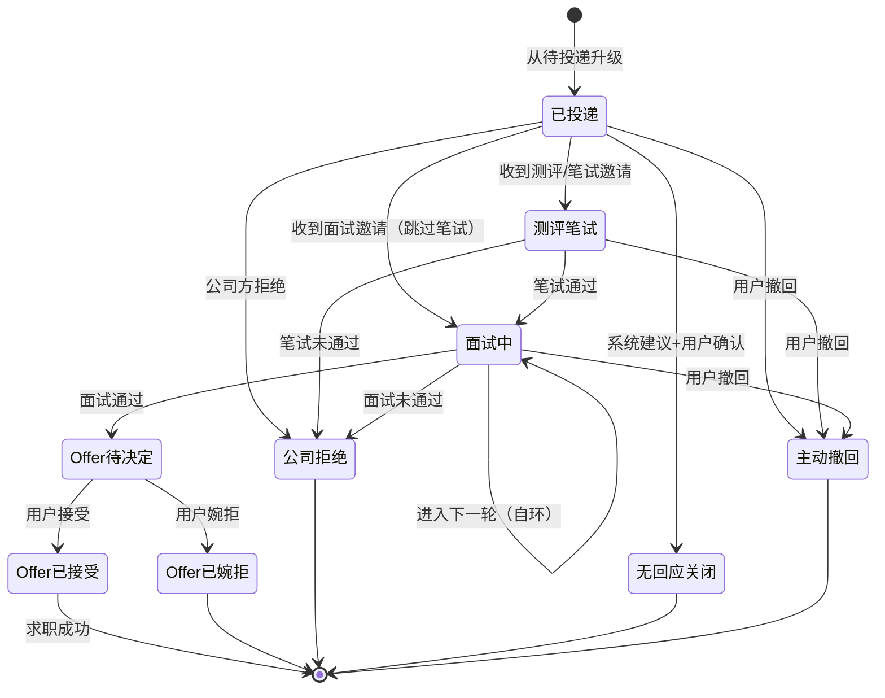

# 产品需求文档（PRD）

> **v3 修订说明**（2026-06-22）：
> 1. 状态机修正为 9 状态 + 5 终态，新增"无回应关闭"
> 2. 新增终态可纠错机制（含日志）
> 3. 数据模型修正：删除 `offer_result`、`UserJobAction` 收窄（不存已投递）、新增 `ApplicationEvent` 统一事件表
> 4. 新增功能点：F-C.5（低成本状态更新）、F-C.6（下一步待办视图）、F-A.6（岗位有效性核验）
> 5. F-D.1 订阅降为 P1
> 6. 更新 Mermaid 图为 9 状态版本
>
> 阶段 1 收官产出。本文档汇总竞品调研、市场分析、痛点与Job Stories的结论，作为阶段 2（架构设计）和阶段 4（实现）的直接输入。

---

## 一、文档信息

| 项目 | 内容 |
|------|------|
| 版本号 | v3.0 |
| 作者 | MiMo Code Agent（v1）/ Codex（v2 校准）/ MiMo Code Agent（v3 评审修订） |
| 日期 | 2026年6月22日 |
| 状态 | 评审修订版 |
| 修订记录 | v2：状态机/AC/数据模型/范围边界 8 处修订；v3：评审建议落地（9状态/纠错/事件表/新功能） |

**关联文档**：
- `docs/research/competitor-analysis.md` — 竞品调研（TASK-001）
- `docs/research/market-analysis.md` — 市场分析（TASK-003）
- `docs/product/pain-points-jtbd.md` — 痛点与Job Stories（TASK-002）
- `docs/product/user-personas.md` — 用户画像
- `docs/product/PROJECT.md` — 立项决策

---

## 二、产品概述

### 2.1 一句话定位

> 面向大学生的招聘信息聚合+投递管理工具，用数据看板掌握求职节奏。

### 2.2 目标用户

| 画像 | 优先级 | 说明 |
|------|--------|------|
| P1 林晓（高频跨平台投递者） | **首批用户** | 痛点最强、投递量大、传播性强 |
| P2 周明（实习定向型） | 次要画像 | 精准定向、个性化订阅价值高，但核心需求超出MVP能力边界 |
| P3（P1延伸场景） | P1生命周期 | 秋招失败后的复盘阶段，用于说明状态机复盘价值 |

### 2.3 核心价值主张

| 价值 | 说明 |
|------|------|
| **信息统一** | 告别在BOSS/拉勾/牛客/实习僧/企业官网之间来回切换 |
| **投递闭环** | 从「收藏→投递→笔试→面试→Offer/拒绝」全状态管理 |
| **数据驱动** | 用看板看清自己的求职节奏与转化 |

### 2.4 项目形态

**作品集 Demo（路径 B）**
- 本地可运行，面试可现场演示
- 数据库用 SQLite（零配置），不引入账号体系
- 采集以公开页面 + 低频请求为主，规避反爬与合规风险

---

## 三、业务流程与状态机

### 3.1 采集流程

```
源（企业官网/主流平台）
    ↓
调度（APScheduler 定时触发）
    ↓
抓取（Playwright/httpx）
    ↓
清洗（字段提取/格式化/毕业年份/学历/经验要求）
    ↓
去重（公司名+岗位名+地点 多字段匹配）
    ↓
入库（写入 Job 表）
    ↓
失效标记（定期检查投递链接是否有效）
```

### 3.2 三层状态概念澄清

本项目存在**三个相互独立的状态维度**，分别存在不同的表中：

| 状态维度 | 含义 | 存储位置 | 取值 |
|---------|------|---------|------|
| **① 岗位状态** | 岗位本身在系统中的生命周期（采集侧） | `Job.status` | `展示中` / `已关闭（失效）` |
| **② 用户-岗位关系** | 当前用户对该岗位的标记行为 | `UserJobAction.action_type` | `收藏` / `待投递` |
| **③ 投递状态** | 用户投递后的求职进度（仅当 action 升级为投递后） | `Application.status` | 见 3.3 状态机 |

**关键关系**：
- 维度② 和 ③ 是**互斥升级**的：一个岗位对用户而言，要么处于"收藏/待投递"（未投递），要么进入"投递状态机"（已投递及之后）
- 升级路径：`无 → 收藏 → 待投递 → 投递状态机起点（已投递）`
- 一旦进入投递状态机，不可回退到"收藏/待投递"

### 3.3 投递状态机（核心，9 状态版本）

**状态定义**（共 9 个状态，含 5 个终态）：

| 类型 | 状态 | 说明 | 进入条件 | 退出条件 |
|------|------|------|---------|---------|
| 进行中 | **已投递** | 已提交，等待回复 | 从"待投递"升级 | 收到笔试/面试/Offer/拒绝/无回应，或用户撤回 |
| 进行中 | **测评/笔试** | 收到测评或笔试 | 用户标记"收到笔试" | 笔试通过→面试中；未通过→公司拒绝；用户撤回 |
| 进行中 | **面试中** | 收到面试（可多轮） | 用户标记"收到面试" | 面试通过→Offer待决定；未通过→公司拒绝；用户撤回 |
| 进行中 | **Offer 待决定** | 收到 Offer，待用户选择 | 用户标记"收到Offer" | 用户接受→Offer已接受；用户婉拒→Offer已婉拒 |
| 终态 | **Offer 已接受** | 用户接受 Offer | 用户点击"接受" | 无（求职成功） |
| 终态 | **Offer 已婉拒** | 用户婉拒 Offer（`offer_declined`） | 用户点击"婉拒" | 无 |
| 终态 | **公司拒绝** | 公司明确拒绝 | 用户标记"被拒" | 无 |
| 终态 | **无回应关闭** | 超时无回复，用户确认后关闭 | 系统建议+用户确认 | 无 |
| 终态 | **主动撤回** | 用户主动撤回投递 | 用户点击"撤回" | 无 |

**"无回应关闭"触发机制**：
- 系统建议 + 用户确认（不自动转换）
- 阈值：默认 14 天无状态变更，系统在待办中提示"是否标记为无回应关闭"
- 阈值可配置

**状态流转图**（Mermaid 格式）：



**禁止的流转规则**：
- 任何终态（Offer已接受/Offer已婉拒/公司拒绝/无回应关闭/主动撤回）→ 任何其他状态：**禁止**（但可纠错，见下文）
- 任何状态 → 回退到前一阶段（如 面试中 → 已投递）：**禁止**（求职进度不可逆）
- 用户可在**任何非终态**撤回 → 主动撤回
- "面试中 → 面试中"是唯一允许的自环（多轮面试）

#### 3.3.1 状态纠错机制（v3 新增）

> 终态永久锁死会导致用户误操作后无法修复。v3 引入纠错机制。

**纠错规则**：
- **任何状态（含终态）都允许"撤销上一步"或"纠正"**
- 每次纠错写入 `ApplicationEvent` 日志，标注 `is_correction=true` 和纠错原因
- **漏斗统计必须排除纠错记录**（在 F-B.2 的 AC 中明确）

**示例**：
- 用户误将"面试中"标记为"公司拒绝" → 可纠正为"面试中"，日志记录纠错
- 用户误将"Offer已接受"标记为"Offer已婉拒" → 可纠正，日志记录纠错

#### 3.3.2 统一事件表 ApplicationEvent（v3 新增）

> 将阶段与事件分离。状态只表达当前求职阶段。笔试时间、面试轮次、DDL、完成情况等进入独立的事件表。

| 字段 | 类型 | 说明 |
|------|------|------|
| id | INTEGER PK | |
| application_id | INTEGER FK | 关联投递 |
| event_type | TEXT | `status_change` / `interview` / `test` / `material_submit` / `offer` / `note` / `correction` |
| from_status | TEXT | 状态变更前（仅 status_change/correction） |
| to_status | TEXT | 状态变更后（仅 status_change/correction） |
| round | INTEGER | 面试轮次（仅 interview） |
| scheduled_at | DATETIME | 计划时间（笔试/面试/材料提交的 DDL） |
| occurred_at | DATETIME | 实际发生时间 |
| is_correction | BOOLEAN | 是否纠错记录（默认 false） |
| correction_reason | TEXT | 纠错原因（仅 correction） |
| note | TEXT | 备注 |

**数据来源**：
- **漏斗数据**：F-B.2 漏斗从 `event_type='status_change' AND is_correction=false` 取
- **下一步待办**：F-C.6 待办视图从 `event_type IN ('interview','test','material_submit') AND scheduled_at IS NOT NULL AND occurred_at IS NULL` 取

### 3.4 订阅-推送流程

```
用户创建订阅规则（关键词/公司/地点）
    ↓
系统定期检查新入库岗位
    ↓
匹配订阅规则
    ↓
生成推送通知（Demo阶段：列表高亮 + 未读计数）
    ↓
用户查看新岗位
```

---

## 四、功能需求

### 模块 A：数据采集与展示（P0）

#### 功能 F-A.1：多源采集器

**优先级**：P0
**对应 Job Story**：JS-01, JS-06
**用户故事**：作为 P1 林晓，我希望在一个地方看到所有平台的岗位信息，以便于不用在多个网站之间来回切换。

**功能描述**：
- 支持从企业官网、BOSS直聘、牛客网、拉勾、实习僧等多个来源采集招聘信息
- 采集器采用适配器模式，每个来源一个适配器
- 采集频率：每小时1次（Demo阶段），避免反爬

**输入/输出**：
- 输入：采集源配置（URL、选择器、调度频率）
- 输出：结构化的岗位数据（JSON格式）

**验收标准（AC）**：
1. 【功能】支持至少 3 个采集源（如 BOSS、牛客、企业官网）
2. 【功能】采集频率可配置，默认每小时 1 次
3. 【功能】采集日志可查看（成功/失败/跳过及原因）
4. 【性能】单源单次采集在本地环境 ≤ 60 秒（前提：目标站点响应正常）

**异常与边界**：
- 采集失败：记录日志，下次重试
- 反爬被封：降低频率，切换User-Agent
- 页面结构变更：标记为"需人工检查"

---

#### 功能 F-A.2：数据清洗与去重

**优先级**：P0
**对应 Job Story**：JS-01
**用户故事**：作为 P1 林晓，我希望系统能自动识别重复岗位，以便于我不重复投递。

**功能描述**：
- 清洗：提取结构化字段（公司名、岗位名、地点、薪资、JD、投递链接、毕业年份、学历、经验要求）
- 去重：基于"公司名+岗位名+地点"多字段匹配，合并重复记录
- 硬条件提取：从JD中提取毕业年份、学历要求、经验要求

**输入/输出**：
- 输入：原始采集数据
- 输出：清洗去重后的岗位数据

**验收标准（AC）**：
1. 【功能】必填字段（公司名/岗位名/地点）缺失的记录被标记为"待人工补全"，不直接丢弃
2. 【功能】同源重复岗位（公司+岗位+地点 完全一致）被合并，保留信息最完整版本
3. 【功能】提供"重复记录对比"入口，用户可手动确认/取消合并
4. 【功能】毕业年份、学历、经验要求从 JD 提取，未知时标记为"未识别"

**异常与边界**：
- 同一岗位不同描述：保留信息最完整的版本
- 字段缺失：标记为"未知"，不丢弃记录
- 去重误判：提供"查看原始记录"入口

---

#### 功能 F-A.3：岗位列表与筛选

**优先级**：P0
**对应 Job Story**：JS-06, JS-20
**用户故事**：作为 P1 林晓，我希望能按公司、岗位类型、毕业年份等筛选职位，以便于快速找到目标岗位。

**功能描述**：
- 列表展示：公司名、岗位名、地点、薪资、采集时间、来源平台、有效性标识
- 筛选条件：关键词、公司、地点、薪资范围、毕业年份、学历、经验要求、来源平台
- 排序：按采集时间（默认）、薪资、公司名
- 分页：每页20条，支持翻页

**输入/输出**：
- 输入：筛选条件
- 输出：符合条件的岗位列表

**验收标准（AC）**：
1. 【功能】支持至少 7 个筛选条件组合（关键词+公司+地点+薪资范围+毕业年份+学历+经验+来源）
2. 【功能】空状态提示"暂无符合条件的岗位，建议放宽条件"
3. 【功能】分页：每页 20 条，支持翻页与回顶
4. 【性能】列表首屏加载 ≤ 1 秒（前提：本地 SQLite，岗位总量 ≤ 10000 条）

**异常与边界**：
- 筛选结果为空：显示"暂无数据"，建议放宽条件
- 网络异常：显示"加载失败"，支持重试
- 大量数据：分页加载，避免一次性加载

---

#### 功能 F-A.4：岗位详情页

**优先级**：P0
**对应 Job Story**：JS-02, JS-08
**用户故事**：作为 P1 林晓，我希望查看岗位的完整JD和投递链接，以便于决定是否投递。

**功能描述**：
- 展示完整JD、岗位要求、薪资范围、工作地点
- 展示硬条件：毕业年份、学历要求、经验要求
- 提供"投递链接"跳转到原平台
- 显示采集来源、采集时间、最后核验时间
- 支持"收藏"和"已投递"操作

**输入/输出**：
- 输入：岗位ID
- 输出：岗位详情页

**验收标准（AC）**：
1. 详情页加载时间 ≤ 1秒
2. 投递链接可正常跳转
3. 收藏/已投递操作即时生效
4. 显示"最后更新时间"和"最后核验时间"

**异常与边界**：
- 链接失效：显示"岗位已关闭"，标记为失效
- 信息不全：显示"部分信息缺失"，标注缺失字段
- 来源不可靠：显示"信息仅供参考"

---

#### 功能 F-A.5：定时调度与失效清理

**优先级**：P0
**对应 Job Story**：JS-06, JS-18
**用户故事**：作为 P1 林晓，我希望系统能自动更新岗位信息并核验有效性，以便于我不用手动刷新。

**功能描述**：
- 定时调度：APScheduler触发，每小时执行一次采集
- 失效清理：定期检查岗位链接是否有效，标记失效岗位
- 调度日志：记录每次调度的执行情况

**输入/输出**：
- 输入：调度配置（频率、时间）
- 输出：调度执行日志

**验收标准（AC）**：
1. 【功能】调度按配置时间触发
2. 【功能】失效检查能识别 HTTP 404 / 目标页结构变更，标记为"疑似失效"
3. 【功能】调度日志可查看（每次执行的时间、源、成功/失败数）
4. 【功能】支持手动触发一次采集/失效检查

**异常与边界**：
- 调度失败：记录日志，下次重试
- 失效误判：提供"手动恢复"入口
- 资源占用过高：限制并发采集数

---

#### 功能 F-A.6：岗位有效性核验（v3 新增）

**优先级**：P0
**对应 Job Story**：JS-18
**用户故事**：作为 P1 林晓，我希望看到岗位的"最后核验时间"和"是否仍有效"，以便于不投递已关闭的岗位。

**功能描述**：
- 岗位卡片显示"最后核验时间"和"有效/失效"标识
- 核验由定时调度自动执行，用户可手动触发
- 失效岗位在列表中置灰显示

**输入/输出**：
- 输入：岗位ID
- 输出：核验状态

**验收标准（AC）**：
1. 【功能】岗位卡片显示"最后核验时间"（格式：X小时前/昨天/X天前）
2. 【功能】失效岗位显示"已失效"标识，列表中置灰
3. 【功能】用户可手动触发"重新核验"
4. 【功能】收藏/待投递列表中标注失效岗位

**异常与边界**：
- 核验失败：显示"核验中"，不改变状态
- 网络异常：显示"无法核验"，保留原状态

---

### 模块 B：看板统计（P0）

#### 功能 F-B.1：核心KPI卡片

**优先级**：P0
**对应 Job Story**：JS-04
**用户故事**：作为 P1 林晓，我希望一眼看到今天的投递数量和总收录数，以便于掌握求职进度。

**功能描述**：
- 今日新增：今日采集入库的岗位数
- 收录总数：系统累计收录的岗位数
- 投递总数：用户累计投递的岗位数
- 待处理：待投递+已投递未回复的岗位数

**输入/输出**：
- 输入：无（自动计算）
- 输出：4个KPI卡片

**验收标准（AC）**：
1. 数据实时更新（刷新页面后生效）
2. 数字格式正确（千分位分隔）
3. 空状态显示"0"
4. 点击卡片可跳转到对应列表

**异常与边界**：
- 数据异常：显示"--"，提示"数据加载失败"
- 历史数据：支持查看历史KPI趋势

---

#### 功能 F-B.2：投递转化漏斗

**优先级**：**P1**（v3 降级，评审 §四建议：小样本不适合细分策略判断，保留基础漏斗）
**对应 Job Story**：JS-04
**用户故事**：作为 P1 林晓，我希望看到投递漏斗（投递→笔试→面试→Offer），以便于定位求职问题。

**功能描述**：
- 漏斗图：展示从投递到Offer的转化漏斗
- 转化率：每个阶段的转化率（如投递→笔试 = 30%）
- 数据来源：`ApplicationEvent` 表中 `event_type='status_change' AND is_correction=false`

**输入/输出**：
- 输入：投递记录
- 输出：漏斗图+转化率

**验收标准（AC）**：
1. 漏斗图清晰展示各阶段数量
2. 转化率精确到小数点后1位
3. 空状态显示"暂无投递数据"
4. 支持按时间范围筛选
5. **漏斗统计排除纠错记录**（`is_correction=false`）

**异常与边界**：
- 数据不足：显示"数据量不足，统计可能不准确"
- 阶段跳跃：允许用户跳过某些阶段（如直接面试）

---

#### 功能 F-B.3：有效进展趋势（v3 重写，原"近7天趋势图"）

**优先级**：P1
**对应 Job Story**：JS-14'
**用户故事**：作为 P1 林晓，我希望看到近7天的有效进展趋势（进入笔试/面试/Offer的数量），以便于维持求职动力。

**功能描述**：
- 折线图：展示近7天的有效进展数（只统计进入测评/面试/Offer的事件）
- 不统计投递数量（避免鼓励无效海投）

**输入/输出**：
- 输入：时间范围（默认近7天）
- 输出：有效进展趋势图

**验收标准（AC）**：
1. 图表加载时间 ≤ 1秒
2. 数据点可hover查看详情
3. 空状态显示"暂无有效进展"
4. 支持切换时间范围（7天/14天/30天）

**异常与边界**：
- 数据缺失：显示"部分日期无数据"
- 极端值：自动调整Y轴范围

---

#### 功能 F-B.4：分布维度

**优先级**：P1
**对应 Job Story**：JS-04
**用户故事**：作为 P1 林晓，我希望看到按公司类型、岗位方向的投递分布，以便于了解投递结构。

**功能描述**：
- 饼图/柱状图：按公司类型、岗位方向、地区分布
- 筛选：支持按时间范围、投递状态筛选
- 交互：点击图表可查看对应列表

**输入/输出**：
- 输入：筛选条件
- 输出：分布图

**验收标准（AC）**：
1. 图表加载时间 ≤ 1秒
2. 支持至少3个维度（公司类型、岗位方向、地区）
3. 空状态显示"暂无数据"
4. 点击图表可跳转到对应列表

**异常与边界**：
- 分类不明确：归入"其他"类别
- 数据量过大：只显示Top10，其余归入"其他"

---

### 模块 C：投递管理（P0）

#### 功能 F-C.1：投递状态机

**优先级**：P0
**对应 Job Story**：JS-02, JS-15
**用户故事**：作为 P1 林晓，我希望标记每个岗位的投递状态，以便于追踪求职进展。

**功能描述**：
- 状态标记：支持 9 个状态（已投递/测评笔试/面试中/Offer待决定/Offer已接受/Offer已婉拒/公司拒绝/无回应关闭/主动撤回）
- 状态流转：严格按 3.3 状态机规则流转，禁止非法跳转
- 终态可纠错：任何状态（含终态）允许"撤销上一步"或"纠正"，记录日志
- 每次状态变更写入 `ApplicationEvent`（3.3.2），用于漏斗分析

**输入/输出**：
- 输入：岗位ID、目标状态、备注（可选）
- 输出：状态更新结果 + 事件日志

**验收标准（AC）**：
1. 【功能】状态流转符合 3.3 状态机定义，非法跳转提示"不允许的操作"
2. 【功能】终态可纠错，纠错记录写入 ApplicationEvent（`is_correction=true`）
3. 【功能】每次状态变更写入 ApplicationEvent，含 from_status / to_status / 时间戳
4. 【功能】面试中→面试中（下一轮）支持，并记录轮次

**异常与边界**：
- 网络异常：操作失败，支持重试
- 并发操作：以时间戳最新者为准
- 误操作：可纠错，但保留日志

---

#### 功能 F-C.2：投递时间线

**优先级**：P0
**对应 Job Story**：JS-02
**用户故事**：作为 P1 林晓，我希望查看每个岗位的投递时间线，以便于了解进展历史。

**功能描述**：
- 时间线：展示岗位从投递到当前状态的完整时间线
- 节点：每个事件一个节点（状态变更、面试、笔试、备注）
- 备注：支持用户添加备注
- 纠错标记：纠错记录显示"纠错"标识

**输入/输出**：
- 输入：岗位ID
- 输出：时间线

**验收标准（AC）**：
1. 时间线按时间倒序排列
2. 节点显示事件类型、时间、备注
3. 纠错记录显示"纠错"标识和纠错原因
4. 空状态显示"暂无状态变更记录"

**异常与边界**：
- 数据缺失：显示"部分记录缺失"
- 时间异常：标注"时间异常"

---

#### 功能 F-C.3：DDL提醒

**优先级**：P0
**对应 Job Story**：JS-03
**用户故事**：作为 P1 林晓，我希望系统提醒我岗位截止时间，以便于不错过DDL。

**功能描述**：
- DDL字段：岗位详情中显示截止时间
- 提醒方式：列表中标红显示即将截止的岗位（3天内）
- 提醒规则：截止前3天、1天、当天提醒

**输入/输出**：
- 输入：岗位截止时间
- 输出：DDL提醒

**验收标准（AC）**：
1. DDL字段可编辑
2. 列表中即将截止岗位标红显示
3. 提醒规则可配置
4. 已过期岗位显示"已截止"

**异常与边界**：
- 无DDL：显示"无截止时间"
- DDL已过：显示"已截止"，标灰
- DDL修改：记录修改历史

---

#### 功能 F-C.4：收藏与待投递区分

**优先级**：P0
**对应 Job Story**：JS-10
**用户故事**：作为 P1 林晓，我希望区分"收藏"和"待投递"的岗位，以便于管理投递节奏。

**功能描述**：
- 收藏（action_type=favorited）：用户感兴趣的岗位，先存着
- 待投递（action_type=to_apply）：已决定要投递，准备简历/等时机
- 升级：收藏 → 待投递 → 投递状态机起点（已投递）
- 降级：待投递 → 收藏（允许）；投递后 → 收藏（禁止，不可回退）

**输入/输出**：
- 输入：岗位ID、目标动作（收藏/待投递）
- 输出：关系更新结果

**验收标准（AC）**：
1. 【功能】收藏列表与待投递列表分离展示，各自显示数量
2. 【功能】支持一键切换 收藏↔待投递
3. 【功能】投递后（进入状态机）该岗位从收藏/待投递列表移除
4. 【功能】空状态提示不同（"暂无收藏"/"暂无待投递岗位"）

---

#### 功能 F-C.5：低成本状态更新（v3 新增）

**优先级**：P0
**对应 Job Story**：JS-16
**用户故事**：作为 P1 林晓，我希望收到笔试邮件或HR微信时，能用最快的方式记录进展，以便于不用打开系统翻找、手填表单。

**功能描述**：
- 快捷交互层：
  - 列表页岗位旁状态快捷按钮
  - 批量操作（选中多个岗位，批量标记状态）
- AI 解析层（亮点）：
  - 粘贴招聘通知文本，解析公司、岗位、建议状态和明确时间
  - LLM 不可用时使用本地规则降级；缺少日期或钟点时不推测
  - 解析结果只作建议，用户确认后才更新状态
  - 有明确时间时，状态事件与面试/测评计划事件在同一事务中写入

**输入/输出**：
- 输入：招聘通知文本或快捷操作
- 输出：状态更新结果，以及可选的计划事件

**验收标准（AC）**：
1. 【功能】列表页岗位旁显示状态快捷按钮（已投递/笔试/面试/Offer/拒绝）
2. 【功能】支持批量选中岗位，批量标记状态
3. 【功能】粘贴通知文本后，解析公司、岗位、建议状态和明确时间，显示预览供确认
4. 【功能】确认前不改变业务数据；确认后状态事件与计划事件原子写入
5. 【功能】计划事件同时出现在投递时间线和统一待办视图

**异常与边界**：
- AI 解析失败：提示"无法解析"，引导手动操作
- 批量操作失败：部分成功，显示失败原因
- 状态与计划事件类型不匹配：整次请求拒绝，不留下部分更新
- 未匹配到唯一投递：使用当前详情页投递作为确认对象，不自动创建未知投递

---

#### 功能 F-C.6：下一步待办视图（v3 新增）

**优先级**：P0
**对应 Job Story**：JS-17
**用户故事**：作为 P1 林晓，我希望看到统一的待办视图（笔试/面试/材料提交的时间），以便于不冲突、不遗漏。

**功能描述**：
- 从 `ApplicationEvent` 取未发生的笔试/面试/材料提交
- 按时间排序，支持日历视图
- 显示：时间+类型+岗位+公司

**输入/输出**：
- 输入：无（自动从 ApplicationEvent 取）
- 输出：待办列表/日历视图

**验收标准（AC）**：
1. 【功能】待办视图显示未来 7 天的笔试/面试/材料提交
2. 【功能】按时间排序，支持日历视图切换
3. 【功能】点击待办可跳转到对应岗位详情
4. 【功能】空状态显示"暂无待办"

**异常与边界**：
- 数据缺失：显示"部分待办信息不完整"
- 时间冲突：高亮显示时间冲突的待办

---

#### 功能 F-C.7：岗位库外投递补录（v4 新增）

**优先级**：P0  
**对应 Job Story**：JS-02、JS-16  
**用户故事**：作为跨平台求职者，我希望用最少字段补录岗位库未收录的投递，以便于所有进展进入同一时间线。

**功能描述**：

- 投递管理页提供“补录外部投递”入口；
- 公司、岗位必填；地点、投递日期、原始链接和备注可选；
- 单次提交创建 `source=manual` 的岗位、`applied` 投递和初始状态事件；
- 创建成功后进入投递详情，沿用既有状态机、通知解析和时间线。

**验收标准（AC）**：

1. 【功能】只填写公司和岗位即可建立正式投递；
2. 【一致性】岗位、投递和初始事件在同一事务中创建，失败时全部回滚；
3. 【防重】同一手动岗位已有非终态投递时返回已有记录；
4. 【边界】补录只记录已发生的外部投递，不触发自动投递或修改外部平台。

---

### 模块 D：个性化订阅（P1，v3 降级）

#### 功能 F-D.1：订阅规则

**优先级**：**P1**（v3 降级，评审建议）
**对应 Job Story**：JS-06
**用户故事**：作为 P2 周明，我希望订阅目标公司的岗位更新，以便于不错过新发布的岗位。

**功能描述**：
- 订阅条件：关键词、公司名、地点
- 组合规则：支持多条件组合（AND逻辑）
- 管理：支持查看、编辑、删除订阅

**输入/输出**：
- 输入：订阅条件（关键词/公司/地点）
- 输出：订阅规则

**验收标准（AC）**：
1. 支持至少3个订阅条件
2. 订阅规则可保存
3. 支持查看、编辑、删除
4. 空状态提示"暂无订阅"

**异常与边界**：
- 重复订阅：提示"已存在相同订阅"
- 条件冲突：提示"条件过于严格，可能无结果"

---

#### 功能 F-D.2：新岗位推送

**优先级**：P1
**对应 Job Story**：JS-06
**用户故事**：作为 P2 周明，我希望新岗位发布时收到通知，以便于及时了解目标公司动态。

**功能描述**：
- 推送方式：列表高亮 + 未读计数（Demo阶段）
- 推送规则：匹配订阅规则的新岗位
- 推送频率：采集完成后立即标记

**输入/输出**：
- 输入：新入库岗位
- 输出：推送通知

**验收标准（AC）**：
1. 新岗位在列表中高亮显示
2. 高亮持续24小时后自动消失
3. 支持查看"未读"岗位数
4. 支持"全部标为已读"

**异常与边界**：
- 推送过多：提供"全部标为已读"功能
- 推送遗漏：提供"手动刷新"入口

---

## 五、非功能需求

### 5.1 性能

| 指标 | 要求 | 说明 |
|------|------|------|
| 列表加载 | ≤ 1秒 | 首屏加载时间 |
| 筛选响应 | ≤ 500毫秒 | 筛选条件变更后响应 |
| 采集并发 | ≤ 3个 | 同时采集的源数量 |
| 数据库查询 | ≤ 200毫秒 | 单次查询时间 |

### 5.2 可用性

| 指标 | 要求 | 说明 |
|------|------|------|
| Demo阶段可用性 | 不要求高可用 | 本地运行，不要求99.9% |
| 错误处理 | 友好提示 | 不显示技术性错误信息 |
| 空状态 | 明确提示 | 每个列表都有空状态设计 |

### 5.3 兼容性

| 指标 | 要求 | 说明 |
|------|------|------|
| 浏览器 | Chrome/Edge/Safari最新版 | 不支持IE |
| 分辨率 | 1024px+ | 桌面端优先，更窄屏幕不主动适配但允许布局降级 |
| 响应式 | 标注但非MVP必须 | 后续可扩展 |

### 5.4 安全

| 指标 | 要求 | 说明 |
|------|------|------|
| 数据库 | SQLite本地存储 | 无账号体系（路径B） |
| 输入校验 | 防SQL注入 | 所有用户输入需校验 |
| 采集频率 | 限制≤1次/分钟/源 | 避免反爬 |
| 敏感数据 | 不存储密码/Token | 仅存储公开信息 |

### 5.5 合规

| 风险 | 对策 |
|------|------|
| 爬虫违反ToS | 仅采集公开页面；低频请求；不绕过反爬 |
| 数据合规 | 不采集用户隐私；仅采集公开招聘信息 |
| 版权风险 | 引用来源标注；不完整复制JD；链接跳转原平台 |

---

## 六、数据模型预览

> v3 修订：删除 `Application.offer_result`、`UserJobAction` 收窄（不存已投递，加 `ended_at`）、新增 `ApplicationEvent` 统一事件表

### 6.1 核心实体

#### Job（岗位）—— 维度① 岗位状态

| 字段 | 类型 | 说明 |
|------|------|------|
| id | INTEGER PK | 主键 |
| company | TEXT | 公司名 |
| title | TEXT | 岗位名 |
| location | TEXT | 工作地点 |
| salary | TEXT | 薪资范围 |
| jd | TEXT | 岗位描述 |
| requirement | TEXT | 岗位要求 |
| apply_url | TEXT | 投递链接 |
| source | TEXT | 来源平台 |
| source_url | TEXT | 原始采集页 URL |
| job_category | TEXT | 岗位方向（产品/技术/设计/运营...） |
| graduation_year | TEXT | 毕业年份要求 |
| education | TEXT | 学历要求 |
| experience | TEXT | 经验要求 |
| collected_at | DATETIME | 采集时间 |
| published_at | DATETIME | 发布时间 |
| deadline | DATETIME | 截止时间 |
| last_verified_at | DATETIME | 最后核验时间 |
| is_valid | BOOLEAN | 是否有效 |
| is_intern | BOOLEAN | 是否实习 |
| is_fresh | BOOLEAN | 是否应届 |
| status | TEXT | 岗位状态：`展示中` / `已关闭` |

#### UserJobAction（用户-岗位关系）—— 维度②

| 字段 | 类型 | 说明 |
|------|------|------|
| id | INTEGER PK | 主键 |
| job_id | INTEGER FK | 关联岗位 |
| action_type | TEXT | `收藏` / `待投递`（**v3 删除"已投递"，已投递由 Application 表达**） |
| created_at | DATETIME | 操作时间 |
| ended_at | DATETIME | **v3 新增**：一旦创建 Application，原记录设 ended_at（结案） |

#### Application（投递记录）—— 维度③ 当前状态

| 字段 | 类型 | 说明 |
|------|------|------|
| id | INTEGER PK | 主键 |
| job_id | INTEGER FK | 关联岗位 |
| status | TEXT | **当前状态**（见 3.3 状态机，9 个状态） |
| applied_at | DATETIME | 投递时间 |
| updated_at | DATETIME | 最后状态变更时间 |
| notes | TEXT | 备注 |

> v3 删除 `offer_result`（status 已表达 Offer 结果）和 `current_round`（多轮面试靠事件表回溯）

#### ApplicationEvent（统一事件表）—— v3 新增

| 字段 | 类型 | 说明 |
|------|------|------|
| id | INTEGER PK | |
| application_id | INTEGER FK | 关联投递 |
| event_type | TEXT | `status_change` / `interview` / `test` / `material_submit` / `offer` / `note` / `correction` |
| from_status | TEXT | 状态变更前（仅 status_change/correction） |
| to_status | TEXT | 状态变更后（仅 status_change/correction） |
| round | INTEGER | 面试轮次（仅 interview） |
| scheduled_at | DATETIME | 计划时间（笔试/面试/材料提交的 DDL） |
| occurred_at | DATETIME | 实际发生时间 |
| is_correction | BOOLEAN | 是否纠错记录（默认 false） |
| correction_reason | TEXT | 纠错原因（仅 correction） |
| note | TEXT | 备注 |

#### Subscription（订阅）

| 字段 | 类型 | 说明 |
|------|------|------|
| id | INTEGER PK | 主键 |
| keyword | TEXT | 关键词 |
| company | TEXT | 公司名 |
| location | TEXT | 地点 |
| created_at | DATETIME | 创建时间 |

#### Company（公司，可选）

| 字段 | 类型 | 说明 |
|------|------|------|
| id | INTEGER PK | 主键 |
| name | TEXT | 公司名 |
| industry | TEXT | 行业 |
| category | TEXT | 公司类型（互联网大厂/创业公司/外企/国企...） |
| website | TEXT | 官网 |

---

## 七、范围边界

### 7.1 明确不做（Demo阶段）

| 功能 | 理由 |
|------|------|
| 简历制作/优化 | 超级简历已做得很好，非本项目核心价值 |
| 面经/面试辅导 | 牛客已做得很好，非本项目核心价值 |
| 公司点评 | 看准网已做得很好，非本项目核心价值 |
| 社交/人脉 | LinkedIn已做得很好，非本项目核心价值 |
| 在线课程 | 牛客、实习僧已有，非本项目核心价值 |
| 账号体系 | 路径B无需账号，本地SQLite |
| 移动端原生适配 | Demo阶段聚焦桌面端，仅保证 1024px+ 宽度可用 |
| 高可用部署 | 本地运行，不要求99.9% |
| 完整站内通知/推送系统 | Demo阶段简化为"列表高亮 + 未读计数"，不做邮件/WebSocket |
| 细分转化分析 | 小样本不适合按岗位/地区/公司类型进行策略判断 |
| 主观标签（应届友好度） | 改为可溯源的毕业年份、学历、经验要求 |

### 7.2 措辞澄清

- **移动端**：桌面端优先，保证 1024px+ 可用；更窄屏幕不主动适配但允许布局降级
- **推送**：F-D.2 的"列表高亮 + 未读计数"是 MVP 做的；邮件/WebSocket/APP 推送是不做的
- **实时性**：采集后立即标记新岗位（准实时，延迟≤采集周期）；不做用户在线时的实时推送

---

## 八、依赖与风险

### 8.1 依赖

| 依赖 | 说明 | 风险等级 |
|------|------|---------|
| 采集源稳定性 | 依赖目标网站的稳定性和可访问性 | 高 |
| 反爬对抗 | 依赖目标网站的反爬策略 | 高 |
| 技术栈成熟度 | Python/Next.js/SQLite成熟稳定 | 低 |
| 开源库可用性 | Playwright/httpx/APScheduler活跃维护 | 低 |

### 8.2 风险

| 风险 | 等级 | 影响 | 对策 |
|------|------|------|------|
| 反爬被封禁 | 高 | 采集失败，数据断供 | 低频请求；User-Agent轮换；代理池；多源冗余 |
| 数据合规 | 高 | 法律风险 | 仅采集公开数据；不存隐私；低频请求 |
| 页面结构变更 | 中 | 采集失败 | 监控采集成功率；快速适配；人工兜底 |
| **用户不维护状态** | **高** | 数据看板价值降低 | **低成本状态更新（F-C.5）；AI解析；价值驱动** |
| 范围蔓延 | 中 | 项目延期 | 严格"做/不做"清单；定期评审 |
| 采集覆盖不全 | 中 | 数据不完整 | 多源组合；人工兜底；优先核心源 |

### 8.3 "看起来简单但实际有坑"的功能

| 功能 | 坑点 | 对策 |
|------|------|------|
| 去重 | 同一岗位不同描述，误判率高 | 多字段匹配；人工审核；用户反馈 |
| 硬条件提取 | JD表述不统一，识别困难 | 正则+关键词；人工兜底；用户标注 |
| DDL提醒 | 截止时间格式不一，提取困难 | 多格式解析；用户手动修正；默认"无DDL" |
| 状态流转 | 用户可能误操作或跳过状态 | 允许跳转；终态可纠错；记录日志 |
| 无回应关闭 | 阈值判断（14天）可能不合理 | 阈值可配置；系统建议+用户确认 |

---

## 九、交付物自检

### 9.1 自查清单

- [x] 八个部分齐全
- [x] 投递状态机定义完整（9个状态+5终态+流转规则+禁止流转+纠错机制）
- [x] 四大模块功能点齐全（含3个新增），每个含AC
- [x] 数据模型预览存在（含 ApplicationEvent 统一事件表）
- [x] 范围边界（不做清单）明确
- [x] 所有功能可追溯到Job Story

### 9.2 面试官可能追问的问题

1. **状态机为什么是 9 个状态？**
   - 答：基于用户画像的真实场景，覆盖从投递到 Offer 的完整流程。关键设计是**区分 Offer 的四种终态**（已接受/已婉拒/公司拒绝/无回应关闭）——"用户婉拒 Offer"和"公司拒绝用户"在漏斗里是完全相反的信号，必须区分。新增"无回应关闭"是因为超时无回复不等于公司明确拒绝，两者对复盘的意义不同。

2. **为什么终态可纠错？**
   - 答：求职过程中用户可能误操作（如误标"拒绝"），终态永久锁死会导致数据不可修复。纠错机制允许"撤销上一步"，但保留完整日志（`is_correction=true`），漏斗统计排除纠错记录，保证数据可信。

3. **去重的准确率怎么保证？**
   - 答：Demo 阶段不设硬阈值（需要标注数据集）。采用多字段匹配（公司+岗位+地点）+ 用户反馈入口持续改进。

4. **为什么不做实时推送？**
   - 答：Demo 阶段用"列表高亮 + 未读计数"已能覆盖核心需求，完整推送通道（邮件/WebSocket）是工程投入大、Demo 收益小的功能。

5. **数据合规怎么处理？**
   - 答：仅采集公开页面、低频请求（≤1次/分钟/源）、不存储用户隐私、引用来源标注。

6. **ApplicationEvent 表的作用是什么？**
   - 答：将阶段与事件分离。状态只表达当前求职阶段，笔试时间、面试轮次、DDL等进入事件表。好处：漏斗数据从事件表取（排除纠错），待办视图从事件表取（未发生的事件），多轮面试靠事件回溯。

---

*文档版本：v3 | 修订日期：2026-06-22*
