# JobPulse 产品需求文档

> **M1 演进说明（2026-08-05）**：本文继续作为 M0 当前实现与验收的事实源。项目已确认向成熟个人 SaaS 演进；账号、数据归属、PostgreSQL、迁移、求职收件箱、真实提醒和外部集成的目标需求见 [PRD-M1.md](PRD-M1.md)，阶段门槛见 [ROADMAP.md](ROADMAP.md)。岗位供给改为[国内校招官方来源优先](DATA-SOURCE-STRATEGY.md)，M0 的海外 Greenhouse 默认源已经停用。M1 功能正式发布前，不把目标能力写成当前已实现。

| 文档属性 | 内容 |
|---|---|
| 版本 | V2.1（Figma 原型增强版） |
| 日期 | 2026-07-31 |
| 状态 | 评审稿 |
| 产品负责人 | 项目所有者（姓名待确认） |
| 协作角色 | 产品、UX/视觉、前端、后端、测试 |
| 对应 MRD | [市场需求文档](../product/MRD.md) |
| 当前实现基线 | [验收报告（2026-07-28）](../qa/ACCEPTANCE-REPORT.md) |
| 高保真资产 | [Figma 高保真原型索引](../design/HIGH-FIDELITY-PROTOTYPE-INDEX.md) |
| 重构依据 | [重构审计与证据矩阵](../archive/prd/PRD-V2.1-重构审计与证据矩阵.md) |

> **一句话摘要**：JobPulse 是面向跨渠道求职者的单用户求职工作台，把岗位发现、收藏与待投递、投递状态、招聘通知和近期安排放进同一条可追溯流程。V2.1 以当前 M0 Demo 为交付边界，并用可编辑的 Figma 设计系统和交互原型表达目标体验。

---

## 一、产品简介

### 1.1 文档目的

本文档是 JobPulse 当前产品需求与验收口径的事实源，回答三个问题：

1. 本期 M0 Demo 需要交付什么；
2. 每项能力为什么存在、如何运行；
3. 产品、设计、研发和测试如何判断交付完成。

市场规模、竞争与机会结论以 [MRD](../product/MRD.md) 为准；页面视觉细节以 [设计文档](../design/DESIGN.md) 为准；代码与接口细节以 [架构文档](../architecture/system-architecture.md) 和 [API 契约](../architecture/api-contract.md) 为准；已发生的验证事实以 [验收报告](../qa/ACCEPTANCE-REPORT.md) 为准。

### 1.2 背景与用户问题

公开内容研究证明以下现象存在，但不能证明其在人群中的发生比例：

- 求职岗位分散在企业官网、招聘平台、社区、群聊和公众号；
- 高频求职者会使用 Excel、Notion、飞书、邮箱或日历维护进度；
- 投递量增加后，记录可能中断，通知、时间和渠道信息可能丢失；
- 重要测评、面试和材料截止时间存在遗漏或冲突风险；
- 邮箱、日历和表格也是强替代方案，新产品只有明显减少重复录入才有迁移价值。

因此，本期核心问题不是“再做一张更漂亮的表格”，而是：

> 如何在保留来源和历史可追溯性的同时，降低从发现岗位到记录下一步行动的维护成本？

### 1.3 本期核心目标

本期以 M0 Demo 为边界，建立并验证以下闭环：

`发现岗位 → 收藏或待投递 → 建立投递 → 更新状态 → 形成计划事件 → 查看近期安排 → 回看历史`

本期必须做到：

- 岗位来源、更新时间、核验信息和演示快照边界清楚；
- 收藏和待投递表达两种独立意图；
- 投递状态和事件历史可追溯；
- 招聘通知只生成建议，用户确认后才改变状态；
- 明确的面试/测评时间与状态在同一事务中写入；
- 岗位库外投递可用最少字段进入统一时间线；
- 桌面端完整可用，390px 移动端可走通核心流程。

### 1.4 本期范围

| 范围 | 优先级 | 交付状态 |
|---|---:|---|
| 公开岗位列表、详情、来源与有效性信息 | P0 | 已实现，需按本 PRD 验收 |
| 收藏与待投递双清单 | P0 | 已实现 |
| 创建投递、9 状态流转、事件时间线 | P0 | 主流程已实现；前端纠错入口待补 |
| 招聘通知解析、人工确认、计划事件与近期安排 | P0 | 已实现 |
| 岗位库外投递最小补录 | P0 | 已实现 |
| 确定性演示快照与公开 ATS 采集质量可见性 | Ops-P0 | 已实现 |
| 求职概览和基础累计漏斗 | P1 | 已实现，用户价值待验证 |
| 岗位订阅规则 CRUD | P1 | 已实现；不含通知发送 |
| 响应式 Web 核心流程 | P0 | 已实现并有 390×844 验证 |

### 1.5 本期不做

以下能力不进入 V2.0 验收：

- 账号、登录、多用户、租户隔离、云同步和团队权限；
- 支付、真实套餐限制、邮件/微信/系统推送；
- 自动读取用户邮箱或日历；
- 自动投递、代替用户提交申请或修改外部招聘平台数据；
- 绕过登录、验证码、访问控制或反爬限制的采集；
- BOSS、牛客等受限平台的在线采集；
- 简历制作、简历优化、面经、课程、公司点评、社交与内推；
- Excel / Notion 历史投递导入；
- 从一封未知通知自动建立全新投递；
- 实习天数、实习周期等专项结构化筛选；
- 按公司、岗位方向或来源的策略性细分转化分析；
- 原生 iOS / Android App。

### 1.6 未来目标与进入条件

| 未来目标 | 进入条件 | 当前里程碑 |
|---|---|---|
| 历史投递导入 | 真人研究证明迁移成本是首要阻力；先支持固定 CSV 模板 | M1 候选 |
| 邮箱/日历集成 | 用户明确接受权限；完成隐私、撤权和数据最小化设计 | M1 候选 |
| 订阅通知闭环 | 至少 2 个数据源可持续刷新；用户验证“及时性”价值 | M1 候选 |
| 未知通知自动建档 | 匹配准确率、重复建档和人工确认机制通过测试 | M1 候选 |
| 账号与云同步 | 5–8 次访谈、3–5 次可用性测试和持续使用出现复用信号 | M1 |
| 细分漏斗和策略建议 | 有足够、完整且非纠错的真实事件样本 | M1/M2 |
| 团队与导师协作 | 真实团队需求出现，不以作品集设想代替证据 | M2 |
| 原生 App | Web 数据显示移动端高频使用且核心任务受 Web 限制 | M2 |

### 1.7 证据边界与已知限制

| 类型 | 当前事实 | 不能推导出的结论 |
|---|---|---|
| 真人研究 | 计划中的 3 人探索性访谈尚未执行，完成数为 0 | 不能声称“访谈用户后得出” |
| 公开内容研究 | 编码 12 条公开记录，证明问题和替代方案存在 | 不能推断总体发生率 |
| 合成角色 | 3 个 AI 合成角色用于找反例和预演访谈 | 不能计入样本、完成率或用户引语 |
| 专家走查 | 修复后核心 19/23、全部 20/26 预设结果覆盖 | 不是用户任务完成率 |
| 自动化测试 | 2026-07-28 基线为 120 项后端测试通过 | 不证明易用性、性能或持续使用 |
| 实现快照 | 14 张当前页面与状态截图 | 不证明用户理解或真实效果 |

### 1.8 名词术语

| 术语 | 定义 |
|---|---|
| 演示快照 | 用于稳定演示的确定性岗位数据，字段完整但不代表仍在招聘 |
| 公开 ATS | 企业使用的公开招聘系统 API；M0 验证过 Greenhouse 类型，海外默认源现已停用 |
| 收藏 | 保留可能性，不代表已经决定投递 |
| 待投递 | 已形成行动意图，但尚未创建正式投递记录 |
| 投递 | 已经在外部渠道完成申请，并进入 JobPulse 状态机 |
| 状态事件 | 一次投递阶段变化，如“已投递 → 测评/笔试” |
| 计划事件 | 未来要发生的面试、测评或材料提交，有计划时间且尚未完成 |
| 纠错 | 修复误操作产生的状态，必须保留纠错原因和事件历史 |
| 无回应关闭 | 长期无反馈后由用户确认的终态，不等同于公司明确拒绝 |

---

## 二、用户角色描述

### 2.1 角色划分原则

产品角色按会改变页面、默认入口、提示和验收规则的行为状态划分，不按学校、年龄、专业或招聘季节划分。

会改变产品行为的差异：

- 当前是在筛选机会、准备行动，还是维护已经发生的投递；
- 是否已有投递和未来计划事件；
- 当前投递是否进行中或已结束；
- 是否需要回看历史和复盘。

不直接成为产品角色的市场标签：

- 应届生、实习生、产品经理、开发者；
- 高频海投、定向求职等人群描述；
- 985/211、城市、年龄等人口属性。

这些标签可用于招募和市场分析，但只有当它们改变页面或规则时，才进入产品角色。

### 2.2 角色表

| 角色 ID | 名称 | 进入条件 | 核心目标 | 产品策略 | 退出条件 |
|---|---|---|---|---|---|
| R-01 | 机会筛选者 | 进入岗位库，尚未形成明确行动 | 找到可信、值得继续处理的岗位 | 强调来源、时效、结构化信息；允许收藏和待投递独立存在 | 创建正式投递或离开 |
| R-02 | 行动准备者 | 至少有一个收藏或待投递岗位 | 把“可能”转成明确行动 | 双清单、低成本切换、从待投递建立投递 | 建立投递或取消意图 |
| R-03 | 进展维护者 | 至少有一个进行中投递 | 用最少操作记录进展和下一步 | 快捷状态、通知解析、计划事件、批量操作、时间线 | 投递进入终态 |
| R-04 | 回看复盘者 | 有已结束投递或阶段性暂停求职 | 找回历史、理解进展并决定下一步 | 状态历史、累计漏斗、近期安排和重新发现入口 | 开始新一轮筛选或行动 |

一个用户会在这些角色之间迁移，同一用户也可能同时拥有多个岗位对象，因此角色描述的是“当前任务状态”，不是永久身份。

### 2.3 市场人群与产品角色映射

| 市场 / 研究分群 | 主要产品角色 | 次要产品角色 | 说明 |
|---|---|---|---|
| 高频跨平台维护者 | R-02、R-03 | R-01、R-04 | 核心闭环覆盖最完整 |
| 定向机会监控者 | R-01、R-02 | R-03 | 订阅价值可能较高，但通知尚未交付 |
| 复盘再投者 | R-04 | R-01 | 是生命周期阶段，不是独立永久画像 |
| 低维护意愿者 | R-03（仅关键行动） | 无 | 是产品边界角色；若仍需大量手工维护，产品价值不成立 |

### 2.4 角色状态迁移图

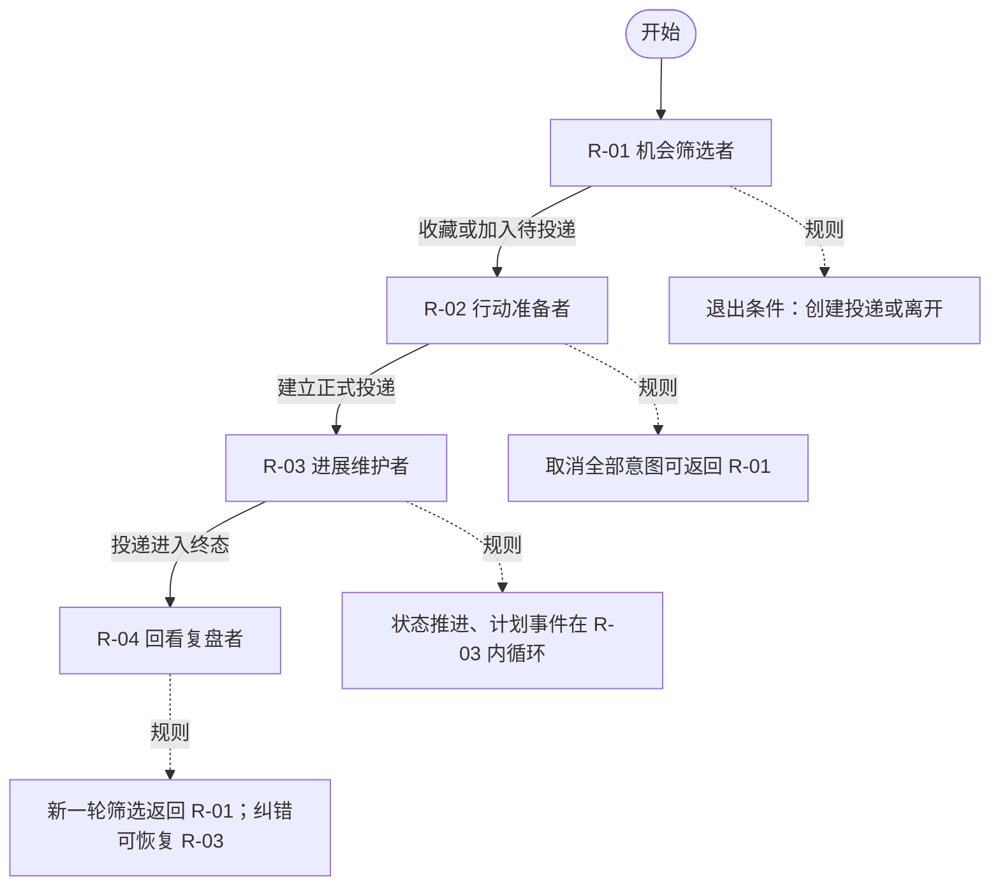
```mermaid
flowchart TB
    S([开始]) --> R01["R-01 机会筛选者"]
    R01 -->|收藏或加入待投递| R02["R-02 行动准备者"]
    R02 -->|建立正式投递| R03["R-03 进展维护者"]
    R03 -->|投递进入终态| R04["R-04 回看复盘者"]
    R01 -.规则.-> N01["退出条件：创建投递或离开"]
    R02 -.规则.-> N02["取消全部意图可返回 R-01"]
    R03 -.规则.-> N03["状态推进、计划事件在 R-03 内循环"]
    R04 -.规则.-> N04["新一轮筛选返回 R-01；纠错可恢复 R-03"]
```

**图 1：产品角色迁移。** 低维护意愿不是独立页面角色，而是需要通过真人研究验证的边界。

### 2.5 角色体验矩阵

| 体验环节 | R-01 机会筛选者 | R-02 行动准备者 | R-03 进展维护者 | R-04 回看复盘者 |
|---|---|---|---|---|
| 默认入口 | 岗位列表 | 收藏与待投递 | 投递进展 / 近期安排 | 求职概览 |
| 首要信息 | 来源、更新、岗位要求 | 意图类型、截止时间 | 当前状态、下一步时间 | 历史状态、累计到达 |
| 主要动作 | 筛选、收藏、待投递 | 切换意图、建立投递 | 更新状态、解析通知、补录 | 查看历史、重新发现 |
| 主要风险 | 误信快照仍有效 | 收藏与待投递混淆 | 维护成本、误操作、时间错误 | 不完整数据导致误导 |
| 成功信号 | 找到并保留目标岗位 | 把一个岗位转成投递 | 关键进展和时间被记录 | 能回答“到哪一步、下一步是什么” |

---

## 三、产品概述

### 3.1 产品目标

1. 让用户在一个工作台中完成从岗位发现到下一步行动的闭环；
2. 降低状态、通知和日程之间的重复录入；
3. 保留来源、状态和事件历史，避免“自动化但不可解释”；
4. 用 M0 Demo 验证产品逻辑和研究问题，不把作品集演示包装成生产 SaaS。

### 3.2 成功指标

#### 3.2.1 未来真实产品实验目标

| KR | 指标与计算口径 | 研究门槛 | 判定 |
|---|---|---|---|
| KR-01 | 核心闭环完成率 = 独立完成“发现→待投递→投递→状态更新”的人数 / 参与人数 | 5 名目标参与者 | 至少 4/5 无关键帮助完成 |
| KR-02 | 通知到行动完成率 = 独立完成“粘贴→理解建议→确认→在近期安排找回”的人数 / 参与人数 | 5 名目标参与者 | 至少 4/5 完成，且无人误以为系统已自动执行 |
| KR-03 | 维护持续性 = 7 天内至少 3 天记录真实进展的人数 / 试用人数 | 3–5 名目标参与者 | 至少 60%；不足则优先降低维护成本 |
| KR-04 | 迁移信号 = 明确愿意替换或补充现有表格/邮箱方案的人数 / 访谈人数 | 5–8 次真人访谈 | 达到 60% 才讨论 M1 |
| KR-05 | 时间准确率 = 正确提取且经用户确认的明确时间 / 含明确时间样本 | 至少 30 条脱敏样本 | 目标 ≥90%，低置信度必须提示 |

这些是研究目标，不是已取得结果。样本小，只用于发现阻塞问题和决定是否继续，不用于推断市场总体。

#### 3.2.2 当前已取得结果

- 当前可演示闭环已通过自动化和专家走查；
- 2026-07-28 基线：120 项后端测试通过，前端 lint/build 通过；
- 24 条演示快照可离线复现；
- 核心专家走查覆盖 19/23，全部覆盖 20/26；
- 390×844 核心路由无横向溢出。

#### 3.2.3 尚未验证的假设

- 用户愿意离开或补充现有表格；
- 用户愿意连续维护状态；
- 通知解析会显著降低维护成本；
- 看板会改变求职策略；
- 订阅规则会带来持续使用；
- 用户存在付费意愿。

### 3.3 产品功能结构

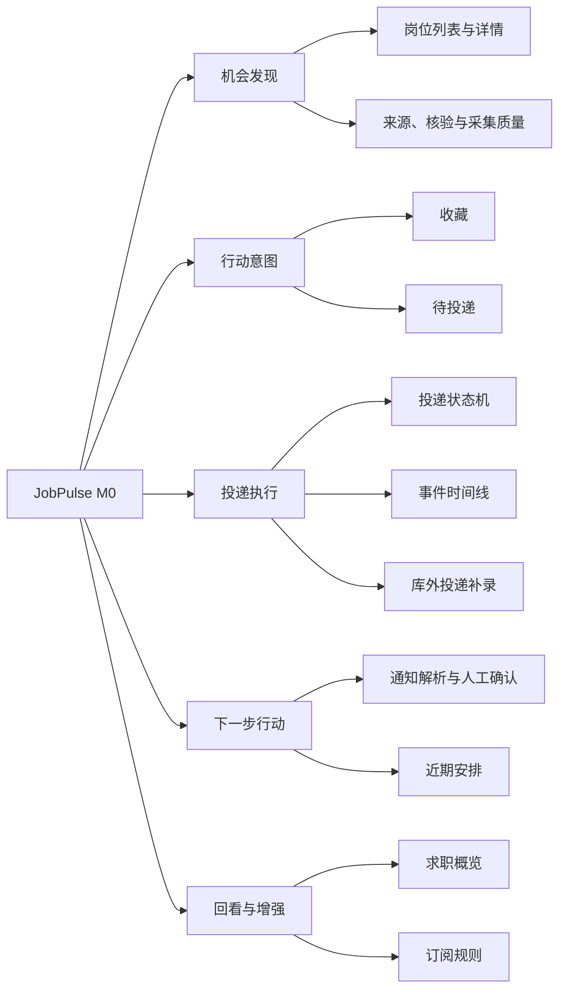
```mermaid
flowchart LR
    JP["JobPulse M0"]
    JP --> DISC["机会发现"]
    DISC --> JOBS["岗位列表与详情"]
    DISC --> SRC["来源、核验与采集质量"]
    JP --> INTENT["行动意图"]
    INTENT --> FAV["收藏"]
    INTENT --> APPLYQ["待投递"]
    JP --> TRACK["投递执行"]
    TRACK --> APP["投递状态机"]
    TRACK --> EVENT["事件时间线"]
    TRACK --> MANUAL["库外投递补录"]
    JP --> ACTION["下一步行动"]
    ACTION --> PARSE["通知解析与人工确认"]
    ACTION --> TODO["近期安排"]
    JP --> REVIEW["回看与增强"]
    REVIEW --> DASH["求职概览"]
    REVIEW --> SUB["订阅规则"]
```

**图 2：功能结构。** 订阅通知发送、账号、多用户和导入不属于 M0。

### 3.4 页面与信息架构

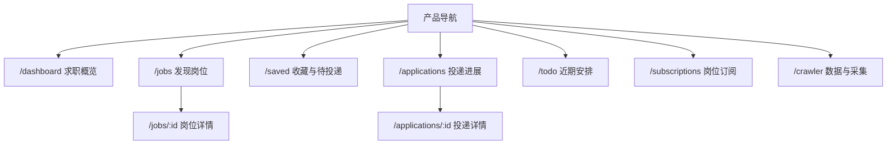
```mermaid
flowchart TB
    NAV["产品导航"]
    NAV --> D["/dashboard 求职概览"]
    NAV --> J["/jobs 发现岗位"]
    J --> JD["/jobs/:id 岗位详情"]
    NAV --> S["/saved 收藏与待投递"]
    NAV --> A["/applications 投递进展"]
    A --> AD["/applications/:id 投递详情"]
    NAV --> T["/todo 近期安排"]
    NAV --> SUB["/subscriptions 岗位订阅"]
    NAV --> C["/crawler 数据与采集"]
```

**图 3：产品页面信息架构。** `/` 官网和 `/case-study` 案例页属于传播与作品集界面，不承载核心业务状态。

### 3.5 总体业务流程

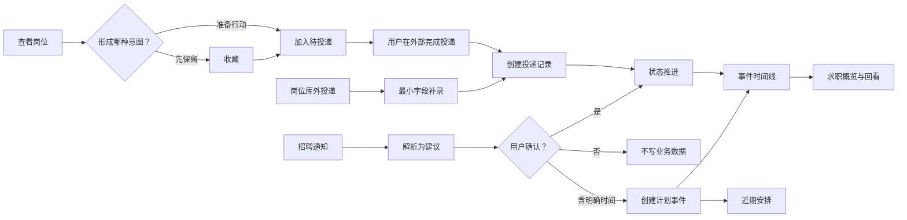
```mermaid
flowchart LR
    A["查看岗位"] --> B{"形成哪种意图？"}
    B -->|先保留| C["收藏"]
    B -->|准备行动| D["加入待投递"]
    C --> D
    D --> E["用户在外部完成投递"]
    E --> F["创建投递记录"]
    X["岗位库外投递"] --> Y["最小字段补录"]
    Y --> F
    F --> G["状态推进"]
    N["招聘通知"] --> P["解析为建议"]
    P --> Q{"用户确认？"}
    Q -->|否| R["不写业务数据"]
    Q -->|是| G
    Q -->|含明确时间| H["创建计划事件"]
    G --> I["事件时间线"]
    H --> I
    H --> J["近期安排"]
    I --> K["求职概览与回看"]
```

**图 4：总体业务流程。** 系统不替用户投递；解析结果在确认前不改变业务数据。

### 3.6 功能摘要与优先级

| 功能 ID | 功能 | 用户价值 | 实施复杂度 | 优先级 | 当前状态 |
|---|---|---:|---:|---:|---|
| F-01 | 岗位发现与来源可信度 | 高 | 中 | P0 | 已实现 |
| F-02 | 收藏与待投递 | 高 | 低 | P0 | 已实现 |
| F-03 | 投递状态与事件时间线 | 高 | 高 | P0 | 主流程已实现，纠错 UI 缺口 |
| F-04 | 通知解析与近期安排 | 高 | 高 | P0 | 已实现 |
| F-05 | 库外投递补录 | 高 | 中 | P0 | 已实现 |
| F-06 | 求职概览与基础漏斗 | 中 | 中 | P1 | 已实现，价值待验证 |
| F-07 | 订阅规则 | 中 | 低 | P1 | 仅 CRUD，通知未来 |
| F-08 | 采集管理与数据质量 | 高（运营） | 高 | Ops-P0 | 已实现 |

优先级判断：

- P0：缺失会破坏从发现到下一步行动的核心闭环；
- Ops-P0：不直接面向求职任务，但缺失会使岗位数据不可解释或不可演示；
- P1：已提升体验，但没有足够证据证明是迁移或持续使用的必要条件；
- P2：进入未来目标，不参加本期验收。

---

## 四、功能需求说明

### 4.1 F-01 岗位发现与来源可信度（P0）

| 项目 | 内容 |
|---|---|
| 目标 | 让 R-01 快速找到岗位，并在行动前看清来源、字段完整度和时效边界 |
| 主要角色 | R-01 机会筛选者 |
| 前置条件 | 岗位库已有演示快照或公开 ATS 采集结果 |
| 触发条件 | 打开岗位列表、输入筛选条件或打开岗位详情 |

#### 4.1.1 业务规则

- `F01-FR-01`：列表默认只返回 `status=displaying` 的岗位，按采集时间倒序分页。
- `F01-FR-02`：页面本期暴露关键词、公司、地点 3 个筛选条件；条件组合采用 AND。
- `F01-FR-03`：关键词匹配岗位名、公司名和 JD；公司、地点使用包含匹配。
- `F01-FR-04`：岗位卡片至少展示岗位、公司、地点/薪资、来源类型和更新信息。
- `F01-FR-05`：岗位详情至少展示地点、薪资、来源、学历、经验、毕业年份、截止时间、最后核验、JD、要求和官方链接；缺失字段显示“待确认”或不展示，不编造。
- `F01-FR-06`：`demo_snapshot` 必须显示“演示快照”声明，并提醒到企业官方页面确认。
- `F01-FR-07`：公开来源岗位保留 `source_url` 和 `apply_url`；系统不代替用户提交申请。
- `F01-FR-08`：失效或疑似失效岗位不得继续呈现为正常可投递状态；核验失败保留原状态并说明无法核验。

#### 4.1.2 页面与结构

- 岗位列表：标题区、结果数、三条件筛选、桌面表格/移动卡片、分页。
- 岗位详情：岗位摘要、可信度提示、JD、要求、官方投递动作、创建投递动作。
- 桌面使用高密度表格；移动端使用卡片和底部导航，不允许横向溢出。

#### 4.1.3 状态与异常

| 状态 | 要求 |
|---|---|
| 默认 / 加载 | 显示加载反馈，不展示上一查询的错误结果 |
| 成功 | 结果数、筛选条件和列表一致 |
| 空状态 | 提示“暂无符合条件的岗位”，保留条件并允许放宽 |
| 服务失败 | 显示可理解错误和“重试”，不展示技术堆栈 |
| 字段缺失 | 显示“待确认”或隐藏，不写“无要求” |
| 快照 | 明确不是实时招聘状态 |
| 失效 | 禁用或弱化主要投递动作，并提供来源核对 |
| 刷新 | 保留当前筛选；结果以最新响应为准 |

#### 4.1.4 交互规则

- Enter 可提交当前筛选；Tab 顺序为关键词 → 公司 → 地点 → 结果区。
- 卡片标题和主要按钮均可聚焦，焦点样式可见。
- 收藏与待投递操作不得阻断用户继续浏览。
- 移动端主要触控目标不小于 44×44 CSS px。

#### 4.1.5 数据、持久化与事件

核心对象为 `Job`。必填：`company`、`title`、`source`；来源、官方链接、核验时间和有效性需要持续保留。筛选状态是页面临时状态，本期不跨设备持久化。

目标分析事件：

| 事件 | 触发 | 必要参数 | 禁止参数 |
|---|---|---|---|
| `job_search_applied` | 筛选提交 | 条件是否填写、结果数 | 完整 JD、用户输入原文 |
| `job_detail_viewed` | 详情成功展示 | job_id、source_kind | 外部页面内容 |
| `official_apply_clicked` | 点击官方申请 | job_id、source_kind | 外部账号信息 |

#### 4.1.6 验收标准

- `F01-AC-01`：给定关键词、公司和地点后，列表只展示同时满足三项的岗位，清空条件后恢复默认列表。
- `F01-AC-02`：无结果时显示空状态，条件仍保留，用户可继续编辑。
- `F01-AC-03`：打开演示快照详情时，页面同时展示演示声明和官方核对提示。
- `F01-AC-04`：缺失学历或截止时间时，页面不生成推测值。
- `F01-AC-05`：API 失败时页面显示重试入口，重试成功后恢复列表。
- `F01-AC-06`：390×844 视口无横向溢出，筛选和主要动作可触达。
- `F01-AC-07`：官方申请动作只打开外部链接，不在 JobPulse 内提交申请。

#### 4.1.7 依赖

F-08 采集与质量；岗位 API；设计系统；公开来源合规配置。

#### 4.1.8 高保真原型

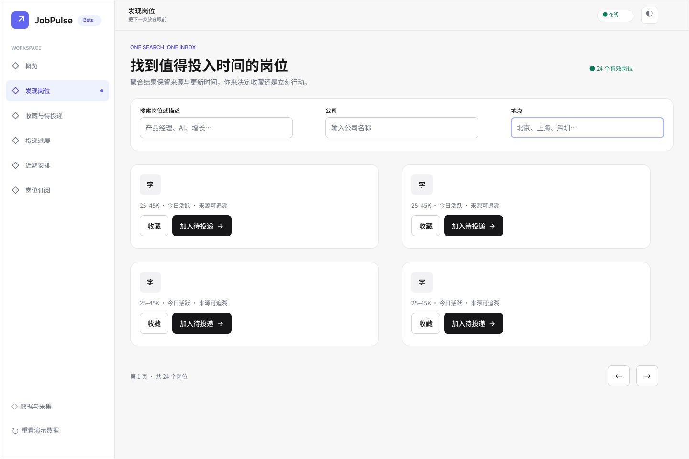

**图 5（P02）：岗位列表桌面成功态，对应 F01-FR-01 至 F01-FR-04。**

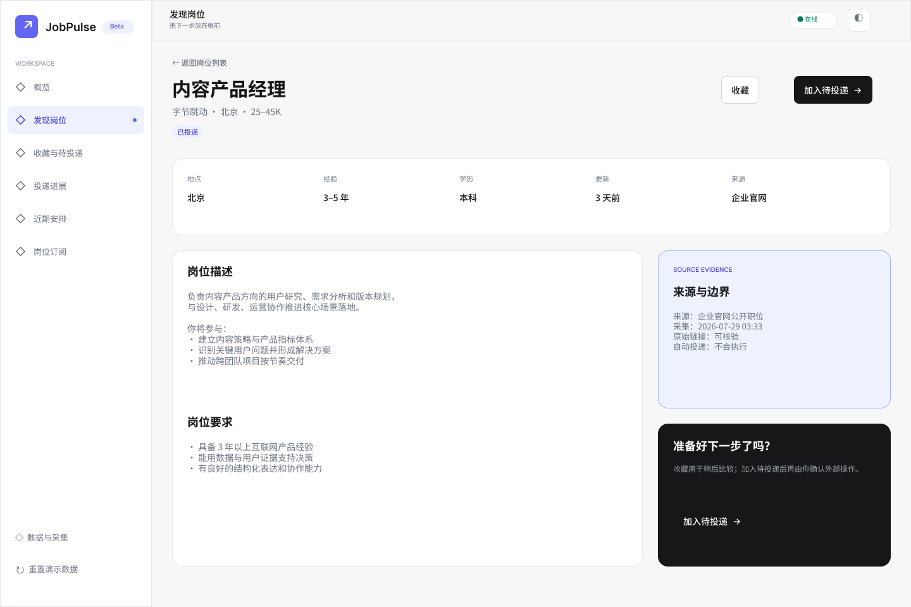

**图 6（P03）：岗位详情，对应 F01-FR-05 至 F01-FR-07。**

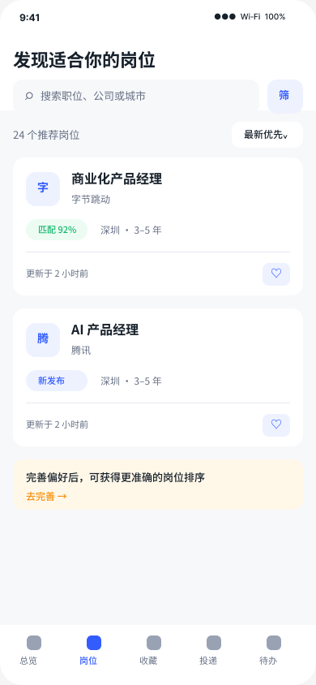

**图 7（P10）：390×844 核心移动状态。空、失败、失效状态仍是原型缺口。**

### 4.2 F-02 收藏与待投递（P0）

| 项目 | 内容 |
|---|---|
| 目标 | 用两个低成本意图帮助 R-01 / R-02 区分“先保留”和“准备行动” |
| 主要角色 | R-01、R-02 |
| 前置条件 | 岗位存在且可读取 |
| 触发条件 | 在岗位列表/详情点击收藏或待投递，或在清单中撤销/建投递 |

#### 4.2.1 业务规则

- `F02-FR-01`：收藏 `favorited` 与待投递 `to_apply` 是独立意图，同一岗位可同时存在两者。
- `F02-FR-02`：相同岗位、相同意图只允许一条活跃记录；重复新增返回冲突。
- `F02-FR-03`：取消意图使用结案时间，不物理删除历史记录；重复取消保持幂等。
- `F02-FR-04`：从待投递建立正式投递后，待投递意图结案。
- `F02-FR-05`：当前实现不会自动取消收藏；是否随投递结束收藏列入 D-01 待决策。
- `F02-FR-06`：收藏页和待投递页必须分别显示数量、空状态和对应动作。

#### 4.2.2 页面与结构

- 一个页面内使用“收藏 / 待投递”两个标签页。
- 卡片展示公司、岗位、地点、薪资、截止时间、状态动作。
- 待投递卡片提供“创建投递”；收藏卡片提供“加入待投递”或“查看待投递”。

#### 4.2.3 状态与异常

- 加载、成功、双空状态、服务失败和操作失败均需独立反馈。
- 快速重复点击时按钮进入忙碌态，避免重复请求。
- 刷新后以持久化关系恢复页面状态。
- 取消意图后提供即时 Toast；未来可评估短时撤销。

#### 4.2.4 交互规则

- 标签页使用 `role=tab` 和 `aria-selected`。
- 操作按钮不得只用颜色表达选中状态，需同时有文案/图标变化。
- 移动端底部导航不得遮挡最后一张卡片的主要动作。

#### 4.2.5 数据、持久化与事件

核心对象为 `UserJobAction`：`job_id`、`action_type`、`created_at`、`ended_at`。

目标分析事件：`job_favorited`、`job_unfavorited`、`job_to_apply_added`、`job_to_apply_removed`、`application_started_from_saved`。只记录对象 ID 和动作，不记录 JD。

#### 4.2.6 验收标准

- `F02-AC-01`：同一岗位可同时出现在收藏和待投递清单，两种计数各自正确。
- `F02-AC-02`：重复收藏或重复加入待投递不会创建第二条活跃记录。
- `F02-AC-03`：取消意图后刷新页面，该岗位不再出现在对应清单。
- `F02-AC-04`：从待投递创建投递后，待投递记录结案且投递列表出现新记录。
- `F02-AC-05`：收藏是否保留遵循 D-01 当前默认：继续保留。
- `F02-AC-06`：两个标签页各自无数据时显示不同空状态。
- `F02-AC-07`：390×844 下可切换标签并完成主要动作。

#### 4.2.7 依赖

F-01 岗位；F-03 投递创建；用户行为 API。

#### 4.2.8 高保真原型

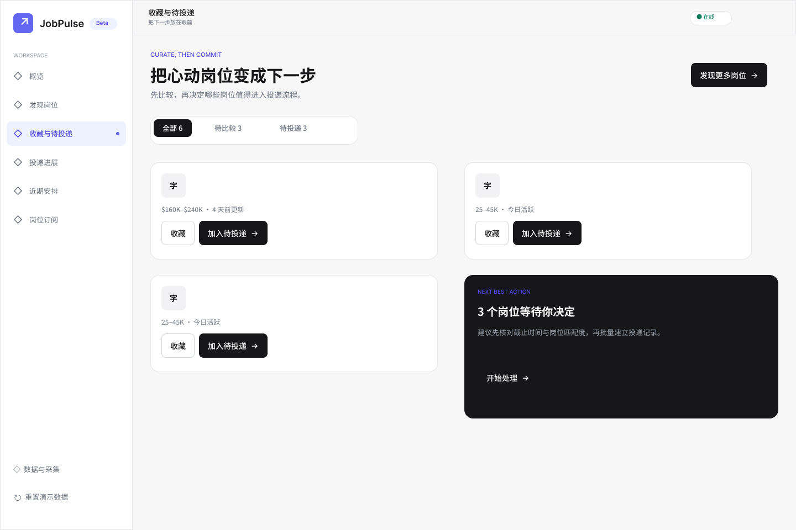

**图 8（P04）：收藏与待投递桌面态。**

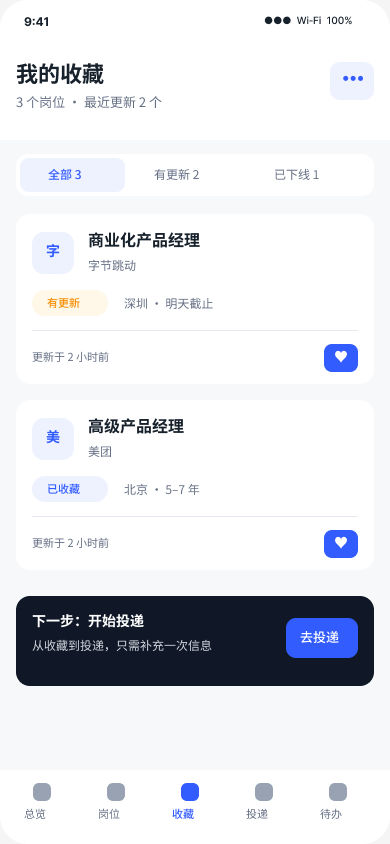

**图 9（P11）：收藏与待投递移动端首屏。**

### 4.3 F-03 投递状态与事件时间线（P0）

| 项目 | 内容 |
|---|---|
| 目标 | 让 R-03 可追溯地推进投递，并在误操作时恢复 |
| 主要角色 | R-03、R-04 |
| 前置条件 | 已有岗位；创建投递时同一岗位没有其他进行中投递 |
| 触发条件 | 创建投递、单条/批量更新状态、查看详情、执行纠错 |

#### 4.3.1 状态机

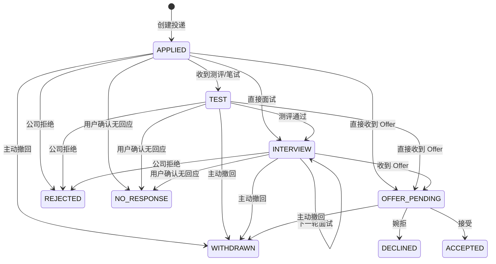
```mermaid
stateDiagram-v2
    [*] --> APPLIED: 创建投递
    APPLIED --> TEST: 收到测评/笔试
    APPLIED --> INTERVIEW: 直接面试
    APPLIED --> OFFER_PENDING: 直接收到 Offer
    TEST --> INTERVIEW: 测评通过
    TEST --> OFFER_PENDING: 直接收到 Offer
    INTERVIEW --> INTERVIEW: 下一轮面试
    INTERVIEW --> OFFER_PENDING: 收到 Offer
    OFFER_PENDING --> ACCEPTED: 接受
    OFFER_PENDING --> DECLINED: 婉拒
    APPLIED --> REJECTED: 公司拒绝
    TEST --> REJECTED: 公司拒绝
    INTERVIEW --> REJECTED: 公司拒绝
    APPLIED --> NO_RESPONSE: 用户确认无回应
    TEST --> NO_RESPONSE: 用户确认无回应
    INTERVIEW --> NO_RESPONSE: 用户确认无回应
    APPLIED --> WITHDRAWN: 主动撤回
    TEST --> WITHDRAWN: 主动撤回
    INTERVIEW --> WITHDRAWN: 主动撤回
    OFFER_PENDING --> WITHDRAWN: 主动撤回
```

**图 10：投递状态机。** 五个终态为已接受、已婉拒、公司拒绝、无回应关闭、主动撤回；终态常规流转无出口。

#### 4.3.2 业务规则

- `F03-FR-01`：投递初始状态为 `applied`，创建时同步写入初始状态事件。
- `F03-FR-02`：常规流转只能前进；进行中状态可进入公司拒绝、无回应关闭或主动撤回。
- `F03-FR-03`：`interviewing → interviewing` 是唯一常规自环，用于多轮面试。
- `F03-FR-04`：终态不可常规流转；纠错必须使用 `is_correction=true` 并填写原因。
- `F03-FR-05`：纠错写独立事件，不覆盖或删除原事件；漏斗排除纠错事件。
- `F03-FR-06`：同一岗位同时最多一个非终态投递。
- `F03-FR-07`：单条状态更新与对应状态事件在同一事务中提交。
- `F03-FR-08`：批量更新按条独立事务执行，允许部分成功，必须返回逐项失败原因。

#### 4.3.3 页面与结构

- 投递列表：阶段概览、全部/进行中/已结束、单条更新、批量选择、库外补录入口。
- 投递详情：关联岗位、合法下一状态、通知解析、即将到来、历史时间线。
- **目标缺口**：终态详情需增加“纠正状态”入口；当前高保真未覆盖。

#### 4.3.4 状态与异常

| 场景 | 要求 |
|---|---|
| 空列表 | 分筛选展示“当前筛选下没有投递记录” |
| 非法流转 | 不改变状态，显示原状态、目标状态和可行动建议 |
| 终态 | 隐藏常规更新，显示流程已结束和纠错入口 |
| 纠错 | 二次确认、必填原因、成功后显示纠错标识 |
| 批量部分失败 | 保留成功结果；展示失败对象和原因，不只显示总数 |
| 并发冲突 | 返回冲突，页面刷新当前状态后要求用户重试 |
| 服务失败 | 不乐观写入；保留选择，允许重试或取消 |

#### 4.3.5 交互规则

- 单条下拉只展示当前状态允许的目标状态。
- 终态和纠错不能混在普通快速更新中。
- 批量更新前显示目标状态和选中数量；不可逆终态要求二次确认。
- 返回操作优先回到来源页面；无历史时回投递列表。

#### 4.3.6 数据、持久化与事件

核心对象为 `Application` 和 `ApplicationEvent`。状态事件包含 `from_status`、`to_status`、`occurred_at`、`is_correction`、`correction_reason`。事件只追加，不因页面刷新重建。

目标分析事件：`application_created`、`application_status_changed`、`application_batch_changed`、`application_correction_started`、`application_corrected`。禁止采集备注全文和招聘通知全文。

#### 4.3.7 验收标准

- `F03-AC-01`：创建投递后，投递状态为已投递，时间线有“未记录 → 已投递”事件。
- `F03-AC-02`：所有合法流转成功，非法回退返回错误且不写新事件。
- `F03-AC-03`：面试中可自环，若填写轮次则为 1–20。
- `F03-AC-04`：终态普通更新被拒绝；纠错缺少原因时被拒绝。
- `F03-AC-05`：纠错成功后当前状态更新，原事件仍在，新增事件带纠错原因。
- `F03-AC-06`：同一岗位已有进行中投递时，再次创建返回已有记录冲突。
- `F03-AC-07`：批量更新部分失败时，响应列出成功 ID、失败 ID 和原因。
- `F03-AC-08`：页面刷新后状态与时间线一致；漏斗不计纠错事件。
- `F03-AC-09`：前端纠错入口完成前，本模块不得标记为“完整交付”。

#### 4.3.8 依赖

状态机服务、数据库事务、F-02 待投递、F-06 漏斗。

#### 4.3.9 高保真原型

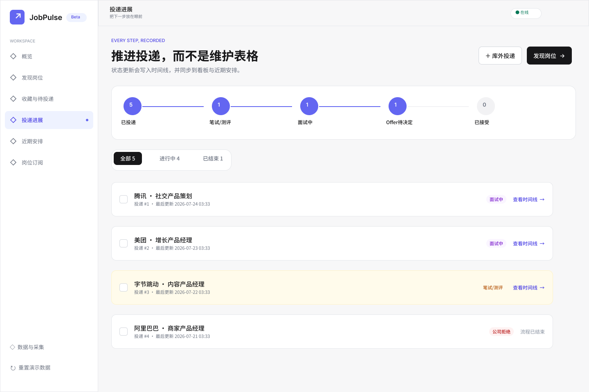

**图 11（P05）：投递列表、阶段概览和批量入口。**

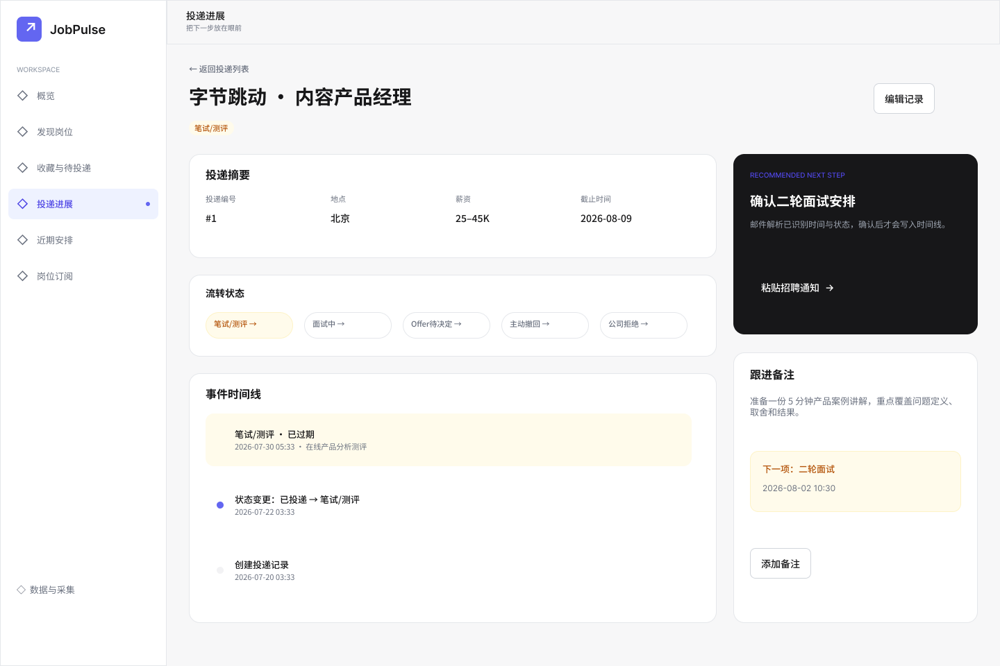

**图 12（P06）：投递详情、合法流转和事件时间线。**

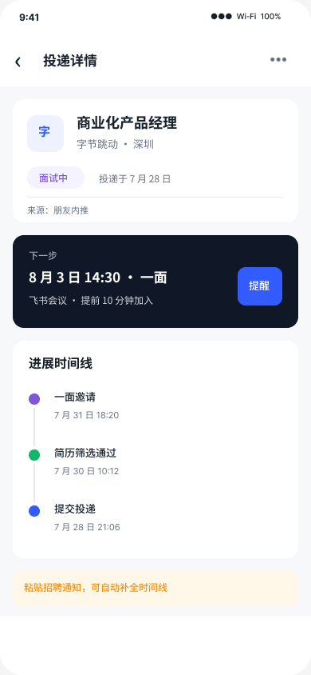

**图 13（P12）：投递详情移动端首屏。纠错入口为已知原型缺口。**

### 4.4 F-04 通知解析与近期安排（P0）

| 项目 | 内容 |
|---|---|
| 目标 | 降低从招聘通知到状态和日程的手工搬运成本 |
| 主要角色 | R-03 |
| 前置条件 | 当前详情有投递，或解析结果可唯一匹配已有投递 |
| 触发条件 | 用户粘贴招聘邮件/聊天文本并点击解析 |

#### 4.4.1 业务规则

- `F04-FR-01`：解析端点只返回建议，不更新状态、不写事件。
- `F04-FR-02`：结果至少包含是否解析、公司、岗位、建议状态、明确时间、置信度、降级标识、匹配投递和依据。
- `F04-FR-03`：未配置 LLM 时使用本地正则降级；缺少日期或钟点时不得推测完整时间。
- `F04-FR-04`：只有用户点击明确确认按钮后才执行状态流转。
- `F04-FR-05`：建议为面试中或测评/笔试且含明确时间时，同一事务写入状态事件和对应计划事件。
- `F04-FR-06`：状态与计划事件类型不一致时整笔拒绝，不留部分更新。
- `F04-FR-07`：未匹配唯一投递时，只能使用当前详情页投递作为确认对象，不自动创建未知投递。
- `F04-FR-08`：近期安排只读取未来 N 天、`scheduled_at` 非空且 `occurred_at` 为空的事件，默认 UI 为 14 天。

#### 4.4.2 解析—确认时序

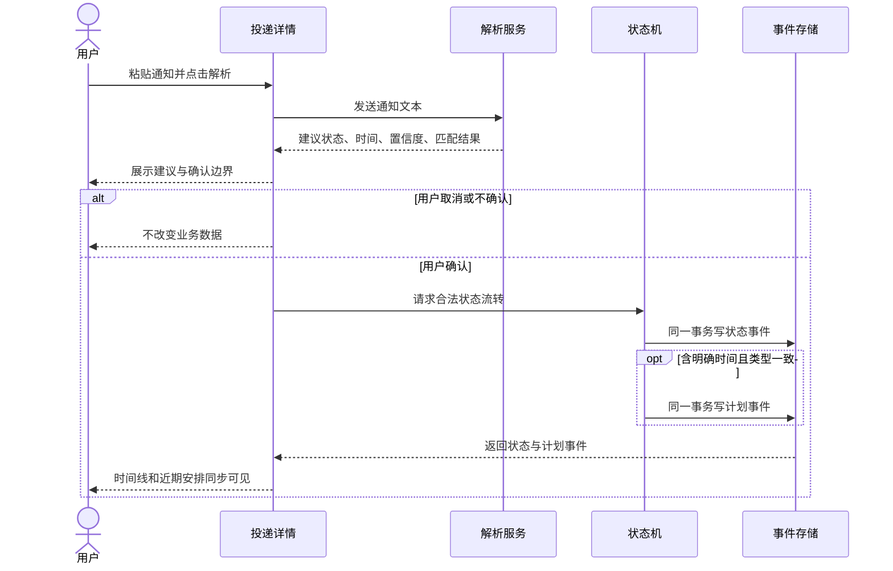
```mermaid
sequenceDiagram
    actor U as 用户
    participant UI as 投递详情
    participant P as 解析服务
    participant S as 状态机
    participant DB as 事件存储
    U->>UI: 粘贴通知并点击解析
    UI->>P: 发送通知文本
    P-->>UI: 建议状态、时间、置信度、匹配结果
    UI-->>U: 展示建议与确认边界
    alt 用户取消或不确认
        UI-->>U: 不改变业务数据
    else 用户确认
        UI->>S: 请求合法状态流转
        S->>DB: 同一事务写状态事件
        opt 含明确时间且类型一致
            S->>DB: 同一事务写计划事件
        end
        DB-->>UI: 返回状态与计划事件
        UI-->>U: 时间线和近期安排同步可见
    end
```

**图 14：通知解析与确认时序。**

#### 4.4.3 页面与结构

- 详情页解析区：文本框、解析按钮、模型/降级标识、字段结果、依据、警示、确认按钮。
- 时间线区：即将到来与历史分组。
- 近期安排页：按计划时间升序，显示类型、轮次、公司、岗位、时间和剩余天数。

#### 4.4.4 状态与异常

- 空输入时解析按钮禁用；输入最多 10,000 字符。
- 解析中禁用重复请求；新解析清空旧结果和旧错误。
- 无法解析时提示“未能解析出有效信息”，不展示确认按钮。
- 低置信度和正则降级必须可见，不能伪装成高确定性 AI。
- 计划时间在过去时在时间线标“已过期”，不进入未来待办。
- 确认失败保留解析结果和输入，允许用户修正或改用手动流转。

#### 4.4.5 交互规则

- 确认按钮文案必须包含目标投递、目标状态以及是否加入近期安排。
- 确认前页面需显示“AI 结果仅为建议”。
- 移动端输入区与确认按钮不得被底部导航遮挡。
- 本期不读取剪贴板、邮箱或通知权限；只有用户主动粘贴。

#### 4.4.6 数据、持久化与事件

通知原文仅作为单次请求输入，本期不写数据库。确认后只保存结构化状态、计划时间、轮次和“由招聘通知确认”备注。

目标分析事件：`notification_parse_requested`、`notification_parse_succeeded`、`notification_parse_failed`、`notification_suggestion_confirmed`、`schedule_created`。禁止采集通知全文、邮箱地址、电话、联系人原文和附件。

#### 4.4.7 验收标准

- `F04-AC-01`：解析但未确认时，投递状态、事件数量和近期安排均不变化。
- `F04-AC-02`：含公司、岗位、面试状态和明确时间的文本能展示结构化建议。
- `F04-AC-03`：确认面试建议后，状态事件与面试计划事件同时写入；任一失败则全部回滚。
- `F04-AC-04`：确认测评建议时只能创建 `test` 计划事件；类型不符返回校验错误。
- `F04-AC-05`：无完整时间的通知不创建计划事件。
- `F04-AC-06`：未匹配唯一投递时，页面明确显示将使用当前投递。
- `F04-AC-07`：同一计划事件同时出现在详情时间线和近期安排，时间、公司和岗位一致。
- `F04-AC-08`：解析失败后可以修改原文并重试，失败不会留下事件。

#### 4.4.8 依赖

AI/正则解析器、匹配器、F-03 状态机、计划事件服务、F-07 不依赖。

#### 4.4.9 高保真原型

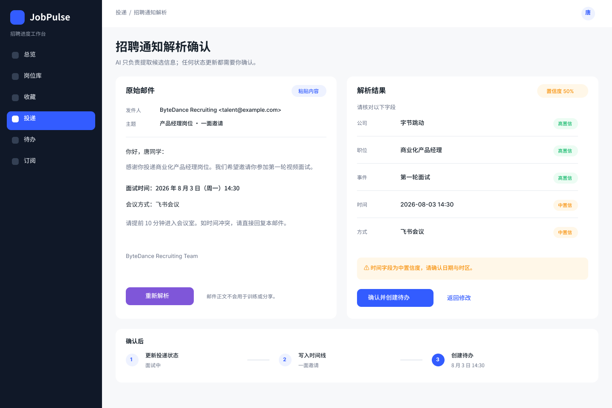

**图 15（P14）：正则降级解析、置信度、匹配投递、明确时间与确认边界。**

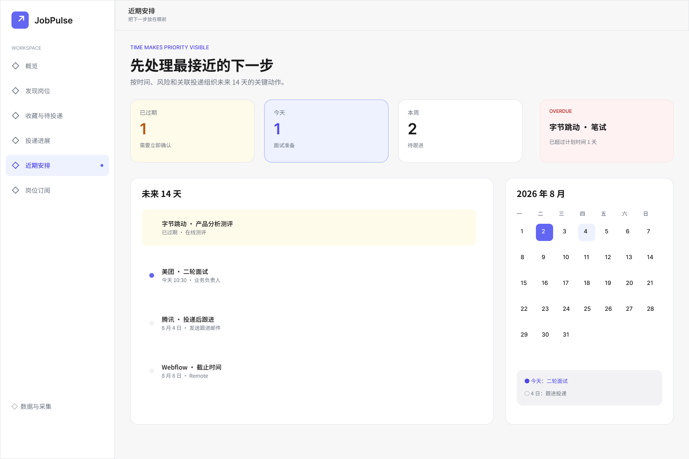

**图 16（P07）：未来 14 天近期安排。解析失败、低置信度和冲突状态需后续补图。**

### 4.5 F-05 岗位库外投递补录（P0）

| 项目 | 内容 |
|---|---|
| 目标 | 让库外已发生的投递用最少字段进入统一状态机 |
| 主要角色 | R-03；低维护边界用户 |
| 前置条件 | 用户已在外部渠道完成投递 |
| 触发条件 | 在投递列表打开“补录外部投递”并提交 |

#### 4.5.1 业务规则

- `F05-FR-01`：公司、岗位必填；地点、投递日期、原始链接和备注可选。
- `F05-FR-02`：原始链接仅接受 `http://` 或 `https://`。
- `F05-FR-03`：一次提交原子创建或复用 `source=manual` 岗位、`applied` 投递和初始状态事件。
- `F05-FR-04`：任一步失败全部回滚，不留下孤立岗位或事件。
- `F05-FR-05`：同公司、岗位、地点的手动岗位已有进行中投递时返回已有记录冲突。
- `F05-FR-06`：创建成功后进入投递详情，继续使用既有状态机、解析和时间线。
- `F05-FR-07`：补录不触发自动投递，也不修改外部平台。

#### 4.5.2 页面、状态与交互

- 补录表单在投递列表内联展开，可收起；必填项用文字和星号表示。
- 保存中禁用重复提交；成功后关闭表单并跳转详情。
- 客户端空必填时不提交；服务端仍执行长度、URL 和冲突校验。
- 失败时保留表单内容并显示可修正原因。
- 移动端表单按单列排列，键盘弹出后提交按钮仍可到达。

#### 4.5.3 数据、持久化与事件

写入 `Job`、`Application`、`ApplicationEvent` 三个对象。备注可包含渠道、联系人或简历版本，但属于用户输入；产品分析不得采集其原文。

目标分析事件：`manual_application_form_opened`、`manual_application_created`、`manual_application_conflicted`、`manual_application_failed`。

#### 4.5.4 验收标准

- `F05-AC-01`：只填写公司和岗位即可创建投递并进入详情。
- `F05-AC-02`：成功后岗位来源为 `manual`，状态为已投递，时间线有初始事件。
- `F05-AC-03`：URL 不以 HTTP(S) 开头时拒绝提交并指出字段错误。
- `F05-AC-04`：同一手动岗位已有进行中投递时不创建重复记录。
- `F05-AC-05`：模拟初始事件写入失败时，岗位和投递均回滚。
- `F05-AC-06`：关闭/收起表单不写数据。
- `F05-AC-07`：页面明确说明不会自动投递或修改外部平台。

#### 4.5.5 依赖

F-03 投递与状态机；数据库事务；岗位去重规则。

#### 4.5.6 高保真原型

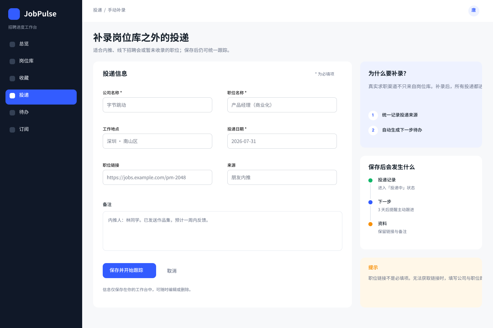

**图 17（P13）：库外投递最小字段表单。移动端、冲突和字段错误仍需补图。**

### 4.6 F-06 求职概览与基础漏斗（P1）

| 项目 | 内容 |
|---|---|
| 目标 | 帮助 R-03 / R-04 建立全局认知并找到下一步 |
| 主要角色 | R-03、R-04 |
| 前置条件 | 岗位、投递和事件数据可读取 |
| 触发条件 | 打开求职概览 |

#### 4.6.1 业务规则

- `F06-FR-01`：KPI 展示今日新增岗位、岗位库、投递记录和进行中数量。
- `F06-FR-02`：漏斗统计“累计到达过阶段的不同投递数”，不是当前状态分布。
- `F06-FR-03`：漏斗阶段固定为已投递、测评/笔试、面试、Offer 待决定、Offer 已接受。
- `F06-FR-04`：纠错事件不进入漏斗统计。
- `F06-FR-05`：近期更新按最后更新时间展示；下一步读取未来计划事件。
- `F06-FR-06`：数据量不足时不得给出策略性建议或行业比较。

#### 4.6.2 页面、状态与交互

- 第一屏：标题、发现岗位和查看待投递动作、4 个 KPI。
- 第二屏：累计漏斗。
- 第三屏：最近更新和下一步。
- 加载、空数据、部分数据和服务失败需有状态；错误不可显示为 0。
- KPI 与列表可互相跳转，键盘焦点可见。

#### 4.6.3 数据、持久化与事件

读取聚合查询，不新建业务对象。目标分析事件：`dashboard_viewed`、`dashboard_next_action_clicked`、`dashboard_funnel_inspected`。

#### 4.6.4 验收标准

- `F06-AC-01`：标准演示数据下 4 个 KPI 与底层对象数量一致。
- `F06-AC-02`：投递进入面试后，面试累计到达数增加；纠错记录不重复累计。
- `F06-AC-03`：无投递时漏斗显示 0 和解释性空状态，不显示虚假转化率。
- `F06-AC-04`：服务失败时显示错误和重试，不显示缓存的错误数字。
- `F06-AC-05`：下一步卡片点击后进入对应安排或投递详情。
- `F06-AC-06`：本功能不展示“你的策略已改善”等未经验证结论。

#### 4.6.5 依赖

F-03 状态事件、F-04 计划事件、Dashboard API。

#### 4.6.6 高保真原型

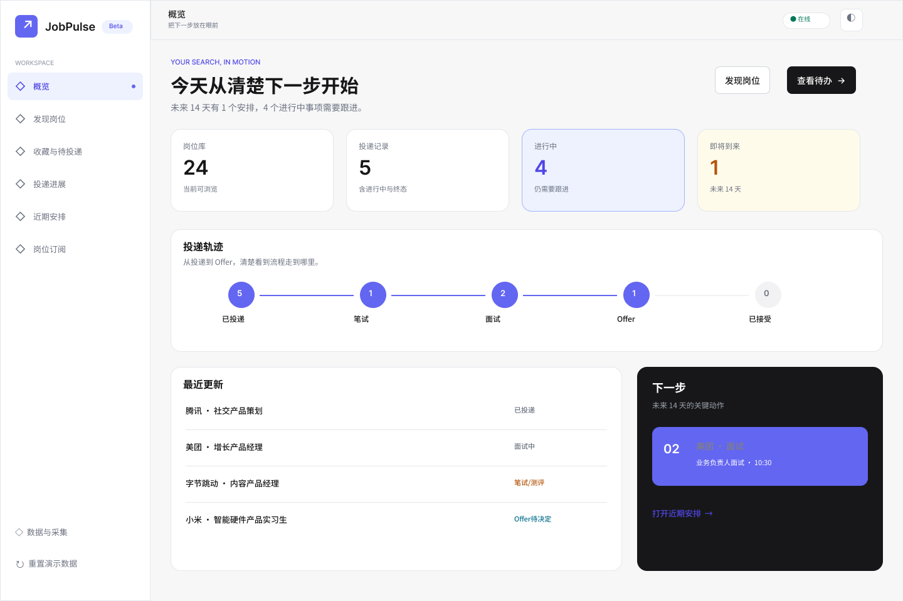

**图 18（P01）：求职概览成功态。**

### 4.7 F-07 岗位订阅规则（P1）

| 项目 | 内容 |
|---|---|
| 目标 | 让定向机会监控者保存关注条件，为未来通知闭环准备 |
| 主要角色 | R-01、R-02 |
| 前置条件 | 无 |
| 触发条件 | 创建、编辑或删除订阅规则 |

#### 4.7.1 业务规则

- `F07-FR-01`：关键词、公司、地点至少填写一项；空白字符串统一为 `null`。
- `F07-FR-02`：多条件组合采用 AND。
- `F07-FR-03`：支持列表、创建、编辑、删除和分页。
- `F07-FR-04`：本期只保存规则，不承诺发送通知、未读计数或新岗位高亮。
- `F07-FR-05`：删除是不可逆操作；目标交互优先提供短时撤销，无法实现时二次确认。

#### 4.7.2 页面、状态与交互

- 表单在同页完成新建和编辑；编辑时提供“取消编辑”。
- 空表单在前端就地报错并设置 `role=alert`、`aria-invalid`。
- 删除过程中禁用重复点击。
- 空、加载、失败和成功状态均有明确反馈。

#### 4.7.3 数据、持久化与事件

对象为 `Subscription`：关键词、公司、地点、创建时间。目标分析事件：`subscription_created`、`subscription_updated`、`subscription_deleted`。不得将“规则创建”记为“通知成功”。

#### 4.7.4 验收标准

- `F07-AC-01`：三个条件都为空时，不发送请求并显示字段级错误。
- `F07-AC-02`：任意一个有效条件可创建规则，刷新后仍存在。
- `F07-AC-03`：编辑保存后原规则更新，不新增第二条。
- `F07-AC-04`：取消编辑恢复新建模式，不修改原规则。
- `F07-AC-05`：删除遵循 D-03；当前无确认实现属于验收缺口。
- `F07-AC-06`：页面始终说明“通知能力列入下一阶段”。

#### 4.7.5 依赖

订阅 API；未来与 F-08 新岗位匹配连接，但本期不实现通知。

#### 4.7.6 高保真原型

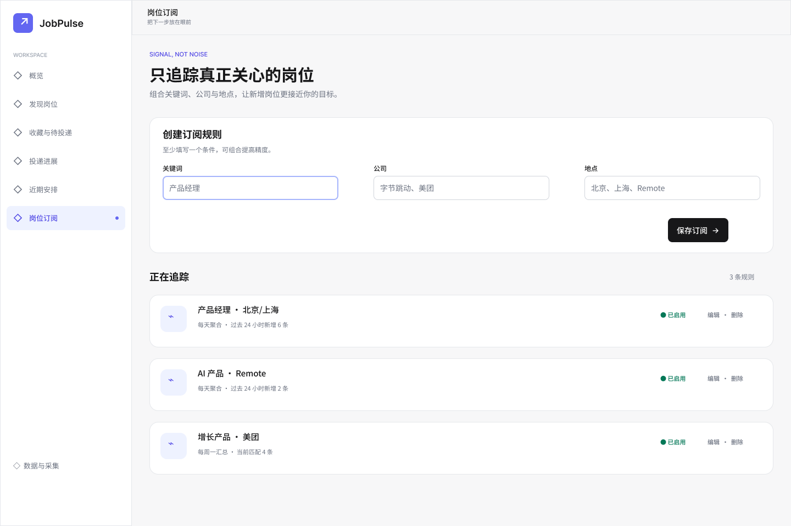

**图 19（P08）：订阅规则 CRUD。删除确认是已知缺口。**

### 4.8 F-08 采集管理与数据质量（Ops-P0）

| 项目 | 内容 |
|---|---|
| 目标 | 让演示和评审者区分演示快照、真实公开采集、失败与受限来源 |
| 主要角色 | 产品维护者、演示操作者、评审者 |
| 前置条件 | 来源配置和采集服务可读取 |
| 触发条件 | 打开采集管理、刷新来源、手动触发允许的公开来源 |

#### 4.8.1 业务规则

- `F08-FR-01`：来源分为公开 API、普通网站和受限平台；受限平台不得绕过访问控制。
- `F08-FR-02`：代码保留 Greenhouse 类型适配器，但 Figma、Webflow、Intercom、Stripe 海外默认源已停用；BOSS、牛客保持禁用。
- `F08-FR-03`：岗位总数、演示快照数和真实采集数分开统计。
- `F08-FR-04`：字段完整度按实际入库数据计算，不使用固定演示数字。
- `F08-FR-05`：采集日志记录来源、成功/失败/跳过、新增数、错误、开始和结束时间。
- `F08-FR-06`：公开演示环境可关闭手动触发；关闭时返回明确禁止原因。
- `F08-FR-07`：公开 API 失败不删除已有岗位，不把失败伪装成成功。

#### 4.8.2 页面、状态与交互

- 顶部：来源配置数、岗位总数、快照和真实采集。
- 中部：字段完整度、来源卡片、单源触发或禁用状态。
- 底部：日志成功、失败、跳过和错误说明。
- 采集中按钮显示忙碌态；同一来源不可重复并发触发。
- 线上关闭触发时不提供可误导的“立即采集成功”反馈。

#### 4.8.3 数据、持久化与事件

对象为 `Job`、`CrawlLog` 和来源 YAML 配置。系统不得记录访问凭据到日志或 API 响应。

目标运营事件：`crawl_triggered`、`crawl_succeeded`、`crawl_failed`、`source_health_viewed`。这些是运营事件，不是用户增长事件。

#### 4.8.4 验收标准

- `F08-AC-01`：重置后的标准演示数据中，快照数与岗位总数分开展示。
- `F08-AC-02`：字段完整度由当前样本计算，样本数变化后百分比同步变化。
- `F08-AC-03`：经审核并显式启用的公开来源可单独触发并产生真实日志；当前没有默认启用的实时来源。
- `F08-AC-04`：关闭在线采集的环境触发时返回 403 和可理解说明。
- `F08-AC-05`：采集失败后已有岗位仍在，日志记录失败原因。
- `F08-AC-06`：受限平台保持禁用，页面说明不登录抓取、不绕过验证码或反爬。
- `F08-AC-07`：页面和 API 不暴露 API Key、Cookie 或内部凭据。

#### 4.8.5 依赖

来源配置、采集适配器、robots/限速策略、F-01 岗位。

#### 4.8.6 高保真原型

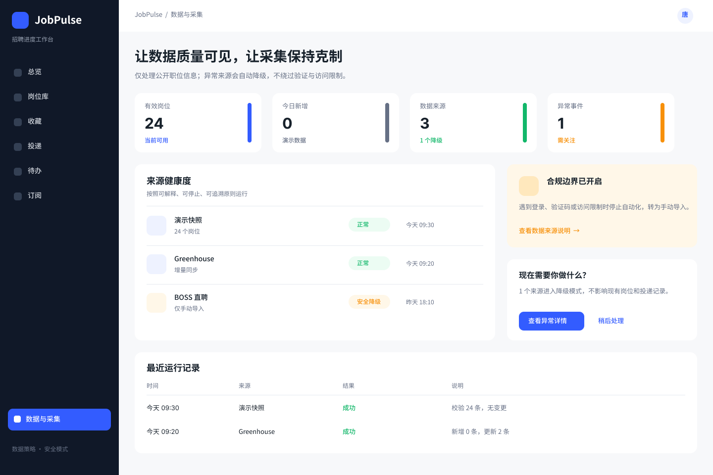

**图 20（P09）：采集来源、演示/真实数据分离、字段完整度和日志。**

---

## 五、其他产品需求

### 5.1 性能与响应目标

以下是目标口径，不是现有生产性能结论。

| 指标 | 目标 | 验收环境 | 方法 |
|---|---:|---|---|
| 核心页面首次可交互 | ≤2 秒 | 本地 API、24–1000 条岗位、桌面 Chrome 最新版 | 5 次冷启动取中位数 |
| 筛选响应 | ≤500 毫秒 | 同上，组合 3 个条件 | 从提交到结果稳定 |
| 状态更新 | ≤1 秒 | 本地 API、单条投递 | 从确认到成功反馈 |
| 通知解析（正则降级） | ≤1 秒 | 10,000 字符以内 | 从提交到结果展示 |
| 看板聚合 | ≤1 秒 | 10,000 条岗位、1,000 条投递、10,000 条事件 | API P95 |
| 公开 ATS 单源采集 | ≤60 秒 | 来源可访问、最多 15 条相关岗位 | 服务日志 |

网络、来源站点或 LLM 不可用时必须触发降级/失败状态，不能为了满足时间目标返回伪成功。

### 5.2 监控与分析需求

#### 5.2.1 业务可观测性

- 状态流转成功率、非法流转和冲突需要可追踪；
- 解析需要区分 LLM 与正则降级，并统计解析/确认漏斗；
- 采集需要按来源记录成功、失败、跳过和耗时；
- 任何分析都不得把演示快照或专家走查写成真实用户使用。

#### 5.2.2 事件命名与最小参数

| 事件组 | 事件 | 必要参数 | 禁止采集 |
|---|---|---|---|
| 发现 | `job_search_applied` | 条件是否存在、结果数 | 搜索原文、完整 JD |
| 意图 | `job_favorited`、`job_to_apply_added` | job_id、source_kind | 岗位原文 |
| 投递 | `application_created`、`application_status_changed` | application_id、from/to、是否批量 | 用户备注原文 |
| 解析 | `notification_parse_succeeded`、`notification_suggestion_confirmed` | 是否降级、置信度区间、是否含时间 | 通知全文、邮箱、电话 |
| 计划 | `schedule_created` | event_type、是否有轮次 | 备注原文 |
| 订阅 | `subscription_created` | 填写了哪些条件 | 条件原文 |
| 采集 | `crawl_succeeded`、`crawl_failed` | source、count、duration | 凭据、Cookie |

当前项目未建立生产分析系统。上述事件是后续真实验证的目标需求，未实现前不得声称有留存或转化数据。

### 5.3 兼容性矩阵

| 环境 | 本期目标 | 验收方法 |
|---|---|---|
| Chrome / Edge 最新版 | 桌面完整体验 | 1440×1000 核心流程回归 |
| Safari 最新版 | 核心流程可用 | 手工回归；未执行前标“待验证” |
| 1024px 桌面 / 平板横屏 | 无横向溢出，主要动作可达 | 页面级截图 + 键盘走查 |
| 390×844 手机 | 岗位、收藏、投递详情、解析与近期安排可用 | 浏览器回归 |
| 320px 手机 | 允许密度降级，不允许主要按钮不可达 | 视觉检查 |
| PWA | 仅 manifest 和可安装性目标 | 不把 manifest 当离线能力；Service Worker 另行验收 |

### 5.4 无障碍要求

- 所有核心操作可用键盘完成，焦点顺序符合视觉顺序；
- 焦点指示不能仅依赖浏览器默认且不可见；
- 状态不只依赖颜色，同时使用文案、图标或形状；
- 表单错误与字段关联，动态反馈使用 `role=alert` 或适当的 live region；
- 移动端主要触控目标不少于 44×44 CSS px；
- 正文、按钮和状态标签满足 WCAG AA 对比度目标；
- 弹层、抽屉或确认框出现时，焦点进入并被限制在容器中，关闭后回到触发点；
- 当前页面主要使用内联表单，没有通用 Modal；新增纠错/删除确认时必须按上述规则实现。

### 5.5 数据、安全与隐私

| 主题 | 本期要求 |
|---|---|
| 用户数据 | M0 无账号和用户隔离；公开 Demo 的数据可能被其他访客看到或重置 |
| 通知文本 | 仅用户主动粘贴；本期不入库。页面提醒先脱敏，不粘贴身份证、电话、私人邮箱或附件 |
| LLM | 未配置密钥时走本地正则；配置外部模型前需明确传输范围、保留策略和退出方式 |
| 本地存储 | SQLite 是本地持久化，不得描述为“安全存储”或“云备份” |
| 输入校验 | 使用参数化查询、长度限制、URL 协议校验和枚举校验 |
| 重置 Demo | 连续两次确认；生产/非演示环境必须可关闭 |
| 采集合规 | 只访问公开来源，遵守 robots/限速，不绕过登录、验证码和反爬 |
| 日志 | 不记录密钥、Cookie、通知全文或用户备注全文 |
| 数据删除 | M0 没有个人账号删除能力；进入 M1 前必须补数据导出、删除和撤权 |

### 5.6 内容与国际化

- V2.0 界面与交付语言为简体中文；
- 状态、事件和错误使用稳定英文 code 持久化，中文只在应用层显示；
- 日期在数据层使用 ISO 8601，界面按本地时区显示；
- Offer、JD、ATS 等英文术语首次出现时提供中文说明；
- 公开岗位原文可以是英文，但产品控制和错误信息保持简体中文；
- 进入多语言版本前不得把中文文案硬编码到状态或数据库约束中。

### 5.7 降级与恢复

| 故障 | 降级 | 恢复 |
|---|---|---|
| LLM 不可用 | 本地正则并显示“正则降级” | 配置恢复后不重跑已确认事件 |
| 公开来源不可用 | 记录失败，保留已有岗位和演示快照 | 下次手动/定时采集 |
| 后端不可用 | 页面显示离线/错误和重试 | 后端恢复后重新请求 |
| 状态+计划写入失败 | 整笔回滚 | 保留解析建议，用户重试 |
| 批量部分失败 | 成功项提交，失败项列明原因 | 用户只重试失败项 |
| 本地数据损坏 | 停止写入并提示恢复 | Demo 可重置；真实版本需备份/导出方案 |
| 误操作 | 纠错事件，不删除历史 | 前端纠错入口完成后可用 |

### 5.8 发布与回退

| 阶段 | 相对周期 | 进入条件 | 退出条件 |
|---|---|---|---|
| PRD 评审 | 1–2 个工作日 | V2.0 文档、原型和审计完成 | D-01 至 D-04 有明确决策 |
| P0 缺口修复 | 2–4 个工作日 | 评审通过 | 纠错 UI、批量失败详情等阻塞项关闭 |
| 回归与文档同步 | 1–2 个工作日 | 代码冻结 | 自动化、桌面和移动端回归通过 |
| 真人可用性测试 | 1–2 周 | 演示环境稳定、招募完成 | 5 名目标参与者完成核心任务 |
| 7 天持续试用 | 1 周 | 可用性阻塞项关闭 | 获得维护持续性信号 |

回退原则：

- 状态机、事件结构和数据迁移变化必须先备份；
- 无法安全迁移时保留旧 code 的只读兼容，不直接删除；
- 影响公开 Demo 的发布需保留上一可用版本和确定性数据重置方式。

---

## 六、风险分析

### 6.1 概率—影响矩阵

评分：概率和影响均为 1（低）至 3（高），风险分 = 概率 × 影响。

| 影响 \ 概率 | 1 低 | 2 中 | 3 高 |
|---|---:|---:|---:|
| 3 高 | 3 关注 | 6 高 | 9 最高 |
| 2 中 | 2 低 | 4 中 | 6 高 |
| 1 低 | 1 低 | 2 低 | 3 关注 |

### 6.2 风险台账

| 风险 ID | 风险 | 概率 | 影响 | 分值 | 预防 | 发生后应对 |
|---|---|---:|---:|---:|---|---|
| RSK-01 | 真人证据不足，方案只在专家走查中成立 | 3 | 3 | 9 | 把真人样本记为 0；按 KR 招募 | 暂停 M1，重做问题/流程 |
| RSK-02 | 用户不愿持续维护状态 | 3 | 3 | 9 | 优先通知→行动、极简补录 | 删除低价值字段/步骤，重新测试 |
| RSK-03 | 范围膨胀到账号、支付、团队 | 2 | 3 | 6 | 本期/未来/不做互斥；变更门槛 | 回退到 M0，新增项进路线图 |
| RSK-04 | 原型与 PRD 规则不一致 | 2 | 3 | 6 | 需求—原型—验收追踪 | 以 PRD 为准，登记设计待修 |
| RSK-05 | 终态误操作却没有前端纠错 | 2 | 3 | 6 | P0 补纠错入口、必填原因 | API/管理员方式修复并保留事件 |
| RSK-06 | 状态与计划事件部分写入 | 1 | 3 | 3 | 同一事务、失败注入测试 | 整笔回滚，禁止手工补半条 |
| RSK-07 | 引导过多增加维护成本，或零提示导致误解 | 2 | 2 | 4 | 只在高风险动作提示；真人测试 | 精简说明或增加情境提示 |
| RSK-08 | 本地/共享 Demo 数据损坏或互相影响 | 2 | 3 | 6 | 二次确认重置、环境开关、确定性快照 | 恢复快照；停止公开写操作 |
| RSK-09 | 粘贴通知包含隐私并被外部模型处理 | 2 | 3 | 6 | 默认正则、脱敏提示、数据最小化 | 停止外发、删除日志、披露范围 |
| RSK-10 | 移动端按钮被遮挡或长列表难操作 | 2 | 2 | 4 | 390/320 视口回归、44px 触控目标 | 降级布局，阻塞发布 |
| RSK-11 | 把静态演示、测试数或走查数写成用户效果 | 2 | 3 | 6 | 固定证据边界和措辞审计 | 立即修正文档与案例页 |
| RSK-12 | 公开来源变更或访问限制导致断供 | 3 | 2 | 6 | 多公开源、低频、快照兜底 | 禁用来源、保留旧数据并标记 |
| RSK-13 | 订阅规则被误解为已经发送通知 | 2 | 2 | 4 | 页面和 PRD 明确“仅保存规则” | 移除误导文案，补功能边界 |
| RSK-14 | 不完整事件导致漏斗误导 | 2 | 2 | 4 | 展示样本量，禁止策略结论 | 隐藏/弱化漏斗，优先下一步 |

### 6.3 风险处置决策图

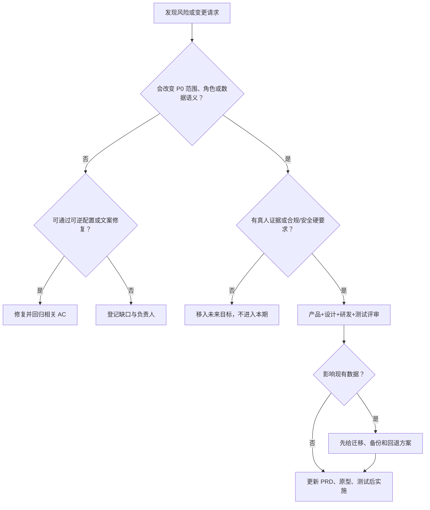
```mermaid
flowchart TD
    A["发现风险或变更请求"] --> B{"会改变 P0 范围、角色或数据语义？"}
    B -->|否| C{"可通过可逆配置或文案修复？"}
    C -->|是| D["修复并回归相关 AC"]
    C -->|否| E["登记缺口与负责人"]
    B -->|是| F{"有真人证据或合规/安全硬要求？"}
    F -->|否| G["移入未来目标，不进入本期"]
    F -->|是| H["产品+设计+研发+测试评审"]
    H --> I{"影响现有数据？"}
    I -->|否| J["更新 PRD、原型、测试后实施"]
    I -->|是| K["先给迁移、备份和回退方案"]
    K --> J
```

**图 21：风险与需求变更处置。**

### 6.4 需求变更门槛

以下变化必须更新 PRD 版本并跨职能评审：

- 增删 P0 功能或改变本期/未来边界；
- 改变产品角色、默认入口或关键任务流程；
- 改变 9 状态 code、终态、合法流转或事件语义；
- 改变通知文本的存储/传输边界；
- 引入邮箱、日历、账号、支付、团队或外部通知；
- 改变采集来源合规策略；
- 改变会影响历史数据的表结构或唯一约束。

文案修正、非关键视觉微调和不改变行为的无障碍修复可以走小版本，但仍需相关回归。

---

## 七、相关文档

| 类型 | 文档 | 用途 |
|---|---|---|
| 项目治理 | [项目章程](../product/PROJECT-CHARTER.md) | 项目形态、范围与技术栈决策 |
| MRD | [市场需求文档](../product/MRD.md) | 市场、用户问题、机会和竞争依据 |
| JTBD | [痛点与 Job Stories](../product/JTBD.md) | 假设任务和优先级来源 |
| 行为分群 | [行为分群与假设画像](../product/PERSONAS.md) | 招募和场景假设，不作为产品角色 |
| 公开研究 | [公开求职行为证据](../research/public-job-search-evidence.md) | 可追溯公开行为证据与限制 |
| 真人研究 | [三人访谈结果模板](../research/user-interview-results-3-participants.md) | 当前待执行，完成数为 0 |
| 研究计划 | [用户验证计划](../research/user-validation-plan.md) | 真人研究与可用性测试计划 |
| 情景走查 | [公开情景研究与角色模拟走查](../research/online-scenario-role-walkthrough-2026-07-28.md) | 专家模拟结果与边界 |
| 产品流程 / IA | [产品设计重构简报](../design/REDESIGN-BRIEF.md) | 三表面信息架构与任务流 |
| 岗位 UX | [岗位列表与详情设计](../design/shape-jobs.md) | F-01 页面细节 |
| 看板 UX | [看板设计](../design/shape-dashboard.md) | F-06 页面细节 |
| 投递 UX | [投递管理设计](../design/shape-applications.md) | F-03 / F-04 页面细节 |
| 视觉规范 | [设计语言系统](../design/DESIGN.md) | 色彩、排版、组件与状态 |
| 高保真索引 | [Figma 高保真原型](../design/HIGH-FIDELITY-PROTOTYPE-INDEX.md) | 14 张设计稿、交互主链与原型缺口 |
| 架构 | [系统架构](../architecture/system-architecture.md) | 系统边界与关键流程 |
| 数据 | [数据库设计](../architecture/database-schema.md) | 对象、约束与索引 |
| API | [API 契约](../architecture/api-contract.md) | 接口、错误和响应结构 |
| 采集验证 | [可信岗位采集](../engineering/CREDIBLE-JOB-INGESTION.md) | 公开 ATS、快照和数据质量事实 |
| P0 验证 | [P0 闭环专项](../engineering/P0-CLOSED-LOOP.md) | 通知计划和库外补录的实施事实 |
| 测试 | [当前验收报告](../qa/ACCEPTANCE-REPORT.md) | 当前验证基线 |
| 缺陷 | [缺陷台账](../qa/DEFECT-REGISTER.md) | 已知问题与技术债 |
| 路线图 | [演进路线图](../product/ROADMAP.md) | M0→M1→M2 的未来目标 |
| 历史 PRD | [旧版 PRD](../product/PRD.md) | 历史基线；待获权限后归档 |
| 重构审计 | [证据矩阵与文档建议](../archive/prd/PRD-V2.1-重构审计与证据矩阵.md) | 冲突裁决、文档分类和待决策 |

---

## 八、附件

### 8.1 原型与演示入口

| 入口 | 地址 | 说明 |
|---|---|---|
| 本地官网 | `http://127.0.0.1:3100/` | 产品营销界面 |
| 本地产品 | `http://127.0.0.1:3100/dashboard` | 核心 Demo |
| 本地案例 | `http://127.0.0.1:3100/case-study` | 作品集案例 |
| 本地 API | `http://127.0.0.1:8100/docs` | OpenAPI 文档 |
| 公开产品 | `https://jobpulse-product-demo.tongqtang.chatgpt.site/dashboard` | 运行前需检查公开后端健康 |
| 公开后端健康 | `https://jobpulse-api-production.up.railway.app/health` | 截图日曾出现不可连接，不视为稳定性结果 |
| Figma 原型 | [JobPulse · 产品设计系统与高保真原型](https://www.figma.com/design/Xy68rSwgub5ZIO1sMzl1Jo) | 可编辑变量、组件、桌面/移动端画面与交互主链 |

### 8.2 高保真资产索引

完整资产、交互主链、状态覆盖和设计缺口见 [Figma 高保真原型索引](../design/HIGH-FIDELITY-PROTOTYPE-INDEX.md)。本 PRD 共引用 14 张 Figma 导出图，其中 11 张桌面/业务状态图、3 张移动端图；旧版前端实装截图继续保留在 `docs/assets/prd/implementation/` 作为实现证据。

### 8.3 当前实现结果与验证记录

以下只描述可证明事实，不能替代第 3、4、5 章的目标要求：

- 24 条确定性演示快照、5 条投递、2 条收藏、2 条待投递、3 条订阅是标准演示数据；
- 公开 ATS 采集代码可适配 Figma、Webflow、Intercom、Stripe 的 Greenhouse Job Board API，但这些海外默认源已停用，仅保留为 M0 历史链路证据；
- 投递、状态事件和计划事件有事务与约束；
- 通知时间→近期安排、库外投递→正式时间线的专家路径通过；
- 2026-07-28 基线为 120 项后端测试、前端 lint/build 通过；
- 专家走查为核心 19/23、全部 20/26，不是用户任务完成率；
- 本次 V2.1 将 PRD 中 14 张前端实装截图替换为 Figma 高保真原型导出图；旧图保留用于实现对照；
- 线上后端在 2026-07-31 截图时不可连接，本地前后端可正常展示。

### 8.4 待确认问题与决策记录

| ID | 待确认 | 当前默认 | 最晚决策点 |
|---|---|---|---|
| D-01 | 创建投递后是否自动结束收藏 | 不自动结束 | F-02 下一次迭代前 |
| D-02 | 纠错采用撤销上一步还是任意状态 | 先撤销上一步；任意状态需原因 | P0 缺口修复前 |
| D-03 | 订阅删除采用撤销还是二次确认 | 优先短时撤销 | F-07 交付前 |
| D-04 | 是否把 V2.0 设为唯一 PRD 并改 README | 先保留旧入口，等待文档权限 | 评审通过后 |
| D-05 | 真人研究的具体招募日期 | 沿用 5–8 次访谈、3–5 次测试 | 宣布 M1 前 |
| D-06 | 是否允许把通知文本发送到外部 LLM | 默认不发送，使用本地降级 | 配置任何外部模型前 |

### 8.5 需求—原型—验收追踪

| 功能 | 主要规则 | 原型 | 核心 AC | 当前判定 |
|---|---|---|---|---|
| F-01 | F01-FR-01～08 | P02、P03、P10 | F01-AC-01～07 | 已实现；状态补图缺 |
| F-02 | F02-FR-01～06 | P04、P11 | F02-AC-01～07 | 已实现；D-01 待决策 |
| F-03 | F03-FR-01～08 | P05、P06、P12 | F03-AC-01～09 | **前端纠错入口缺** |
| F-04 | F04-FR-01～08 | P07、P14 | F04-AC-01～08 | 已实现；异常补图缺 |
| F-05 | F05-FR-01～07 | P13 | F05-AC-01～07 | 已实现；移动补图缺 |
| F-06 | F06-FR-01～06 | P01 | F06-AC-01～06 | 已实现；用户价值待验证 |
| F-07 | F07-FR-01～05 | P08 | F07-AC-01～06 | CRUD 已实现；删除保护缺 |
| F-08 | F08-FR-01～07 | P09 | F08-AC-01～07 | 已实现 |

### 8.6 修订记录

| 版本 | 日期 | 变更 |
|---|---|---|
| V2.1 | 2026-07-31 | 新建 Figma 设计系统与交互原型；以 14 张 Figma 导出图替换 PRD 原型图片；保留旧版实装截图作为实现证据 |
| V2.0 | 2026-07-31 | 按证据重建 8 章结构；重划产品角色；区分已实现、目标、未来和假设；补 14 张高保真实现快照；补状态、异常、数据、事件、验收、风险和追踪矩阵 |
